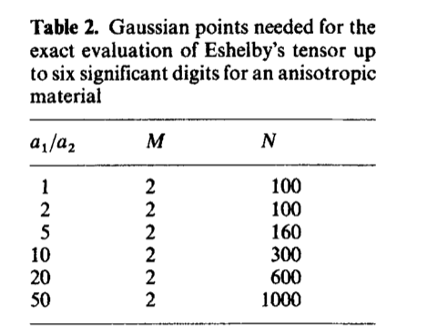

# Eshelby 张量的数值计算

这一部分将应用 Fourier 变换表示的 Green 函数，给出在各向异性介质内，Eshelby 张量的一般的积分形式。通过积分参数变化，将积分转化为适用于 Gauss 数值积分的格式。

## 椭球夹杂问题

考虑在三维空间中的弹性介质，弹性刚度张量为 $L_{ijkl}$，其内部包含一个椭球形状的夹杂区域。不失一般性，将椭球夹杂的中心放置在坐标原点，并使椭圆的主轴与全局坐标系重合，则夹杂区域 $\Omega$ 可以表示为

$$
\Omega: \frac{x_1^2}{a_1^2} + \frac{x_2^2}{a_2^2} + \frac{x_3^2}{a_3^2} \leq 1,
$$

在夹杂内施加大小为 $\boldsymbol{\mu}$ 的均匀本征应变，远场处应变 $\boldsymbol{\varepsilon}_{0} \to \boldsymbol{0}$。在整个空间 $V$ 内满足无体力的平衡方程：

$$
\begin{equation}
\big( L_{ijkl} ( \varepsilon_{kl} - \mu_{kl} ) \big)_{,j} = 0
\label{eq:eigen}
\end{equation}
$$

将本征应变引入的本征应力 $\boldsymbol{\lambda} = -\mathbb{L}: \boldsymbol{\mu}$ 视作外部载荷，并利用均质材料弹性力学方程的基本解：

$$
\begin{equation}
L_{ijkl} G_{k,lj}^{m}(\boldsymbol{x}, \boldsymbol{x}') + \delta_{im}\delta(\boldsymbol{x} - \boldsymbol{x}') = 0,
\label{eq:sln_fdmt}
\end{equation}
$$

就可以将方程 $\eqref{eq:eigen}$ 的解表示为：

$$
\begin{equation}
\begin{gathered}
\varepsilon_{mn}(\boldsymbol{x}) = S_{mnkl}(\boldsymbol{x}) \mu_{kl}
= -P_{mnkl}(\boldsymbol{x}) \lambda_{kl}, \\
S_{ijkl}(\boldsymbol{x}) = P_{ijmn}(\boldsymbol{x}) L_{mnkl}, \quad 
P_{ijkl}(\boldsymbol{x}) = \int_{\Omega} \Gamma_{ijkl} (\boldsymbol{x} - \boldsymbol{x}') \ \mathrm{d} \boldsymbol{x}'
\end{gathered}
\label{eq:disp_rep}
\end{equation}
$$

式中出现的四阶张量算子 $\Gamma_{ijkl}$ 是考虑指标对称性后 Green 函数 $G_{i}^{j}$ **二阶导数的线性组合**：

$$
\Gamma_{ijkl}
= -\frac{1}{4} \big( G_{k,jl}^{i} + G_{l,jk}^{i} + G_{k,il}^{j} + G_{l,ik}^{j} \big),
$$

因此，只要能确定 Green 函数二阶导数在夹杂区域 $\Omega$ 内的积分值，就能得到 Eshelby 张量各个分量的取值。

## 使用 Fourier 变换表示 Green 函数

三维空间中 Fourier 变换和逆变换定义如下：

$$
\begin{aligned}
\mathscr{F}\big[ f \big] &= \hat{f}(\boldsymbol{\xi}) = b \int_{\mathbb{R}^3} f(x) e^{-i2\pi a \boldsymbol{x} \cdot \boldsymbol{\xi}} \ \mathrm{d} \boldsymbol{x}, \\
\mathscr{F}^{-1} \big[ \hat{f}\ \big] &= f(\boldsymbol{x}) = \frac{a^3}{b~} \int_{\mathbb{R}^3} f(\boldsymbol{\xi}) e^{i2\pi a \boldsymbol{x} \cdot \boldsymbol{\xi}} \ \mathrm{d} \boldsymbol{\xi},
\end{aligned}
$$

式中， $a,b$ 可选取为不同的常数。本文选取 $a=1$，$b=1$，所以有

$$
\begin{aligned}
\hat{f}(\boldsymbol{\xi}) &= \int_{\mathbb{R}^3} f(\boldsymbol{x}) e^{-i2\pi \boldsymbol{x} \cdot \boldsymbol{\xi}} \ \mathrm{d} \boldsymbol{x}, \\
f(\boldsymbol{x}) &= \int_{\mathbb{R}^3} f(\boldsymbol{\xi}) e^{i2\pi \boldsymbol{x} \cdot \boldsymbol{\xi}}\ \mathrm{d} \boldsymbol{\xi}
\end{aligned}
$$

以及关于偏导数的变换公式：

$$
\mathscr{F}\big[ \partial f / \partial x_{i} \big] = i2\pi \xi_{i}\ \hat{f}.
$$

对方程 $\eqref{eq:sln_fdmt}$ 进行 Fourier 变换, 得到

$$
L_{ijkl} \xi_{l} \xi_{j} \hat{G}_{k}^{m} 
 = \frac{1}{4\pi^2}e^{-i2\pi \boldsymbol{x}' \cdot \boldsymbol{\xi}} \delta_{im} ,
$$

记矩阵 $\hat{K}_{ik}(\boldsymbol{\xi}) = L_{ijkl} \xi_{l} \xi_{j}$，注意到根据 $L_{ijkl}$ 的主对称性，$\hat{K}_{ik}$ 是**对称矩阵**。Green 函数在频域空间可以通过对 $\hat{K}_{ik}$ 求逆得到：

$$
\hat{G}_{k}^{m} (\boldsymbol{\xi}) = \frac{1}{4\pi^2}e^{-i2\pi \boldsymbol{x}' \cdot \boldsymbol{\xi}} \hat{K}_{mk}^{-1}(\boldsymbol{\xi}),
$$

再应用 Fourier 逆变换公式得到

$$
G_{k}^{m}(\boldsymbol{x}, \boldsymbol{x}')
= \frac{1}{4\pi^2} \int_{\mathbb{R}^3}\hat{K}_{mk}^{-1}(\boldsymbol{\xi}) e^{i2\pi (\boldsymbol{x} - \boldsymbol{x}') \cdot \boldsymbol{\xi}}\ \mathrm{d} \boldsymbol{\xi}.
$$

## 椭球夹杂内的应变场

以下考虑 Green 函数二阶导数在椭球夹杂 $\Omega$ 内的积分：

$$
\begin{aligned}
g_{mnkl}(\boldsymbol{x}) &= \int_{\Omega} G_{k,nl}^{m}(\boldsymbol{x} - \boldsymbol{x}') \ \mathrm{d} \boldsymbol{x}' \\
&= \frac{1}{4\pi^2}\frac{\partial^2}{\partial x_{n} \partial x_{l}} 
\int_{\Omega} \mathrm{d} \boldsymbol{x}'
\int_{\mathbb{R}^3} \hat{K}_{mk}^{-1}(\boldsymbol{\xi}) 
e^{i2\pi (\boldsymbol{x} - \boldsymbol{x}') \cdot \boldsymbol{\xi}}
\ \mathrm{d} \boldsymbol{\xi}.
\end{aligned}
$$

取积分项的实数部分 $\cos \big( 2\pi \boldsymbol{x}\cdot\boldsymbol{\xi} \big)$，并将体积微元用立体角表示：

$$
\mathrm{d} \boldsymbol{\xi} = \rho^2 \mathrm{d}\rho\ \mathrm{d}\omega(\boldsymbol{n}), \quad
\rho = \| \boldsymbol{\xi} \|, \quad \boldsymbol{n} = \boldsymbol{\xi} / \| \boldsymbol{\xi} \|,
$$

那么内部的积分项可以简化为

$$
\begin{gathered}
\int_{\mathbb{R}^3} \hat{K}_{mk}^{-1}(\boldsymbol{\xi}) 
e^{i2\pi (\boldsymbol{x} - \boldsymbol{x}') \cdot \boldsymbol{\xi}}\ \mathrm{d} \boldsymbol{\xi}
= \int_{S}\hat{K}_{mk}^{-1}(\boldsymbol{n}) 
\underbrace{\int_{0}^{\infty} \cos \big( 2\pi\rho (\boldsymbol{x}-\boldsymbol{x}')\cdot\boldsymbol{n} \big) \mathrm{d}\rho}_{\frac{1}{2} \delta\big( (\boldsymbol{x}-\boldsymbol{x}')\cdot\boldsymbol{n} \big)}
\ \mathrm{d}\omega \\
= \int_{S}\hat{K}_{mk}^{-1}(\boldsymbol{n}) \delta\big( (\boldsymbol{x}-\boldsymbol{x}')\cdot\boldsymbol{n} \big) \ \mathrm{d}\omega,
\end{gathered}
$$

式中，$S$ 是三维空间中的单位球面。将上述简化后的积分项代入 $g_{mnkl}$ 中，交换积分顺序后得到

$$
\begin{equation}
g_{mnkl}(\boldsymbol{x}) = \frac{1}{8\pi^2} \frac{\partial^2}{\partial x_{n} \partial x_{l}} 
\int_{S} \hat{K}_{mk}^{-1}(\boldsymbol{n})
\underbrace{\int_{\Omega} \delta\big( (\boldsymbol{x}-\boldsymbol{x}')\cdot\boldsymbol{n} \big)\ \mathrm{d} \boldsymbol{x}'}_{\triangleq \psi( \boldsymbol{x}, \boldsymbol{n} )}
\ \mathrm{d}\omega
\label{eq:A}
\end{equation}
$$

函数 $\psi( \boldsymbol{x}, \boldsymbol{n} )$ 的物理意义是经过点 $\boldsymbol{x}$，法方向为 $\boldsymbol{n}$ 的平面截过椭球 $\Omega$ 的面积，当点 $\boldsymbol{x}$ 在椭球内部时，函数 $\psi$ 总是良定义的，并且可以给出解析的表达式：

$$
\begin{equation}
\psi( \boldsymbol{x}, \boldsymbol{n} )
= \frac{\pi a_{1}a_{2}a_{3}}{l^3(\boldsymbol{n})} \big\{ l^2(\boldsymbol{n}) - ( \boldsymbol{x}\cdot\boldsymbol{n} )^2 \big\}, \quad
l(\boldsymbol{n}) = \sqrt{ a_{1}^2 n_{1}^2 + a_{2}^2 n_{2}^2 + a_{3}^2 n_{3}^2 }
\label{eq:area_ellip}
\end{equation}
$$

注意到函数 $\psi$ 是关于 $x_{i}$ 的**二次函数**，在代入式 $\eqref{eq:A}$ 并对 $x_{i}$ 求二次偏导数之后，$g_{mnkl}$ 将与坐标 $\boldsymbol{x}$ 无关。因此，**椭球夹杂内**的应变场是**均匀的**，式 $\eqref{eq:disp_rep}$ 中 Eshelby 张量 $S_{ijkl}$ 和 Hill 张量在夹杂内是常值：

$$
\begin{equation}
\boxed{
\begin{gathered}
S_{ijkl} = P_{ijmn} L_{mnkl}, \quad
P_{ijkl} = -\frac{1}{4}(g_{ijkl} + g_{ijlk} + g_{jikl} + g_{jilk}), \\
g_{ijkl} = -\frac{a_{1}a_{2}a_{3}}{4\pi} 
\int_{S} 
\frac{ n_{j}n_{l} \hat{K}_{ik}^{-1}(\boldsymbol{n}) }{ \big( a_{1}^2 n_{1}^2 + a_{2}^2 n_{2}^2 + a_{3}^2 n_{3}^2 \big)^{3/2} }
\ \mathrm{d}\omega.
\end{gathered}
}
\label{eq:eshelby}
\end{equation}
$$

## Eshelby 张量的数值积分格式

仅在弹性介质的刚度张量 $L_{ijkl}$ 具有特殊的对称性时，才能给出式 $\eqref{eq:eshelby}$ 中积分结果的解析表达式，这将在之后的文档中给出。此处希望能给出数值计算方法，这需要将积分域从单位球面变换为更方便数值积分的区域。考虑式 $\eqref{eq:eshelby}$ 中的积分 $g_{ijkl}$

$$
g_{ijkl} = -\frac{a_{1}a_{2}a_{3}}{4\pi} 
\int_{S} \frac{ n_{j}n_{l} \hat{K}_{ik}^{-1}(\boldsymbol{n}) }{ l^3(\boldsymbol{n}) }\ \mathrm{d}\omega(\boldsymbol{n}),
$$

式中，分母项 $l$ 是法向量 $\boldsymbol{n}$ 经过仿射变换 $\boldsymbol{A}$ 后得到的向量长度：

$$
l(\boldsymbol{n}) = \| \boldsymbol{A} \boldsymbol{n} \|, \quad
\boldsymbol{A} = \mathrm{diag}(a_{1},\ a_{2},\ a_{3}).
$$

考虑如下参数变换

$$
\begin{equation}
\boldsymbol{m} = \frac{1}{l(\boldsymbol{n})} \boldsymbol{A} \boldsymbol{n},
\label{eq:para}
\end{equation}
$$

向量 $\boldsymbol{m}$ 同样在单位球面上，而面积微元转变为

$$
\frac{a_1 a_2 a_3}{l^3} \mathrm{d}\omega(\boldsymbol{n}) 
= \mathrm{d}\omega(\boldsymbol{m}) = \mathrm{d} m_{3}|_{-1}^{1}\ \mathrm{d}\theta|_{0}^{2\pi},
$$

于是，积分式 $g_{ijkl}$ 可以简化为

$$
g_{ijkl} = -\frac{1}{4\pi} 
\int_{-1}^{1} \int_{0}^{2\pi}
n_{j}n_{l} \hat{K}_{ik}^{-1}(\boldsymbol{n}) \ \mathrm{d}m_{3} \mathrm{d}\theta.
$$

另一方面，积分项中关于向量 $\boldsymbol{n}$ 的函数需要用 $m_{i}$ 进行表示。参数变换 $\eqref{eq:para}$ 是非线性变换，然而这里可以利用积分项 $n_{j}n_{l} \hat{K}_{ik}^{-1}(\boldsymbol{n})$ 是关于向量 $\boldsymbol{n}$ 的 0 阶齐次函数的性质：

$$
n_{j}n_{l} \hat{K}_{ik}^{-1}(\boldsymbol{n}) 
= \hat{G}_{ijkl}(\boldsymbol{n}) = \hat{G}_{ijkl}(\boldsymbol{n}/l) 
= \hat{G}_{ijkl}( \boldsymbol{A}^{-1}\boldsymbol{m} ),
$$

就得到在区间 $m_{3} \times \theta = [-1,1]\times[0,2\pi]$ 内的积分：

$$
\begin{equation}
\boxed{
g_{ijkl} = -\frac{1}{4\pi} 
\int_{-1}^{1} \int_{0}^{2\pi}
\hat{G}_{ijkl}( \tfrac{m_1}{a_1},\tfrac{m_2}{a_2},\tfrac{m_3}{a_3} ) \ \mathrm{d}m_{3} \mathrm{d}\theta,
}
\label{eq:g}
\end{equation}
$$

其中，向量 $\boldsymbol{m}$ 的 1，2 方向分量等于：

$$
m_{1} = \sqrt{1-m_{3}^2} \cos\theta, \quad m_{2} = \sqrt{1-m_{3}^2} \sin\theta.
$$

式 $\eqref{eq:g}$ 可进一步使用 Gauss 积分公式数值求解。为达到 6 位小数的精度，不同椭圆长轴比所需要的 Gauss 积分点数量不同，下表给出了长轴比和积分点数量的关系

## 更新日志

### 2026/07/24

1. 邱俊淞创建了文档 `Eshelby 张量的数值计算.md`
