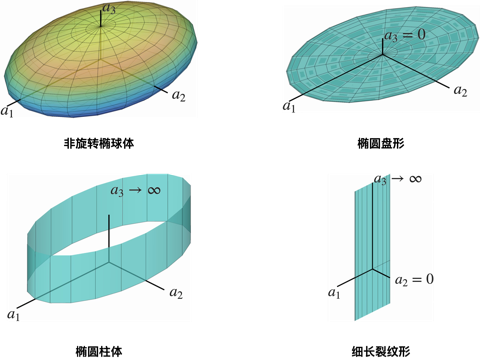
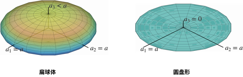
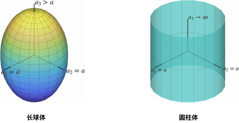
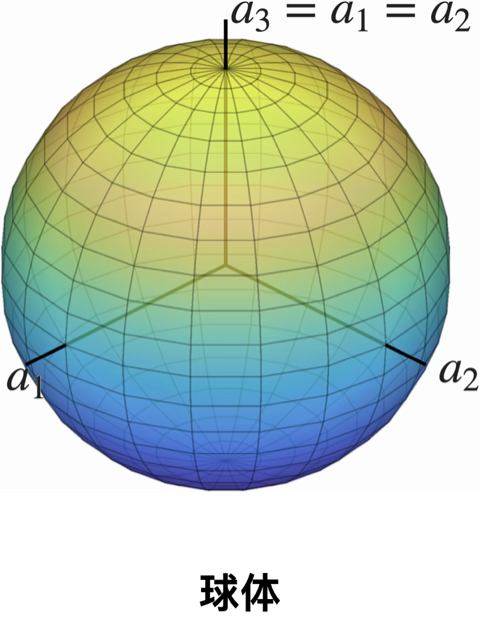

# Eshelby 张量的解析公式

这里整理了（1）各向同性（2）横观各向同性和（3）正交各向异性弹性介质内 Eshelby 张量的**解析公式**。

1. 本文档**直接给出 Eshelby 张量的解析公式，不包含推导过程**。各向同性 Eshelby 张量的推导过程可见*王敏中：高等弹性力学*，各向异性 Eshelby 张量的推导可见 Mura.

2. 本文档**仅考虑弹性介质材料坐标系与椭球主轴重合的情景**。Eshelby 张量的对称性由（1）弹性介质的**材料对称性**和（2）夹杂的**几何对称性**共同决定，这导致

   1. 即使在各向同性弹性介质内，Eshelby 张量也可以因非球形的夹杂形状而具有各向异性；
   2. 当弹性介质的材料坐标系与夹杂椭圆主轴不重合时，此时 Eshelby 张量具有高度的各向异性，夹杂也可能产生有限旋转。

3. 随着弹性介质各向异性的增加，Eshelby 张量的解析公式将限制在一些特殊形状的夹杂。对具有不同材料对称性的弹性介质，本篇文档整理的夹杂形状有：

   1. **各向同性**：任意形状的椭球体；
   2. **正交各向异性**：椭圆柱体、细长裂纹形和圆盘形；
   3. **横观各向同性**：椭圆柱体、细长裂纹形和圆盘形；

   对具有各向异性且任意形状的椭球夹杂的 Eshelby 张量，可通过数值方法求解。

## Eshelby 张量的性质

在无穷大**各向异性**弹性介质中的椭球夹杂内的应变场总是均匀的，可通过四阶张量  $\mathbb{S}$ 将夹杂内的应变场与施加在夹杂内的本征应变关联：

$$
\boldsymbol{\varepsilon}(\boldsymbol{x}) \equiv \mathbb{S} : \boldsymbol{\mu}, \quad \boldsymbol{x} \in \Omega.
$$

式中，四阶张量 $\mathbb{S}$ 即为 **Eshelby 张量**。它具有次对称性，但一般不具有主对称性，

$$
S_{ijkl} = S_{jikl} = S_{ijlk},\quad S_{ijkl} \neq S_{klij}
$$

Eshelby 张量是类似于应变的无量纲量，因此在使用 Voigt 记法写成矩阵形式时，其 4-6 行一般乘因子 2。由于 Eshelby 张量不具有主对称性，因此其矩阵形式不是对称矩阵。相比之下，**Hill 极化张量** $\mathbb{P}$ 将夹杂内的应变场与极化应力 $\boldsymbol{\lambda} = -\mathbb{L}: \boldsymbol{\mu}$ 关联：

$$
\boldsymbol{\varepsilon}(\boldsymbol{x}) \equiv -\mathbb{P} : \boldsymbol{\lambda}, \quad \boldsymbol{x} \in \Omega.
$$

因此张量 $\mathbb{P}$ 和 $\mathbb{S}$ 之间的关系为：

$$
\mathbb{P} = \mathbb{S}: \mathbb{M},
$$

式中，$\mathbb{M}$ 是弹性介质的柔度张量。Hill 极化张量同时具有主对称性和次对称性：

$$
P_{ijkl} = P_{jikl} = P_{ijlk} = P_{klij},
$$

并且具有类似于柔度的量纲，因此在记成矩阵形式之后，`r4:6,c1:3` 和 `r1:3,c4:6` 的分量是对应张量分量的 2 倍，而 `r4:6,c4:6` 的分量是张量分量的 4 倍。除 Eshelby 张量和 Hill 极化张量之外，另一个常用到的是 **Hill 约束张量** $\mathbb{L}^{*}$，与其它张量之间的关系为

$$
\mathbb{L} + \mathbb{L}^{*} = \mathbb{L} : \mathbb{S}^{-1} = \mathbb{P}^{-1},
$$

其物理含义是弹性介质内孔洞的刚度张量，若在孔洞内施加应力 $\boldsymbol{\sigma}^{*}$，孔洞产生的应变为

$$
\boldsymbol{\sigma}^{*} = - \mathbb{L}^{*} : \boldsymbol{\varepsilon}^{*}.
$$

此外，无论何种形状的夹杂（也即在夹杂内部的应变场可以是不均匀的），总有如下关于 Eshelby 分量的恒等式逐点成立：

$$
S_{ijij} = 3,
$$

也即记成矩阵形式的 Eshelby 张量 $\{ \mathbb{S} \}$ 对角线元素之和等于 3。

## 椭球体夹杂的几何描述

将椭球体夹杂的中心放置在坐标原点，并使**椭球的主轴与全局坐标系重合**，则夹杂区域 $\Omega$ 可以表示为

$$
\Omega: \frac{x_1^2}{a_1^2} + \frac{x_2^2}{a_2^2} + \frac{x_3^2}{a_3^2} \leq 1,
$$

因此，夹杂形状可通过向量 $(a_1,a_2,a_3)$ 唯一确定。以下列举了椭圆长轴在各种取值范围时对应的形状名称，以及相应的示意图。

|                            | $a_{1}\neq a_{2}\neq a_{3}$ | $a_{1}= a_{2}>a_3$ | $a_{1}= a_{2}<a_3$ | $a_1=a_2=a_3$ |
| -------------------------- | --------------------------- | ------------------ | ------------------ | ------------- |
| 长轴均不等于 0 或 $\infty$ | 非旋转椭球体                | 扁球体             | 长球体             | 球体          |
| $a_{3} = \infty$           | 椭圆柱体                    | -                  | 圆柱体             | -             |
| $a_{3} = 0$                | 椭圆盘形                    | 圆盘形             | -                  | -             |
| $a_2=0,a_3=\infty$         | 细长裂纹形                  | -                  | -                  | -             |

## Eshelby 张量的解析表达式

### 弹性介质为各向同性

当弹性介质为各向同性材料时，Eshelby 的分量只与泊松比 $\nu$ 相关。以下根据夹杂形状分成两类情况讨论：

1. 非旋转椭球体，$a_1> a_2 > a_3$ 。
2. 旋转椭球体，椭圆长轴 $a_1 = a_2 = a$，$a_3 = b$。

#### 非旋转椭球体

Eshelby 张量的分量是形如 $n_{i}n_{j}\delta_{mn}r^2$ 或 $n_{i}n_{j}n_{m}n_{n}r^2$  作为积分项，在单位球面 $S$ 上的积分结果。根据积分域 $S$ 和椭球 $\Omega$ 在空间中的对称性，只有积分项指标出现**偶数次**才能得到非零值。因此，如果将 Eshelby 张量按 Voigt 记法写成矩阵形式，那么所有非零元素为：

$$
\begin{equation}
\big\{ \mathbb{S} \big\}
= \begin{pmatrix}
S_{1111} & S_{1122} & S_{1133} & 0 & 0 & 0 \\
S_{2211} & S_{2222} & S_{2233} & 0 & 0 & 0 \\
S_{3311} & S_{3322} & S_{3333} & 0 & 0 & 0 \\
0        &        0 &        0 & 2S_{2323} & 0 & 0 \\
0        &        0 &        0 & 0 & 2S_{1313} & 0 \\
0        &        0 &        0 & 0 & 0 & 2S_{1212}
\end{pmatrix}
\label{eq:eshelby_voigt}
\end{equation}
$$

在 Eshelby 张量分量中，所有可能出现的积分列举如下（**以下默认积分值 $I_{i}$，$I_{ii}$，和 $I_{ij}$ 的指标不求和**）：

$$
\begin{equation}
I_{i} = \int_{S} \frac{n_{i}^{2} r^{2}}{a_{i}^{2}} \ \mathrm{d}\omega, \quad
I_{ii} = \int_{S} \frac{n_{i}^{4} r^{2}}{a_{i}^{4}} \ \mathrm{d}\omega, \quad
I_{ij} = 3\int_{S} \frac{n_{i}^{2}n_{j}^{2} r^{2}}{a_{i}^{2}a_{j}^{2}} \ \mathrm{d}\omega\ ( i\neq j)
\label{eq:i_def}
\end{equation}
$$

在式 $\eqref{eq:eshelby_voigt}$ 中代入定义的积分值 $I_{i}$，$I_{ii}$，和 $I_{ij}$，就得到

$$
\begin{aligned}
\big\{ \mathbb{S} \big\}
&= \frac{1-2\nu}{8\pi(1-\nu)} \begin{pmatrix}
 I_1 & -I_1 & -I_1 & 0 & 0 & 0 \\
-I_2 &  I_2 & -I_2 & 0 & 0 & 0 \\
-I_3 & -I_3 &  I_3 & 0 & 0 & 0 \\
0        &        0 &        0 & I_{2}+I_{3} & 0 & 0 \\
0        &        0 &        0 & 0 & I_{1}+I_{3} & 0 \\
0        &        0 &        0 & 0 & 0 & I_{1}+I_{2}
\end{pmatrix} \\
&+\frac{1}{8\pi(1-\nu)} \begin{pmatrix}
3a_{1}^2 I_{11} &  a_{2}^2 I_{12} &  a_{3}^2 I_{13} & 0 & 0 & 0 \\
 a_{1}^2 I_{12} & 3a_{2}^2 I_{22} &  a_{3}^2 I_{23} & 0 & 0 & 0 \\
 a_{1}^2 I_{13} &  a_{2}^2 I_{23} & 3a_{3}^2 I_{33} & 0 & 0 & 0 \\
0        &        0 &        0 & \small{(a_{2}^2+a_3^2)I_{23}} & 0 & 0 \\
0        &        0 &        0 & 0 & \small(a_{1}^2+a_3^2)I_{13} & 0 \\
0        &        0 &        0 & 0 & 0 & \small(a_{1}^2+a_2^2)I_{12}
\end{pmatrix} 
\end{aligned}
$$

式 $\eqref{eq:i_def}$ 定义的积分可以表示成如下形式：

$$
\begin{aligned}
I_{i} &= \int_{S} \frac{n_{i}^{2} r^{2}}{a_{i}^{2}} \ \mathrm{d}\omega
= 2\pi a_{1} a_{2} a_{3} \int_{0}^{\infty} \frac{1}{(a_{i}^{2}+u)} \frac{\mathrm{d}u}{\Delta}, \\
I_{ii} &= \int_{S} \frac{n_{i}^{4} r^{2}}{a_{i}^{4}} \ \mathrm{d}\omega
= 2\pi a_{1} a_{2} a_{3} \int_{0}^{\infty} \frac{1}{(a_{i}^{2}+u)^2}\frac{\mathrm{d}u}{\Delta}, \\
I_{ij} &= 3\int_{S} \frac{n_{i}^{2}n_{j}^{2} r^{2}}{a_{i}^{2}a_{j}^{2}} \ \mathrm{d}\omega
= 2\pi a_{1} a_{2} a_{3} \int_{0}^{\infty} \frac{1}{(a_{i}^{2}+u)(a_{j}^{2}+u)}\frac{\mathrm{d}u}{\Delta}
\end{aligned}
$$

式中，$\Delta^2 \triangleq ( a_{1}^{2} + u )( a_{2}^{2} + u )( a_{3}^{2} + u )$。可以验证，这些积分值之间满足如下代数关系式：

$$
\begin{equation}
\sum_{i=1}^{3} I_{i} = 4\pi, \quad
I_{ij} = -\frac{I_i - I_j}{a_{i}^2 - a_{j}^2}\ (i\neq j),\quad
2a_{i}^2I_{ii}  = 4\pi - a_{i}^2\sum_{j=1}^{3}I_{ij},
\label{eq:i_alg}
\end{equation}
$$

因此，只要确定积分值 $I_{i}$ 中的其中两个，就可以通过上述方程直接确定其它积分的取值。可以使用标准的第一类和第二类不完全椭圆积分

$$
E(\phi|m) = \int_{0}^{\phi} \sqrt{1-m \sin^2\varphi} \ \mathrm{d} \varphi, \quad
F(\phi|m) = \int_{0}^{\phi} \frac{1}{\sqrt{1-m\sin^2\varphi}} \ \mathrm{d} \varphi
$$

将积分值 $I_{i}$ 表示为

$$
\begin{equation}
\begin{aligned}
I_{1} &= \frac{4\pi a_2 a_3}{ma_1^2 \sin^3\phi\ } 
\big[ -E + F \big],\\
I_{2} &= \frac{4\pi a_2 a_3}{m(1-m)a_1^2 \sin^3\phi } 
\big[ E - (1-m)F - \frac{a_3}{a_2}m\sin\phi \big], \\
I_{3} &= \frac{4\pi a_2 a_3}{(1-m)a_1^2 \sin^3\phi } 
\big[ -E + \frac{a_2}{a_3}\sin\phi \big]
\end{aligned}
\label{eq:Ii}
\end{equation}
$$

其中，

$$
m = \frac{a_1^2 - a_2^2}{a_1^2 -a_3^2}, \quad
\cos \phi = \frac{a_3}{a_1}.
$$

#### 旋转椭球体

此时不再能用式 $\eqref{eq:i_alg}$ 提供的代数关系 $I_{i}$ 表示 $I_{ij}$，也不能用椭圆积分表示 $I_{i}$，因为此时定义的积分是奇异的。使用如下公式直接计算影响张量分量：

$$
\begin{aligned}
& S_{1111}=S_{2222}=\frac{3}{8\left(1-\nu\right)} \frac{\alpha^2}{\alpha^2-1}+\frac{1}{4\left(1-\nu\right)}\left[1-2 \nu-\frac{9}{4\left(\alpha^2-1\right)}\right] q \\
& S_{3333}=\frac{1}{2\left(1-\nu\right)}\left\{1-2 \nu+\frac{3 \alpha^2-1}{\alpha^2-1}-\left[1-2 \nu+\frac{3 \alpha^2}{\alpha^2-1}\right] q\right\} \\
& S_{1122}=S_{2211}=\frac{1}{4\left(1-\nu\right)}\left\{\frac{\alpha^2}{2\left(\alpha^2-1\right)}-\left[1-2 \nu+\frac{3}{4\left(\alpha^2-1\right)}\right] q\right\} \\
& S_{1133}=S_{2233}=\frac{1}{2\left(1-\nu\right)}\left\{\frac{-\alpha^2}{\alpha^2-1}+\frac{1}{2}\left[\frac{3 \alpha^2}{\alpha^2-1}-\left(1-2 \nu\right)\right] q\right\} \\
& S_{3311}=S_{3322}=\frac{1}{2\left(1-\nu\right)}\left\{2 \nu-1-\frac{1}{\alpha^2-1}+\left[1-2 \nu+\frac{3}{2\left(\alpha^2-1\right)}\right] q\right\} \\
& S_{1212}=\frac{1}{4\left(1-\nu\right)}\left\{\frac{\alpha^2}{2\left(\alpha^2-1\right)}+\left[1-2 \nu-\frac{3}{4\left(\alpha^2-1\right)}\right] q\right\} \\
& S_{1313}=S_{2323}=\frac{1}{4\left(1-\nu\right)}\left\{1-2 \nu-\frac{\alpha^2+1}{\alpha^2-1}-\frac{1}{2}\left[1-2 \nu-\frac{3\left(\alpha^2+1\right)}{\alpha^2-1}\right] q\right\}
\end{aligned}
$$

式中，$\alpha = b/a$，$q$ 会随 $a$，$b$ 不同的大小关系而改变：

$$
q = \begin{cases}
\dfrac{\alpha}{(\alpha^2 - 1)^{3/2}} 
\big[ \alpha(\alpha^2 - 1)^{1/2} - \text{arccosh}\ \alpha \big], & \alpha\geq 1,\\
\dfrac{\alpha}{(1 - \alpha^2)^{3/2}} 
\big[ \arccos \alpha - \alpha(1-\alpha^2)^{1/2}\big], & \alpha\leq 1.
\end{cases}
$$

当椭球的比例系数 $\alpha$ 取特定值时，$q$ 在极限意义下取值。此时 Eshelby 张量的分量为

（1）**圆柱体** $\alpha = \infty, q = 1$

$$
\begin{aligned}
&S_{3333} = 0, \quad S_{1111} = S_{2222} = \frac{5-4\nu}{8(1-\nu)}, \\
&S_{3311} = S_{3322} = 0, \quad S_{1122} = S_{2211} = \frac{4\nu - 1}{8(1-\nu)}, \quad
S_{1133} = S_{2233} = \frac{\nu}{2(1-\nu)}, \\
&S_{1313} = S_{2323} = \frac{1}{4}, \quad 
S_{1212} = \frac{3-4\nu}{8(1-\nu)}
\end{aligned}
$$

（2）**圆盘形** $\alpha = 0, q = 0$

$$
S_{3333} = 1, \quad S_{3311} = S_{3322} = \frac{\nu}{1-\nu}, \quad
S_{1313} = S_{2323} = \frac{1}{2}.
$$

（3）**球体** $\alpha=1, q = \frac{2}{3}$

$$
\mathbb{S} = \frac{1+\nu}{3(1-\nu)} \mathbb{H}_{v}
+ \frac{2 (4 - 5\nu)}{15(1-\nu)} \mathbb{H}_{d}
= \frac{K}{K+4G/3} \mathbb{H}_{v}
+ \frac{6K + 12G}{5 (3 K + 4G)} \mathbb{H}_{d}
$$

$$
\begin{gathered}
\mathbb{P} = \mathbb{S} : \mathbb{L}_{0}^{-1} = \frac{1}{3K+4G} \mathbb{H}_{v}
+ \frac{3K + 6G}{5G (3 K + 4G)} \mathbb{H}_{d}\\
\mathbb{L}^{*}
= \mathbb{P}^{-1} - \mathbb{L}_{0}
= 4G \mathbb{H}_{v} + \frac{5G (3 K + 4G)}{3K + 6G} \mathbb{H}_{d}
\end{gathered}
$$

#### Eshelby 张量在空间中的方向平均

任意夹杂形状的 Eshelby 张量，在经过方向平均之后，得到的是球形夹杂的结果：

$$
\{ \mathbb{S} \}_{\boldsymbol{n}} = \frac{1+\nu}{3(1-\nu)} \mathbb{H}_{v}
+ \frac{2 (4 - 5\nu)}{15(1-\nu)} \mathbb{H}_{d}
$$

### 弹性介质为正交各向异性

#### 椭圆柱体

记 Voigt 矩阵形式的弹性刚度张量为 $\mathbf{L}$，并定义变量 $g$，$\beta_{3}$，$h$，$s$，$\rho$：

$$
\begin{aligned}
& g=\sqrt{\frac{L_{11} L_{22}-L_{12}^2+2 L_{66}\left(\left(L_{11} L_{22}\right)^{1 / 2}-L_{12}\right)}{L_{22} L_{66}}}>0 \\
& \beta_3=\sqrt{L_{55} / L_{44}}\quad h=\sqrt{\frac{L_{11}}{L_{22}}} \quad s=g^2-2 h \quad \rho=a_1 / a_2
\end{aligned}
$$

以及如下参数：

$$
\begin{aligned}
& n_0=2\left(h \beta_3+h \rho+\beta_3 \rho g\right)+\rho^2\left(g+\beta_3\right)+\beta_3^2(g+\rho)+s\left(\beta_3+\rho\right)+h g \\
& n_2=\left(g+\beta_3+\rho\right) \\
& n_4=\left(h \beta_3+h \rho+\beta_3 \rho g\right) \\
& n_6=2 \rho h \beta_3\left(\rho+g+\beta_3\right)+\rho^2\left(\beta_3 s+\beta_3^2 g+h g\right)+\beta_3^2(\rho s+h g)+h^2\left(\beta_3+\rho\right)\\
& d_1=g\left(h+\beta_3 g+\beta_3^2\right)\left(\rho^2+\rho g+h\right)\left(\beta_3+\rho\right)>0 \\
& d_2=h \beta_3 \rho>0\\
\end{aligned}
$$

那么非零项的 Hill 极化张量分量就可以写成如下形式：

$$
\begin{aligned}
& P_{11}=\frac{\rho}{d_1 L_{22} L_{44} L_{66}}\left(L_{55} L_{66} \frac{n_0}{d_2}+\left(L_{22} L_{55}+L_{44} L_{66}\right) n_2+L_{22} L_{44} n_4\right) \\
& P_{12}=\frac{\rho}{d_1 L_{22} L_{44} L_{66}}\left(-L_{55}\left(L_{12}+L_{66}\right) n_2-L_{44}\left(L_{12}+L_{66}\right) n_4\right) \\
& P_{22}=\frac{\rho}{d_1 L_{22} L_{44} L_{66}}\left(L_{11} L_{55} n_2+\left(L_{55} L_{66}+L_{11} L_{44}\right) n_4+L_{44} L_{66} n_6\right) \\
& P_{66}=\frac{\rho}{d_1 L_{22} L_{44} L_{66}}\left(L_{11} L_{55} \frac{n_0}{d_2}+\left(L_{11} L_{44}-2 L_{12} L_{55}\right) n_2+\left(L_{22} L_{55}-2 L_{12} L_{44}\right) n_4+L_{22} L_{44} n_6\right) \\
& P_{55}=\frac{\rho}{d_1 L_{22} L_{44} L_{66}}\left(L_{11} L_{66} \frac{n_0}{d_2}+\left(L_{11} L_{22}+L_{66}^2-\left(L_{12}+L_{66}\right)^2\right) n_2+L_{22} L_{66} n_4\right) \\
& P_{44}=\frac{\rho}{d_1 L_{22} L_{44} L_{66}}\left(L_{11} L_{66} n_2+\left(L_{11} L_{22}+L_{66}^2-\left(L_{12}+L_{66}\right)^2\right) n_4+L_{22} L_{66} n_6\right)
\end{aligned}
$$

#### 细长裂纹形

记小量 $\varepsilon = 1/\rho$，那么非零项 Hill 极化张量修正到 $\mathcal{O}(\varepsilon)$ 有

$$
\begin{array}{l}
P_{11}=\varepsilon \dfrac{L_{22}+L_{66}(\alpha \beta)^{1 / 2}}{L_{11} L_{66}\left(\alpha^{1 / 2}+\beta^{1 / 2}\right)} \quad 
P_{12}=-\varepsilon \dfrac{L_{12}+L_{66}}{L_{11} L_{66}(\alpha \beta)^{1 / 2}\left(\alpha^{1 / 2}+\beta^{1 / 2}\right)} \\
P_{22}=\dfrac{1}{L_{22}}+\varepsilon \dfrac{L_{22}-L_{66}\left[\alpha+\beta+(\alpha \beta)^{1 / 2}\right]}{L_{22} L_{66}(\alpha \beta)^{1 / 2}\left(\alpha^{1 / 2}+\beta^{1 / 2}\right)} \quad 
P_{44}=\dfrac{1}{L_{44}}-\varepsilon \dfrac{\left(L_{55}\right)^{1 / 2}}{\left(L_{44}\right)^{3 / 2}} \\
P_{55}=\varepsilon \dfrac{1}{\left(L_{44} L_{55}\right)^{1 / 2}} \quad 
P_{66}=\dfrac{1}{L_{66}}-\varepsilon \dfrac{2\left(L_{11} L_{22}-L_{12}^2\right)}{L_{11} L_{66}^2(\alpha \beta)^{1 / 2}\left(\alpha^{1 / 2}+\beta^{1 / 2}\right)}
\end{array}
$$

式中，$\alpha$ 和 $\beta$ 是如下二次方程的根：

$$
L_{11}L_{66} x^2 - ( L_{11}L_{22} - L_{12}^2 -2L_{12}L_{66} )x + L_{22}L_{66} = 0.
$$

若取极限 $\varepsilon\to 0$，那么有

$$
P_{22} = 1/L_{22}, \quad
P_{44} = 1/L_{44}, \quad
P_{66} = 1/L_{66}.
$$

#### 圆盘形

非零项的 Hill 极化张量分量等于

$$
P_{33} = 1/L_{33}, \quad
P_{44} = 1/L_{44}, \quad
P_{55} = 1/L_{55}.
$$

由此可见，对于正交各向异性材料，细长裂纹形和圆盘形得到的 Eshelby 张量是相同的。

### 弹性介质为横观各向同性

#### 椭圆柱体

此处规定弹性介质旋转对称轴研全局坐标系 3 方向，Hill 极化张量的非零项等于

$$
\begin{array}{ll}
P_{11}=\dfrac{\rho\left(L_{22}^0+L_{66}^0\right)+2 L_{66}^0}{2 L_{22}^0 L_{66}^0(1+\rho)^2} & P_{12}=-\dfrac{\rho\left(L_{66}^0-L_{22}^0\right)}{2 L_{22}^0 L_{66}^0(1+\rho)^2} \\
P_{22}=\dfrac{\rho\left[L_{22}^0+L_{66}^0(1+2 \rho)\right]}{2 L_{22}^0 L_{66}^0(1+\rho)^2} & P_{44}=\dfrac{\rho}{L_{44}^0(1+\rho)} \\
P_{66}=\dfrac{L_{22}^0\left(1+\rho^2\right)+2 \rho L_{66}^0}{L_{22}^0 L_{66}^0(1+\rho)^2} & P_{55}=\dfrac{1}{L_{44}^0(1+\rho)}
\end{array}
$$

## 更新日志

### 2026/07/24

1. 邱俊淞创建了文档 `Eshelby 张量的解析公式.md`
