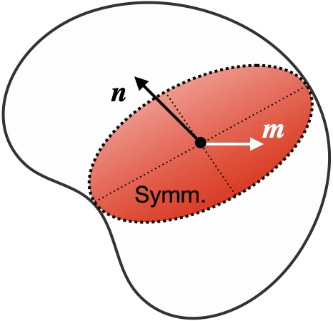
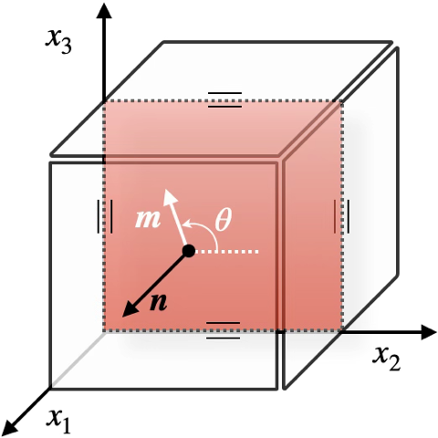
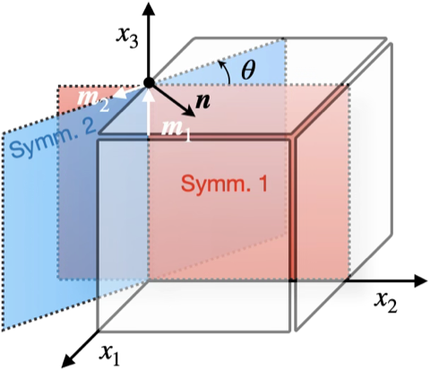

# 线弹性材料八种对称性的证明

Ting (2002)[^1] 通过推广 Cowin--Mehrabadi 定理，给出一种证明线弹性材料仅包含八种不同对称性的证明。

## Cowin--Mehrabadi 定理

若 $\boldsymbol{n}$ 是**单位向量**，$\boldsymbol{m}$ 是材料对称面内的**任意**向量，如图所示

那么**向量 $\boldsymbol{n}$ 是材料对称面的法向量的充分必要条件**是：

$$
\begin{equation}\label{eq:thm_cm}
\begin{gathered}
L_{ijkk} n_{j} = \big( L_{pqtt}n_{p}n_{q} \big) n_{i} \quad
L_{isks} n_{k} = \big( L_{pqrq}n_{p}n_{r} \big) n_{i} \\
L_{ijks} n_{j}n_{s}n_{k} = \big( L_{pqrt} n_{p}n_{q}n_{r}n_{t} \big) n_{i} \\
L_{ijks} m_{j}m_{s}n_{k} = \big( L_{pqrt} n_{p}m_{q}n_{r}m_{t} \big) n_{i}
\end{gathered}
\end{equation}
$$

如果定义如下二阶对称张量 $\boldsymbol{U}$，$\boldsymbol{V}$ 和 $\boldsymbol{Q}^{(\boldsymbol{m})}$：

$$
U_{ij} = L_{ijkk}, \quad
V_{ij} = L_{ikjk}, \quad
\boldsymbol{Q}^{(\boldsymbol{m})} = L_{ikjl}m_{k}m_{l}
$$

那么式 $\eqref{eq:thm_cm}$ 又可以写成如下形式

$$
\begin{gathered}
\boldsymbol{U} \boldsymbol{n} = \big( \boldsymbol{n} \boldsymbol{U} \boldsymbol{n} \big)\ \boldsymbol{n}, \quad
\boldsymbol{V} \boldsymbol{n} = \big( \boldsymbol{n} \boldsymbol{V} \boldsymbol{n} \big)\ \boldsymbol{n}, \\
\boldsymbol{Q}^{(\boldsymbol{n})} \boldsymbol{n} = \big( \boldsymbol{n} \boldsymbol{Q}^{(\boldsymbol{n})} \boldsymbol{n} \big)\ \boldsymbol{n}, \quad
\boldsymbol{Q}^{(\boldsymbol{m})} \boldsymbol{n} = \big( \boldsymbol{n} \boldsymbol{Q}^{(\boldsymbol{m})} \boldsymbol{n} \big)\ \boldsymbol{n},
\end{gathered}
$$

也即向量 $\boldsymbol{n}$ 是二阶对称张量 $\boldsymbol{U}$，$\boldsymbol{V}$，$\boldsymbol{Q}^{(\boldsymbol{n})}$ 和 $\boldsymbol{Q}^{(\boldsymbol{m})}$ 的特征向量。定理中最后的两个式子，再加上 $\boldsymbol{m}$ 的任意性，即构成充分必要条件。然而，为了计算的简化，上述定理可进一步化简至有限个 $\boldsymbol{m}$ 的情景：

1. 当 $\boldsymbol{n}$ 已经是张量 $\boldsymbol{U}$，$\boldsymbol{V}$ 和 $\boldsymbol{Q}^{(\boldsymbol{n})}$ 的特征向量时，只需证明对**某一个**向量 $\boldsymbol{m}$，使得 $\boldsymbol{n}$ 是张量 $\boldsymbol{Q}^{(\boldsymbol{m})}$ 的特征向量，即可得出结论
2. 当 $\boldsymbol{n}$ 已经是张量 $\boldsymbol{U}$，$\boldsymbol{V}$ 和 $\boldsymbol{Q}^{(\boldsymbol{n})}$ 中**任意两个**的特征向量时，只需证明对**某两个不同的**向量 $\boldsymbol{m}_{1}$ 和 $\boldsymbol{m}_{2}$，使得 $\boldsymbol{n}$ 是张量 $\boldsymbol{Q}^{(\boldsymbol{m}_{1})}$ 和 $\boldsymbol{Q}^{(\boldsymbol{m}_{2})}$ 的特征向量，即可得出结论
3. 当 $\boldsymbol{n}$ 已经是张量 $\boldsymbol{U}$，$\boldsymbol{V}$ 和 $\boldsymbol{Q}^{(\boldsymbol{n})}$ 中**任意一个**的特征向量时，只需证明对**某三个不同的**向量 $\boldsymbol{m}_{1}$，$\boldsymbol{m}_{2}$ 和 $\boldsymbol{m}_{3}$，使得 $\boldsymbol{n}$ 是张量 $\boldsymbol{Q}^{(\boldsymbol{m}_{1})}$，$\boldsymbol{Q}^{(\boldsymbol{m}_{2})}$ 和 $\boldsymbol{Q}^{(\boldsymbol{m}_{3})}$ 的特征向量，即可得出结论

## 添加一个对称面

设材料对称面的法向量 $\boldsymbol{n}$ 沿 $x_{1}$ 方向，如图所示

此时法向量 $\boldsymbol{n}$ 和对称面内的向量 $\boldsymbol{m}$ 写成分量形式为

$$
n_{i} = \delta_{1i}, \quad
m_{i} = \delta_{2i} \cos\theta + \delta_{3i} \sin\theta,
$$

代入到 CM 定理中得到

$$
\begin{gathered}
L_{i1kk} = L_{11tt} n_{i} \quad
L_{is1s} = L_{1q1q} n_{i} \quad
L_{i111} = L_{1111} n_{i} \\
L_{ij1s} m_{j}m_{s} = \big( L_{1q1t} m_{q}m_{t} \big) n_{i}
\end{gathered}
$$

$$
\begin{gathered}
\big( L_{i212} \cos^{2}\theta 
+ (L_{i213}+L_{i312}) \cos\theta\sin\theta
+ L_{i313} \sin^{2}\theta \big) \\
= \big( L_{1212} \cos^{2}\theta 
+ (L_{1213}+L_{1312}) \cos\theta\sin\theta
+ L_{1313} \sin^{2}\theta \big) n_{i}
\end{gathered}
$$

当指标 $i=1$ 时，上述方程是恒等式。指标 $i$ 取其它值得到的方程为

$$
\begin{gathered}
L_{21kk} = 0 \quad L_{31kk} = 0 \quad 
L_{2s1s} = 0 \quad L_{3s1s} = 0 \quad 
L_{2111} = 0 \quad L_{3111} = 0\\
\big( L_{2212} \cos^{2}\theta 
+ (L_{2213}+L_{2312}) \cos\theta\sin\theta
+ L_{2313} \sin^{2}\theta \big) = 0 \\
\big( L_{3212} \cos^{2}\theta 
+ (L_{3213}+L_{3312}) \cos\theta\sin\theta
+ L_{3313} \sin^{2}\theta \big) = 0
\end{gathered}
$$

写成 Voigt 指标形式有

$$
\left.\begin{array}{rl}
L_{16}+L_{26}+L_{36} &=& L_{15}+L_{25}+L_{35} &=& 0 \\ 
L_{16}+L_{26}+L_{45} &=& L_{15}+L_{46}+L_{35} &=& 0 \\
L_{15}&=&L_{16}&=&0 \\
&&\big( L_{26} \cos^{2}\theta 
+ (L_{25}+L_{46}) \cos\theta\sin\theta
+ L_{45} \sin^{2}\theta \big) &=& 0 \\
&&\big( L_{46} \cos^{2}\theta 
+ (L_{45}+L_{36}) \cos\theta\sin\theta
+ L_{35} \sin^{2}\theta \big) &=& 0
\end{array}\right\}
$$

上述齐次方程的未知数数量为 8，$\theta$ 指定某一值之后补充了两个独立方程，总独立方程数目同样为 8 个，因此方程的解为零：

$$
\begin{equation}
L_{15} = L_{25} = L_{35} = L_{45} = L_{16} = L_{26} = L_{36} = L_{46} = 0
\label{eq:mono}
\end{equation}
$$

得到弹性刚度矩阵为

$$
\big\{ \mathbb{L} \big\} = \begin{pmatrix}
L_{11} & L_{12} & L_{13} & L_{14} & 0      & 0      \\
       & L_{22} & L_{23} & L_{24} & 0      & 0      \\
       &        & L_{33} & L_{34} & 0      & 0      \\
       &        &        & L_{44} & 0      & 0      \\
       &        &        &        & L_{55} & L_{56} \\
       &        &        &        &        & L_{66} \\
\end{pmatrix}
$$

## 添加两个对称面

在原对称面 $x_{1} = 0$ 的基础上，再添加第二个对称面，不失一般性，设第二个对称面与第一个对称面的交线为 $x_{3}$ 轴，如图所示。

第二个对称平面与第一个对称平面之间的夹角为 $\theta\neq 0$，图中法向量 $\boldsymbol{n}$ 的坐标为

$$
\boldsymbol{n} = \begin{pmatrix}
\cos\theta & \sin\theta & 0 
\end{pmatrix}
$$

由 CM 定理可得，法向量 $\boldsymbol{n}$ 是矩阵 $\boldsymbol{U}$，$\boldsymbol{V}$ 和任意两个不重合的对称面内向量得到的矩阵 $\boldsymbol{Q}^{(\boldsymbol{m}_{1})}$ 和 $\boldsymbol{Q}^{(\boldsymbol{m}_{2})}$ 的特征向量，由此得到一组方程：

$$
\begin{gathered}
\boldsymbol{m}_{1}
\cdot \big\{ \boldsymbol{U}\boldsymbol{n}, \quad
\boldsymbol{V}\boldsymbol{n}, \quad
\boldsymbol{Q}^{(\boldsymbol{m}_{1})}\boldsymbol{n}, \quad
\boldsymbol{Q}^{(\boldsymbol{m}_{2})}\boldsymbol{n} \big\}=0 \\
\boldsymbol{m}_{2}
\cdot \big\{ \boldsymbol{U}\boldsymbol{n}, \quad
\boldsymbol{V}\boldsymbol{n}, \quad
\boldsymbol{Q}^{(\boldsymbol{m}_{1})}\boldsymbol{n}, \quad
\boldsymbol{Q}^{(\boldsymbol{m}_{2})}\boldsymbol{n} \big\}=0
\end{gathered}
$$

分量形式为

$$
\begin{gathered}
m_{i}^{(1)}\big\{  L_{ijkk}, \quad L_{ikjk}, \quad
L_{ikjl}m_{k}^{(1)}m_{l}^{(1)}, \quad
L_{ikjl}m_{k}^{(2)}m_{l}^{(2)} \big\} n_{j} = 0 \\
m_{i}^{(2)}\big\{  L_{ijkk}, \quad L_{ikjk}, \quad
L_{ikjl}m_{k}^{(1)}m_{l}^{(1)}, \quad
L_{ikjl}m_{k}^{(2)}m_{l}^{(2)} \big\} n_{j} = 0
\end{gathered}
$$

选取向量 $\boldsymbol{m}_{1}$ 和 $\boldsymbol{m}_{2}$ 为

$$
\boldsymbol{m}_{1} = \begin{pmatrix}
0&0&1
\end{pmatrix}, \quad
\boldsymbol{m}_{2} = \begin{pmatrix}
-\sin\theta&\cos\theta&0
\end{pmatrix}
$$

代入关于 $\boldsymbol{m}_{1}$ 的第一组方程，首先确定 $L_{34} = 0$，代入之后得到关于 $(L_{14},L_{24},L_{56})$ 的齐次方程组：

$$
\underbrace{\begin{pmatrix}
1 & 1 & 0 \\
0 & 1 & 1 \\
-c^2 & c^{2} & s^2-c^2\\
\end{pmatrix}}_{\triangleq \boldsymbol{A}}
\begin{pmatrix}
L_{14} \\ L_{24} \\ L_{56}
\end{pmatrix}
= \begin{pmatrix}
0 \\ 0 \\ 0
\end{pmatrix}
$$

齐次方程组是否有唯一解依赖于系数矩阵 $\boldsymbol{A}$ 的行列式：

$$
\det \boldsymbol{A} = s^2 - 3c^2 \begin{cases}
\neq 0, & \theta \neq \pm \pi/3 \\
= 0,    & \theta =    \pm \pi/3
\end{cases}
$$

## 更新日志

### 2026/07/24

1. 创建了文档 `线弹性材料八种对称性的证明.md`

[^1]: Ting, T.C.T., 2003. Generalized Cowin–Mehrabadi theorems and a direct proof that the number of linear elastic symmetries is eight. International Journal of Solids and Structures 40, 7129–7142. https://doi.org/10.1016/S0020-7683(03)00358-5
