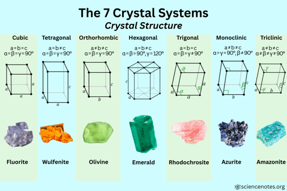
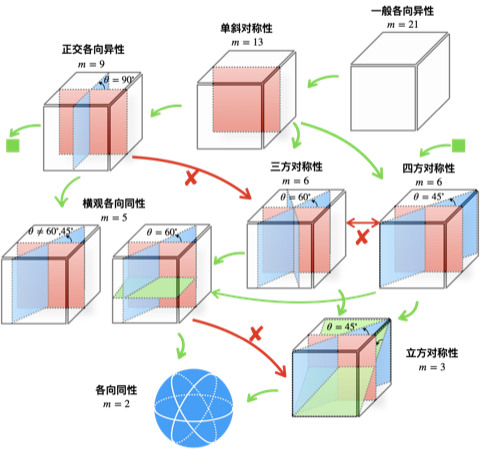

# 对称性的分类

以下将概述（1）材料（2）几何和（3）四阶张量的对称性，关于每一种对称性下这三方面的具体表述将在其它文档中单独给出。

## 材料对称性

材料的对称性考虑的是应变能密度泛函在某些对称变换下的不变性，由此降低描述材料弹性属性的独立系数数量。应变能密度泛函 $\mathcal{W}$ 是关于应变的**正定二次型泛函**：

$$
\begin{equation}
\mathcal{W}(\boldsymbol{\varepsilon}) = \frac{1}{2} \boldsymbol{\varepsilon} : \mathbb{L} : \boldsymbol{\varepsilon} > 0,
\label{eq:e_df}
\end{equation}
$$

式中，$\mathbb{L}$ 是弹性刚度张量。弹性刚度张量是一个**四阶张量**，由应变是对称张量所以**具有次对称性**，由能量泛函的二阶导数与求偏导顺序无关所以**具有主对称性**：

$$
L_{ijkl} = L_{jikl} = L_{ijlk} = L_{klij},
$$

由泛函的正定性所以**具有正定性**：

$$
\forall \eta_{ij}, \quad L_{ijkl}\eta_{ij}\eta_{kl} > 0
$$

使用 Voigt 记法将对称指标 $ij$ 压缩成 Voigt 指标 $I$：

$$
11\mapsto 1 \quad 22\mapsto 2 \quad 33\mapsto 3 \\ 
23,32\mapsto 4 \quad 13,31\mapsto 5 \quad 12,21\mapsto 6
$$

该记法下刚度张量是 `6x6` 的**对称矩阵**，记作

$$
\begin{equation}
\big\{ \mathbb{L} \big\}
= \begin{pmatrix}
L_{11} & L_{12} & L_{13} & L_{14} & L_{15} & L_{16} \\
       & L_{22} & L_{23} & L_{24} & L_{25} & L_{26} \\
       &        & L_{33} & L_{34} & L_{35} & L_{36} \\
       &        &        & L_{44} & L_{45} & L_{46} \\
       &        &        &        & L_{55} & L_{56} \\
       &        &        &        &        & L_{66} \\
\end{pmatrix}
\label{eq:lmat}
\end{equation}
$$

此时应变能密度泛函写成分量形式为

$$
\begin{equation}
\left.\begin{array}{r}
\mathcal{W}\left(\varepsilon_{\alpha \beta}\right)=L_{11} \varepsilon_1^2 / 2+L_{12} \varepsilon_1 \varepsilon_2 +L_{13} \varepsilon_1 \varepsilon_3+L_{14} \varepsilon_1 \varepsilon_4+L_{15} \varepsilon_1 \varepsilon_5+L_{16} \varepsilon_1 \varepsilon_6 \\
+L_{22} \varepsilon_2^2 / 2+L_{23} \varepsilon_2 \varepsilon_3+L_{24} \varepsilon_2 \varepsilon_4+L_{25} \varepsilon_2 \varepsilon_5+L_{26} \varepsilon_2 \varepsilon_6 \\
+L_{33} \varepsilon_3^2 / 2+L_{34} \varepsilon_3 \varepsilon_4+L_{35} \varepsilon_3 \varepsilon_5+L_{36} \varepsilon_3 \varepsilon_6 \\
+L_{44} \varepsilon_4^2 / 2+L_{45} \varepsilon_4 \varepsilon_5+L_{46} \varepsilon_4 \varepsilon_6 \\
+L_{55} \varepsilon_5^2 / 2+L_{56} \varepsilon_5 \varepsilon_6 \\
+L_{66} \varepsilon_6^2 / 2
\end{array}\right\}
\label{eq:strain_energy}
\end{equation}
$$

因此，对于最一般的各向异性材料，弹性刚度矩阵**独立系数个数为 21**。刚度矩阵独立系数的数量可根据材料的对称性进一步减少，这可以通过应变能密度泛函 $\eqref{eq:strain_energy}$ 在指定变换群下保持不变得到。材料对称性和对应的独立系数数量按照对称性从小到大的顺序列表如下：

| 材料对称性                             | 独立系数数量 | 晶系                     | 对称群            | 晶格       |
| -------------------------------------- | ------------ | ------------------------ | ----------------- | ---------- |
| 一般各向异性（anisotropic）            | 21           | 三斜晶系（triclinic）    | $\mathsf{C_{i}}$  | P          |
| 单斜对称性（monoclinic）               | 13           | 单斜晶系（monoclinic）   | $\mathsf{C_{2h}}$ | P，S       |
| 正交各向异性（orthotropic）            | 9            | 正交晶系（orthorhombic） | $\mathsf{D_{2h}}$ | P，S，I，F |
| 四方对称性（tetragonal）               | 6            | 四方晶系（tetragonal）   | $\mathsf{D_{4h}}$ | P，I       |
| 三方对称性（trigonal）                 | 6            | 六方晶系（hexagonal）    | $\mathsf{D_{6h}}$ | P          |
| 横观各向同性（transversely isotropic） | 5            | -                        | -                 | -          |
| 立方对称性（cubic）                    | 3            | 立方晶系（cubic）        | $\mathsf{O_{h}}$  | P，I，F    |
| 各向同性（isotropic）                  | 2            | -                        | -                 | -          |

## 几何对称性

由上述列表可以看到，在描述材料对称性时，用到许多晶系的概念（比如单斜对称性，四方对称性等），但也有一些力学中特有的对称性（比如横观各向同性）。这是因为描述材料对称性的变换（旋转，镜像，反演等）最早用于描述晶体的对称性，并且由后文中的 Cowin-Mehrabadi 定理，材料对称性可以**等价地**用空间中一组对称面描述。这一部分将重点关注与力学中材料对称性高度相关的晶系和晶格的概念，用以构造用于实现某种宏观材料对称性的单胞。

### 晶系

在给定三维空间中互不重合的一组晶矢 $(\boldsymbol{a}, \boldsymbol{b}, \boldsymbol{c})$ 之后，就能确定能够密铺整个空间的单元，也称为单胞。单胞的几何尺寸，依据晶体学的惯例，可以等价地用三个边的边长 $(a,b,c)$ 和三边之间的夹角 $(\alpha,\beta,\gamma)$ 进行描述，如图所示

在笛卡尔坐标系下，三维空间中从坐标 $\boldsymbol{x}$ 到 $\boldsymbol{x}^\prime$ 的变换可以描述为

$$
\boldsymbol{x}^{\prime} = \boldsymbol{Q} \boldsymbol{x} + \boldsymbol{x}^{0},
$$

式中，$\boldsymbol{Q}$ 是正交矩阵，其行列式取值为 $\pm1$，当为正值时为旋转变换，特别的 $\boldsymbol{Q} = \boldsymbol{I}$ 为恒等变换；当行列式取值为 $-1$ 时为反射变换，特别的 $\boldsymbol{Q} = -\boldsymbol{I}$ 为中心反演变换。$\boldsymbol{x}^{0}$ 是平移变换。一般的，上述七种晶系在只考虑旋转和反射时，可以继续区分为 32 种点群；再考虑平移之后又可以分类为 230 种空间群。然而，式 $\eqref{eq:e_df}$ 给出的二次型能量泛函形式对于中心反演变换 $\boldsymbol{Q} = -\boldsymbol{I}$ 总是不变的，这将大部分区分手性和极性的点群排除在外，只保留对称性较高的点群，如上表所示。

横观各向同性一般用来描述层状结构或纤维增强型材料，没有与之直接对应的晶系。后文的 C-M 定理显示，如果在六方晶系中增加一个对称面，垂直于其它三个对称面，此时等价地材料对称性即为横观各向同性。

晶系中同样不包含各向同性，这是因为能够密铺整个三维空间的晶系最多只有一重（$180^\circ$）、二重（$90^\circ$）、三重（$60^\circ$）、四重（$45^\circ$）和六重（$30^\circ$）对称面，而根据 C-M 定理，各向同性要求含有其它角度的对称面，因此晶系能够达到最高的对称性是**立方对称**。

### 晶格

晶系确定了空间中阵列重复单元的尺寸，还需要给出晶系的格点位置才能确定晶体结构。晶体点阵可作如下分类：

1. **简单格子（P）**：晶胞仅在 8 个顶点处有点阵点
2. **底心格子（A/B/C）**：除了顶点，在晶胞的一对相对面上各有一个点阵点
3. **体心格子（I）**除了顶点，在晶胞的正中心有一个点阵点
4. **面心格子（F）**除了顶点，在晶胞的 6 个面上各有一个点阵点

在排除因对称性重复的点阵结构之后，7 种晶系又可以分类为 14 种晶格，又称布拉维晶格，在表中给出。

### 几何与材料对称性的关联

这一部分关心的问题是：在给定单胞结构之后，如何确定均质化之后宏观弹性刚度张量（或影响张量）的对称性？Ting 通过 Cowin-Mehrabadi 定理，给出材料对称性与一组对称面集合（集合中对称面数量是有限的）之间完整且等价的表述。如果单胞满足相应的几何对称性，同时组分的材料对称性设置为各向同性，那么单胞在均质化之后得到的宏观弹性刚度张量应具有和几何相当的对称性。以下总结了为获取指定的材料对称性，单胞所需要具有的几何对称面：

一些必要的评注：

1. 图中列举的材料对称性按照从低到高的顺序排列，最低为一般各向异性，没有对称平面，最高为各向同性，每一个平面都是对称平面
2. 图中 $m$ 是材料的独立系数个数，$\theta$ 是对称平面之间的夹角
3. 图中标注的是使得单胞符合某种对称性的**最小数量**的对称平面，单胞仍可能有图中给出之外其它的对称面。例如正交各向异性只标注了两个相互垂直的对称平面，这时能自然得到第三个和前两者相互垂直的平面也是对称平面
4. 图中从 A 指向 B 的绿色箭头表示：B 在 A 的基础上额外增加了对称平面，因此是 A 的特例，或者说 B 继承了 A。而红色箭头则表示两个材料之间没有继承关系。并不是独立系数少的材料类就能用多的材料类降级表示，例如具有立方对称性的材料只有 3 个独立系数，而横观各向同性有 5 个独立系数，但除非立方对称的剪切模量 $\mu=\mu^{\prime}$（此时为各向同性），否则就不具有横观各向同性面。

## 四阶张量的对称性

如前所述，弹性刚度张量可通过材料对称性，在给定（材料）坐标系下减少独立系数的数目。一般的，对满足某一对称性的四阶张量，在指定坐标系下，可通过一组数量为 $M$ 线性无关的四阶张量基 $\{ \mathbb{E}_{i} \}$ 表示，因此张量 $\mathbb{A}$ 同构于长度为 $M$ 的数组 $\mathsf{A}$

$$
\mathbb{A} = \sum_{i=1}^{M} a_{i} \mathbb{E}_{i}, \quad
\mathbb{A} \cong \mathsf{A} \triangleq \begin{pmatrix}
a_{1} & a_{2} & \cdots & a_{M}
\end{pmatrix}.
$$

恰当的选取张量基 $\{ \mathbb{E}_{i} \}$，能够将四阶张量之间的双点积运算大大简化，这有助于将矩阵形式的影响张量恒等式转化为数目更少的影响系数恒等式。在其它对某一指定对称性的讨论中，将给出如下内容：

1. 构造基底，以及基底之间双点积运算表
2. 给出四阶张量的表示，以及系数的计算方法
3. 建立同构于张量双点积和求逆的运算公式
4. 指定具体的坐标系，给出基底、弹性刚度和柔度张量的矩阵表示。

## 更新日志

### 2026/07/24

1. 邱俊淞创建了文档 `对称性的分类.md`
