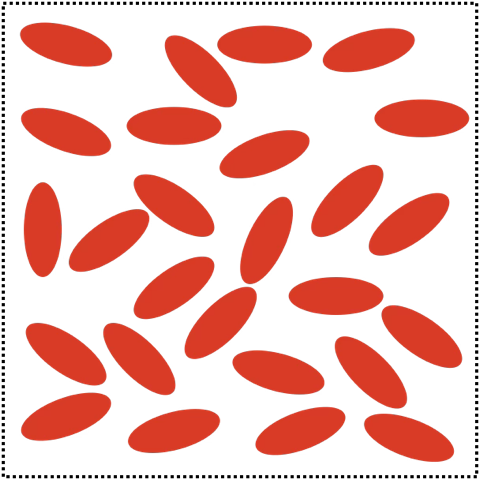
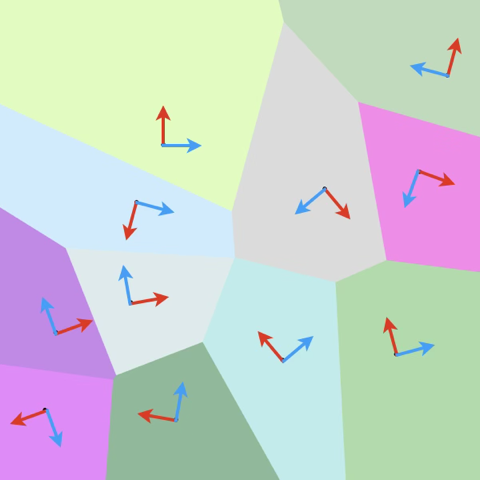

# 一般各向异性

一般各向异性又称为三斜对称性。

## 几何构型

三斜对称性无任何的对称平面，对应的几何构型有

**三斜晶系 UC**

其中，$a\neq b \neq c$，$\alpha\neq \beta \neq \gamma$。

**夹杂朝向随机的 RVE**

**晶粒材料坐标系随机分布的 RVE**

## 材料属性

### 弹性刚度张量

材料的弹性刚度张量由应变能密度泛函 $\mathcal{W}$ 给出，它是关于应变的**正定二次型泛函**：

$$
\mathcal{W}(\boldsymbol{\varepsilon}) = \frac{1}{2} \boldsymbol{\varepsilon} : \mathbb{L} : \boldsymbol{\varepsilon} > 0,
$$

因此，弹性刚度张量是一个**四阶张量**，由应变是对称张量所以**具有次对称性**，由能量泛函的二阶导数与求偏导顺序无关所以**具有主对称性**，由泛函的正定性所以**具有正定性**。使用 Voigt 记法将对称指标 $ij$ 压缩成 Voigt 指标 $I$：

$$
11\mapsto 1 \quad 22\mapsto 2 \quad 33\mapsto 3 \\ 
23,32\mapsto 4 \quad 13,31\mapsto 5 \quad 12,21\mapsto 6
$$

该记法下刚度张量是 `6x6` 的**对称矩阵**，记作

$$
\begin{equation}
\big\{ \mathbb{L} \big\}
= \begin{pmatrix}
L_{11} & L_{12} & L_{13} & L_{14} & L_{15} & L_{16} \\
       & L_{22} & L_{23} & L_{24} & L_{25} & L_{26} \\
       &        & L_{33} & L_{34} & L_{35} & L_{36} \\
       &        &        & L_{44} & L_{45} & L_{46} \\
       &        &        &        & L_{55} & L_{56} \\
       &        &        &        &        & L_{66} \\
\end{pmatrix}
\label{eq:lmat}
\end{equation}
$$

此时应变能密度泛函写成分量形式为

$$
\begin{equation}
\left.\begin{array}{r}
\mathcal{W}\left(\varepsilon_{\alpha \beta}\right)=L_{11} \varepsilon_1^2 / 2+L_{12} \varepsilon_1 \varepsilon_2 +L_{13} \varepsilon_1 \varepsilon_3+L_{14} \varepsilon_1 \varepsilon_4+L_{15} \varepsilon_1 \varepsilon_5+L_{16} \varepsilon_1 \varepsilon_6 \\
+L_{22} \varepsilon_2^2 / 2+L_{23} \varepsilon_2 \varepsilon_3+L_{24} \varepsilon_2 \varepsilon_4+L_{25} \varepsilon_2 \varepsilon_5+L_{26} \varepsilon_2 \varepsilon_6 \\
+L_{33} \varepsilon_3^2 / 2+L_{34} \varepsilon_3 \varepsilon_4+L_{35} \varepsilon_3 \varepsilon_5+L_{36} \varepsilon_3 \varepsilon_6 \\
+L_{44} \varepsilon_4^2 / 2+L_{45} \varepsilon_4 \varepsilon_5+L_{46} \varepsilon_4 \varepsilon_6 \\
+L_{55} \varepsilon_5^2 / 2+L_{56} \varepsilon_5 \varepsilon_6 \\
+L_{66} \varepsilon_6^2 / 2
\end{array}\right\}
\label{eq:strain_energy}
\end{equation}
$$

因此，对于最一般的三斜对称性（也即没有对称性），弹性刚度矩阵**独立系数个数为 21**。刚度矩阵独立系数的数量可根据材料的对称性进一步减少，这可以通过应变能密度泛函 $\eqref{eq:strain_energy}$ 在指定变换群下保持不变得到。

## 更新日志

### 2026/07/24

1. 邱俊淞创建了文档 `一般各向异性.md`
