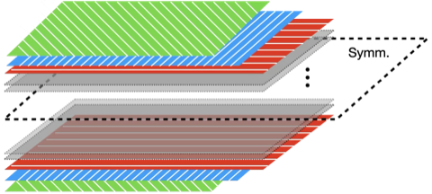

# 单斜对称性

## 几何构型

单斜晶系在空间中具有一个对称面。

**具有一个对称平面的层合板**

**单斜晶胞**

包含 mP 和 mS 两种晶胞构型：

## 材料属性

设材料对称面的法向量 $\boldsymbol{n}$ 沿 $x_{1}$ 方向，如图所示

得到 Voigt 矩阵化的弹性刚度矩阵 $\big\{ \mathbb{L} \big\}$ 为

$$
\big\{ \mathbb{L} \big\} = \begin{pmatrix}
L_{11} & L_{12} & L_{13} & L_{14} & 0      & 0      \\
       & L_{22} & L_{23} & L_{24} & 0      & 0      \\
       &        & L_{33} & L_{34} & 0      & 0      \\
       &        &        & L_{44} & 0      & 0      \\
       &        &        &        & L_{55} & L_{56} \\
       &        &        &        &        & L_{66} \\
\end{pmatrix}
$$

## 更新日志

### 2026/07/24

1. 创建了文档 `单斜对称性.md`
