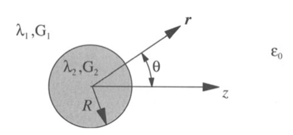
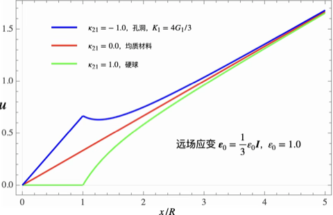
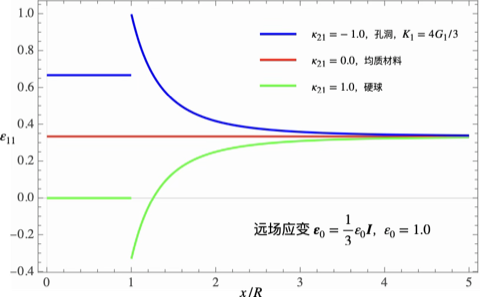
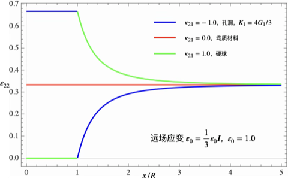
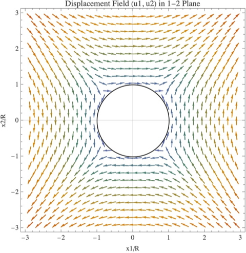
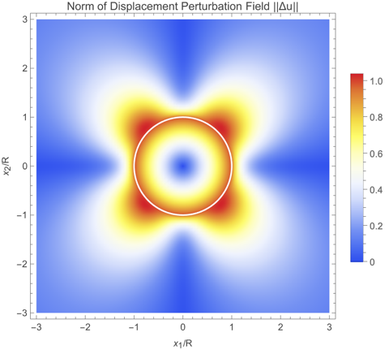
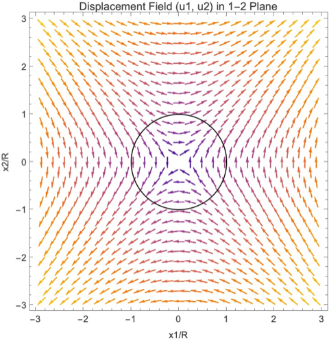
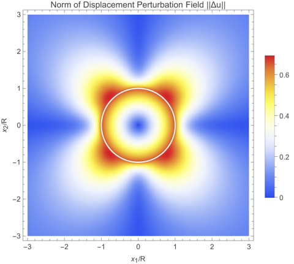
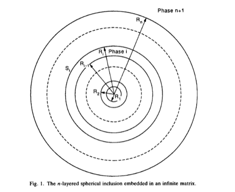

# 圆球异质

这篇文档给出圆球异质问题内部和外部位移和应变场的解析解。圆球异质的解又称为 Kelvin 解，远在 Eshelby 处理更一般的椭球夹杂问题之前就已经给出。这一特殊形式的解可以对夹杂问题位移和应变场在远场处的衰减性质有更具体的理解。

## 双相圆球异质

### 问题设置

考虑图中的圆球异质，在远场处施加的应变大小为 $\boldsymbol{\varepsilon}_{0}$。圆球的拉梅常数为 $\lambda_{1}$ 和 $G_{1}$，外部无穷大的弹性介质的拉梅常数为 $\lambda_{2}$ 和 $G_{2}$。

需要求解如下 Navier 方程：

$$
\begin{equation}
\begin{aligned}
(\lambda_{1} + G_{1}) \nabla (\nabla\cdot\boldsymbol{u}) + G_{1} \nabla^2\boldsymbol{u} = \boldsymbol{0}, \quad r\geq R \\
(\lambda_{2} + G_{2}) \nabla (\nabla\cdot\boldsymbol{u}) + G_{2} \nabla^2\boldsymbol{u} = \boldsymbol{0}, \quad r\leq R
\end{aligned}
\label{eq:biharm}
\end{equation}
$$

并满足如下在界面和远场处的边界条件：

$$
\begin{cases}
\boldsymbol{u}^{+} = \boldsymbol{u}^{-}, & r=R\\
\boldsymbol{\sigma}^{+} \cdot \boldsymbol{n}^{+} + \boldsymbol{\sigma}^{-} \cdot \boldsymbol{n}^{-} = \boldsymbol{0}, & r=R\\
\boldsymbol{u} = \boldsymbol{\varepsilon}_{0} \cdot \boldsymbol{r}, & \boldsymbol{r}\to \infty
\end{cases}
$$

以下分别考虑远场应变为静水压力和偏应变进行讨论。

### 远场应变为静水压力

考虑远场应变为

$$
\boldsymbol{\varepsilon}_{0} = \frac{1}{3}\varepsilon_{0} \boldsymbol{I},
$$

此时内部的位移场应具有球对称性，其内部和外部的解的形式可以假设为在背景应变场 $\boldsymbol{\varepsilon}_{0}$ 之外额外加入一个扰动场 ：

$$
\begin{equation}
\boldsymbol{u} = \boldsymbol{\varepsilon}_{0}\cdot\boldsymbol{r} +  \begin{cases}
B \boldsymbol{\varepsilon}_{0} \cdot\boldsymbol{r}, & r \leq R \\
A \boldsymbol{\varepsilon}_{0} \cdot \nabla \dfrac{1}{r}, & r \geq R
\end{cases}
\label{eq:A}
\end{equation}
$$

注意到圆球异质之外的位移场恰好对应于 Papkovich-Neuber 通解中要求选择的两个调和函数分别为 $\boldsymbol{r}$ 和 $1/r$，并且该解满足远场边界条件。待定系数可通过界面处位移连续和应力相同条件给出：

$$
\begin{gathered}
\boldsymbol{u}^{-} = \frac{1}{3}\varepsilon_{0}(1+B)\boldsymbol{R}, \quad
\boldsymbol{u}^{+} = \frac{1}{3}\varepsilon_{0}(1-A/R^3)\boldsymbol{R} \\
\boldsymbol{\sigma}^{-} \cdot \boldsymbol{n} = (1+B) K_{2}\varepsilon_{0} \boldsymbol{n}, \quad
\boldsymbol{\sigma}^{+} \cdot \boldsymbol{n} = \big( K_{1} + \frac{4A}{3R^3}G_{1} \big)\varepsilon_{0}\boldsymbol{n}
\end{gathered}
$$

由此求解得到 $A$，$B$ 取值为

$$
A = \kappa_{21} R^{3}, \quad 
B = -\kappa_{21}, \quad \text{where } \kappa_{21} \triangleq \frac{( K_{2}-K_{1} )}{K_{2}+4G_{1}/3}.
$$

代入式 $\eqref{eq:A}$ 中，并根据 $\nabla r^{-1} = -\boldsymbol{r}/r^{3}$ 得到

$$
\begin{equation}
\boldsymbol{u} =  \begin{cases}
\boldsymbol{\varepsilon}_{0}\cdot\boldsymbol{r} - \kappa_{21} \boldsymbol{\varepsilon}_{0} \cdot\boldsymbol{r}, & r \leq R \\
\boldsymbol{\varepsilon}_{0}\cdot\boldsymbol{r} - \kappa_{21} \boldsymbol{\varepsilon}_{0} \cdot\boldsymbol{r} \Big( \dfrac{R}{r} \Big)^3, & r > R
\end{cases}
\label{eq:B}
\end{equation}
$$

对应的应变场表达式为

$$
\begin{equation}
\boldsymbol{\varepsilon} = \begin{cases}
\boldsymbol{\varepsilon}_{0} - \kappa_{21} \boldsymbol{\varepsilon}_{0}, & r\leq R \\
\boldsymbol{\varepsilon}_{0} + \kappa_{21} R^{3} \boldsymbol{\varepsilon}_{0} \cdot \dfrac{3\boldsymbol{n}\boldsymbol{n} - I}{r^{3}}, & r>R
\end{cases}
\label{eq:strain_p}
\end{equation}
$$

选取 $\varepsilon_{0} = 1$，绘制位移场与应变场沿指定方向的变化曲线如图所示

### 远场应变为偏应变

这里将双协调方程 $\eqref{eq:biharm}$ 的通解写出：

$$
\boldsymbol{u} = \begin{cases}
\boldsymbol{\varepsilon}_{0} \cdot\boldsymbol{r}
+ A\boldsymbol{\varepsilon}_{0} \cdot \nabla \Big( \dfrac{1}{r} \Big)
+ B \boldsymbol{\varepsilon}_{0} : \nabla\nabla\nabla \Big( \dfrac{1}{r} \Big)
+ C \boldsymbol{\varepsilon}_{0} : \nabla\nabla\nabla (r), & r \geq R \\
\boldsymbol{\varepsilon}_{0} \cdot\boldsymbol{r} + D \boldsymbol{\varepsilon}_{0} \cdot\boldsymbol{r}, & r \leq R
\end{cases}
$$

式中，$A,B,C,D$ 是待定系数，之后通过界面的连续性条件得到。针对剪切变形 $\trace \boldsymbol{\varepsilon}_{0} = 0$，在球核外的位移场可以作如下简化（$\varepsilon_{ij}(\delta_{ij}r_k + \delta_{ik}r_j + \delta_{jk}r_i) = 2\varepsilon_{ij}r_{j}$）：

$$
\begin{aligned}
\boldsymbol{u}
= \boldsymbol{\varepsilon}_{0} \cdot \boldsymbol{r}
&- \Big( \frac{A}{r^3} - \frac{6B}{r^5} + \frac{2C}{r^3} \Big) \boldsymbol{\varepsilon}_{0} \cdot \boldsymbol{r} \\
&+ 3 \Big( \frac{C}{r^3} - \frac{5B}{r^5} \Big) (\boldsymbol{n}\otimes\boldsymbol{n} : \boldsymbol{\varepsilon}_{0}) \boldsymbol{r}, \quad
r > R
\end{aligned}
$$

根据边界上的连续性条件，求解得到待定系数为

$$
\begin{aligned}
& A=-\frac{10 \left(G_1-G_2\right)\left(3 K_1+4 G_1\right)}{3 G_1\left(9 K_1+8 G_1\right)+18 G_2\left(K_1+2 G_1\right)}R^3, \\
& B=\frac{\left(G_1-G_2\right)\left(3 K_1+G_1\right)}{3 G_1\left(9 K_1+8 G_1\right)+18 G_2\left(K_1+2 G_1\right)}R^5, \\
& C=\frac{5 \left(G_1-G_2\right)\left(3 K_1+G_1\right)}{3 G_1\left(9 K_1+8 G_1\right)+18 G_2\left(K_1+2 G_1\right)}R^3, \\
& D=\frac{G_1-G_2}{G_2+H_1}, \quad H_1= \frac{3 K_1 / 2+4 G_1 / 3}{K_1+2 G_1} G_1
= \frac{1-S_{d}}{S_{d}} G_{1}
\end{aligned}
$$

定义极化剪切模量 $\mu_{21}$

$$
\mu_{21} = -D = \frac{G_2-G_1}{G_2+H_1}
$$

此时球核内外的应变场可以表示为

$$
\varepsilon_{i j}=\left\{ \begin{array}{l}
&\boldsymbol{\varepsilon}_{0} - \mu_{21} \boldsymbol{\varepsilon}_{0}, & r\leq R,\\
&\varepsilon^0_{i j}
+\dfrac{3 A}{2 r^3}
\Big[\mathcal{G}_{i j k l}(\boldsymbol{n})-\dfrac{2}{3} \delta_{i k} \delta_{j l}
\Big] \varepsilon_{k l}^0 \\
&\quad -\dfrac{15 B}{r^5}
\Big[\mathcal{H}_{i j k l}(\boldsymbol{n})-7 n_i n_j n_k n_l
\Big] \varepsilon_{k l}^0 \\
&\quad + \dfrac{3 C}{r^3}\big[\mathcal{H}_{i j k l}(\boldsymbol{n})-5 n_i n_j n_k n_l\big] \varepsilon_{k l}^0, & r > R,
\end{array}\right.
$$

式中，

$$
\begin{aligned}
\mathcal{G}_{i j k l}(\boldsymbol{r}) &=n_i n_l \delta_{j k}+n_j n_l \delta_{i k} \\
\mathcal{H}_{i j k l}(\boldsymbol{r}) &=n_j n_l \delta_{i k}+n_i n_l \delta_{j k}+n_k n_l \delta_{i j}+n_i n_k \delta_{j l}+n_j n_k \delta_{i l},
\end{aligned}
$$

#### 算例：液体中的刚性球

当异质为刚性球并且弹性介质是流体时 $G_2 \gg K_{1}\gg G_{1}$，待定系数等于

$$
A=\frac{5}{3}R^3, \quad
B=-\frac{1}{6}R^5, \quad
C=-\frac{5}{6}R^3, \quad
D=-1
$$

代入位移表达式中得到

$$
\boldsymbol{u} /R
= \begin{cases}
0, & x<1 \\
\boldsymbol{\varepsilon}_{0} \cdot \boldsymbol{x}- x^{-5} \boldsymbol{\varepsilon}_{0} \cdot \boldsymbol{x}
- \frac{5}{2} \Big( \frac{1}{x^3} - \frac{1}{x^5} \Big) (\boldsymbol{n}\otimes\boldsymbol{n} : \boldsymbol{\varepsilon}_{0}) \boldsymbol{x}, &
x > 1
\end{cases}
$$

此时若施加偏应变 $\boldsymbol{\varepsilon}_{0} =\varepsilon_{12}\boldsymbol{e}_{1}\otimes\boldsymbol{e}_{2}+\varepsilon_{12}\boldsymbol{e}_{2}\otimes\boldsymbol{e}_{1}$，那么位移场的表达式为

$$
\boldsymbol{u} = \begin{pmatrix}
u_1\\u_2\\u_3
\end{pmatrix}
=\begin{pmatrix}
\varepsilon_{12} x_2 \big[ 1 - x^{-5} - 5 n_1^2 (x^{-3} - x^{-5}) \big] \\
\varepsilon_{12} x_1 \big[ 1 - x^{-5} - 5 n_2^2 (x^{-3} - x^{-5}) \big] \\
\varepsilon_{12} x_3 \big[ - 5 n_1 n_2 (x^{-3} - x^{-5}) \big]
\end{pmatrix}
$$

#### 算例：液体中的气泡

当异质为孔洞时 $G_2 \ll K_{1},G_{1}$，待定系数等于

$$
A=-\frac{10 }{9}R^3, \quad
B=\frac{1}{9}R^5, \quad
C=\frac{5}{9}R^3, \quad
D=\frac{2}{3}
$$

代入位移表达式中得到

$$
\boldsymbol{u} /R
= \begin{cases}
\boldsymbol{\varepsilon}_{0} \cdot\boldsymbol{r} + \frac{2}{3} \boldsymbol{\varepsilon}_{0} \cdot\boldsymbol{r},, & x<1 \\
\boldsymbol{\varepsilon}_{0} \cdot \boldsymbol{x} + \frac{2}{3} x^{-5} \boldsymbol{\varepsilon}_{0} \cdot \boldsymbol{x}
+ \frac{5}{3} \Big( \frac{1}{x^3} - \frac{1}{x^5} \Big) (\boldsymbol{n}\otimes\boldsymbol{n} : \boldsymbol{\varepsilon}_{0}) \boldsymbol{x}, &
x > 1
\end{cases}
$$

此时若施加偏应变 $\boldsymbol{\varepsilon}_{0} =\varepsilon_{12}\boldsymbol{e}_{1}\otimes\boldsymbol{e}_{2}+\varepsilon_{12}\boldsymbol{e}_{2}\otimes\boldsymbol{e}_{1}$，那么位移场的表达式为

$$
\boldsymbol{u} = \begin{pmatrix}
u_1\\u_2\\u_3
\end{pmatrix}
=\begin{pmatrix}
\varepsilon_{12} x_2 \big[ 1 + \frac{2}{3} x^{-5} + \frac{10}{3} n_1^2 (x^{-3} - x^{-5}) \big] \\
\varepsilon_{12} x_1 \big[ 1 + \frac{2}{3} x^{-5} + \frac{10}{3} n_2^2 (x^{-3} - x^{-5}) \big] \\
\varepsilon_{12} x_3 \big[ \frac{10}{3} n_1 n_2 (x^{-3} - x^{-5}) \big]
\end{pmatrix}
$$

## 多相圆球异质

Herve 和 Zaodi（1993）给出多相材质不同的球壳在均匀应变或应力（远场）边界条件下的位移场解析表达式。上述双相圆球在均匀应变边界条件下的解可以看作是该模型的特殊情况。

### 几何描述

### 远场应变（应力）为静水张量

**均匀应变边界条件**设置为

$$
\boldsymbol{\varepsilon}^{(n+1)} = \frac{1}{3}\varepsilon_{0} \boldsymbol{I},
$$

而**均匀应力边界条件**设置为

$$
\boldsymbol{\sigma}^{(n+1)} = -p_{0} \boldsymbol{I}.
$$

类似的，设置第 $i$ 层球壳内的位移场 $\boldsymbol{u}^{(i)}$ 解的形式如下：

$$
\boldsymbol{u}^{(i)} = A_{i} \nabla \dfrac{1}{r} + B_{i} \boldsymbol{r},
$$

式中，$B_{i}$ 和 $A_{i}$ 是标量值的待定系数，由每一层球壳之间的连续性条件确定。第 $i$ 层球壳的应变场 $\boldsymbol{\varepsilon}^{(i)}$ 和应力场 $\boldsymbol{\sigma}^{(i)}$ 为

$$
\boldsymbol{\varepsilon}^{(i)} = B_{i} \boldsymbol{I} + \frac{A_{i}}{r^3} \big( 3\boldsymbol{n}\otimes \boldsymbol{n} - \boldsymbol{I} \big), \quad
\boldsymbol{\sigma}^{(i)} =3K_{i} B_{i} \boldsymbol{I} + \frac{2\mu_{i} A_{i}}{r^3} \big( 3\boldsymbol{n}\otimes \boldsymbol{n} - \boldsymbol{I} \big),
$$

其中应用了如下公式：

$$
\left\{\begin{aligned}
&\nabla \|\boldsymbol{r}\|^{-n} = -n \|\boldsymbol{r}\|^{-(n+1)}\hat{\boldsymbol{r}}, \\
&\nabla^{2} \|\boldsymbol{r}\|^{-n}
= n(n-1) \| \boldsymbol{r} \|^{-(n+2)}, \\
&\nabla\nabla\Big( \frac{1}{r} \Big) 
= \frac{3\boldsymbol{n}\otimes\boldsymbol{n}-\boldsymbol{I}}{r^{3}}, \\
\end{aligned}\right.\quad\quad
\left\{\begin{aligned}
&\mathbb{H}_{v} : \boldsymbol{I} = 3\boldsymbol{I}, \\
&\mathbb{H}_{d} : \boldsymbol{\varepsilon}^{\mathrm{dev}} = \boldsymbol{\varepsilon}^{\mathrm{dev}}, \\
&\mathbb{H}_{v} : \boldsymbol{\varepsilon}^\mathrm{dev} = \mathbb{H}_{d} : \boldsymbol{I} = \boldsymbol{0}.
\end{aligned}\right.
$$

位移和应力的连续性条件分别为

$$
\big( \boldsymbol{u}^{(i+1)} - \boldsymbol{u}^{(i)} \big)|_{S_{i}} = \boldsymbol{0}, \quad 
\boldsymbol{n} \cdot \big( \boldsymbol{\sigma}^{(i+1)} - \boldsymbol{\sigma}^{(i)} \big)|_{S_{i}} = \boldsymbol{0}.
$$

如果定义 $2\times 2$ 矩阵 $\boldsymbol{\mathsf{J}}_{i}$，包含该材料相的半径和模量参数，以及待确定的参数向量 $\boldsymbol{\mathsf{v}}_{i}$

$$
\boldsymbol{\mathsf{J}}_{i}(r) \triangleq \begin{pmatrix}
r & -1/r^{2} \\ 3K_{i} & 4\mu_{i}/r^{3}
\end{pmatrix}, \quad
\boldsymbol{\mathsf{v}}_{i} \triangleq \begin{pmatrix}
B_{i} \\ A_{i}
\end{pmatrix},
$$

那么连续性条件可以表示为

$$
\boldsymbol{\mathsf{J}}_{i}(R_{i}) \boldsymbol{\mathsf{v}}_{i}
= \boldsymbol{\mathsf{J}}_{i+1}(R_{i}) \boldsymbol{\mathsf{v}}_{i+1},\quad
i=1,2,\cdots,n
$$

因此有

$$
\boldsymbol{\mathsf{v}}_{i+1}
= \boldsymbol{\mathsf{N}}_{i}\boldsymbol{\mathsf{v}}_{i},\quad i=1,2,\cdots,n\\
\boldsymbol{\mathsf{N}}_{i} \triangleq \boldsymbol{\mathsf{J}}_{i+1}^{-1}(R_{i}) \boldsymbol{\mathsf{J}}_{i}(R_{i})= \frac{1}{3K_{i+1}+4\mu_{i+1}}\begin{pmatrix}
3K_i+4\mu_{i+1} & 4(\mu_i-\mu_{i+1})/R_i^3 \\
3R_i^3(K_i-K_{i+1}) & 3K_{i+1}+4\mu_i
\end{pmatrix}.
$$

远场系数 $\boldsymbol{\mathsf{v}}_{n+1}$ 与球核中心系数 $\boldsymbol{\mathsf{v}}_{1}$ 之间的关系是

$$
\boldsymbol{\mathsf{v}}_{n+1} = \Big( \prod_{k=n}^{1} \boldsymbol{\mathsf{N}}_{k} \Big) \boldsymbol{\mathsf{v}}_{1},
$$

并且，已经知道了头尾系数的结果：

$$
A_{1} = 0, \quad B_{n+1} = \begin{cases}
\varepsilon_{0}/3 & \text{uniform  strain},\\
-p_{0}/3K_{n+1}   & \text{uniform  stress},
\end{cases}
$$

通过上述方程继续确定 $A_{n+1}$ 或 $B_{1}$，进而就可以获得所有的系数。

### 远场应变（应力）为偏张量

设置远场应力和应变条件为 $\boldsymbol{\sigma}_{0}$ 或 $\boldsymbol{\varepsilon}_{0}$，均为偏张量：

$$
\trace \boldsymbol{\sigma}_{0} = 0 \text{ or } \trace \boldsymbol{\varepsilon}_{0} = 0.
$$

一般的，使用偏张量 $\boldsymbol{s}_{0}$ 表示上述两种边界条件的某一种。使用双协调方程，假设位移场具有如下函数形式：

$$
\boldsymbol{u}^{(i)} = 
  A_{i} \boldsymbol{s}_{0} \cdot \nabla \Big( \dfrac{1}{r} \Big)
+ B_{i} \boldsymbol{s}_{0} : \nabla\nabla\nabla \Big( \dfrac{1}{r} \Big)
+ C_{i} \boldsymbol{s}_{0} : \nabla\nabla\nabla (r)
+ D_{i} \boldsymbol{s}_{0} \cdot\boldsymbol{r},
$$

由于 $\trace \boldsymbol{s}_{0}=0$，上述位移场方程可进一步简化为

$$
\boldsymbol{u}^{(i)}
= \alpha(r)\boldsymbol{s}_{0} \cdot \boldsymbol{r}
+ \beta(r) q \boldsymbol{r}, \\
\alpha(r) = D_{i} -\frac{A_{i}}{r^3} + \frac{6B_{i}}{r^5} - \frac{2C_{i}}{r^3}, \quad
\beta(r) = \frac{3C_{i}}{r^3} - \frac{15B_{i}}{r^5}, \quad
q = \boldsymbol{n}\otimes\boldsymbol{n} : \boldsymbol{s}_{0}
$$

第 $i$ 层球壳的应变场 $\boldsymbol{\varepsilon}^{(i)}$ 和应力场 $\boldsymbol{\sigma}^{(i)}$ 为

$$
\boldsymbol{\varepsilon}^{(i)}
= \frac{1}{3}(r\beta'+\beta)q \boldsymbol{I}
+ \alpha\boldsymbol{s}_{0}
+ \frac{1}{3}(r\beta'-2\beta)q \boldsymbol{t}
+ (r\alpha' + 2\beta) \mathrm{symm}\,[\boldsymbol{n}\otimes\boldsymbol{n}\cdot\boldsymbol{s}_{0}], \\
\begin{aligned}
\boldsymbol{\sigma}^{(i)}
&= \Big(  K_{i}(r\beta'+\beta) + K_{i}(r\alpha' + 2\beta)
- \frac{2}{3}\mu_{i}(r\alpha' + 2\beta) \Big)
q\boldsymbol{I}\\
&+ 2\mu_{i}\alpha \boldsymbol{s}_{0}
+ \frac{2}{3}\mu_{i} (r\beta'-2\beta)q \boldsymbol{t}+ 2\mu_{i} (r\alpha' + 2\beta)\mathrm{symm}\,[\boldsymbol{n}\otimes\boldsymbol{n}\cdot\boldsymbol{s}_{0}]
\end{aligned}
$$

应用连续性条件，得到方程组为

$$
\begin{pmatrix}
-1/R_{i}^{3} & 6/R_{i}^{5} & -2/R_{i}^{3} & 1 \\
0 & -15/R_{i}^{5} & 3/R_{i}^{3} & 0 \\
(3K_{i+1}+\mu_{i+1})/R_{i}^{3} & 120\mu_{i+1}/R_{i}^{5} & (6K_{i+1} - 16\mu_{i+1})/R_{i}^{3} & 0\\
\mu_{i+1}/R_{i}^{3} & -48\mu_{i+1}/R_{i}^{5} & 8\mu_{i+1}/R_{i}^{3} & 2\mu_{i+1}
\end{pmatrix}^{-1}
\begin{pmatrix}
-1/R_{i}^{3} & 6/R_{i}^{5} & -2/R_{i}^{3} & 1 \\
0 & -15/R_{i}^{5} & 3/R_{i}^{3} & 0 \\
(3K_{i}+\mu_{i})/R_{i}^{3} & 120\mu_{i}/R_{i}^{5} & (6K_{i} - 16\mu_i{})/R_{i}^{3} & 0\\
\mu_{i}/R_{i}^{3} & -48\mu_{i}/R_{i}^{5} & 8\mu_{i}/R_{i}^{3} & 2\mu_{i}
\end{pmatrix}
\begin{pmatrix}
A_{i} \\ B_{i} \\ C_{i} \\ D_{i}
\end{pmatrix}
= \begin{pmatrix}
A_{i+1} \\ B_{i+1} \\ C_{i+1} \\ D_{i+1}
\end{pmatrix}
$$

$$
\begin{aligned}
\boldsymbol{\sigma}^{(i)} \cdot \boldsymbol{n}
&= \Big(  K_{i}(r\beta'+\beta) + K_{i}(r\alpha' + 2\beta)
+ \frac{1}{3}\mu_{i}(r\alpha' + 2\beta) 
+ \frac{4}{3}\mu_{i} (r\beta'-2\beta)
\Big) q\boldsymbol{n}\\
&+ \big( 2\mu_{i}\alpha + \mu_{i} (r\alpha' + 2\beta) \big)
\boldsymbol{s}_{0}\cdot\boldsymbol{n}
\end{aligned}
$$

$$
\begin{pmatrix}
 \dfrac{1}{3} \left(\dfrac{\mu _i}{\mu _{i+1}}+2\right) & \dfrac{16 \left(\mu _{i+1}-\mu _i\right)}{\mu _{i+1} R_i^2} & \dfrac{8}{3} \left(\dfrac{\mu _i}{\mu _{i+1}}-1\right) & \dfrac{2
   \left(\mu _i-\mu _{i+1}\right) R_i^3}{3 \mu _{i+1}} \\
 \dfrac{R_i^2 \left(\mu _{i+1} \left(9 K_i+2 \mu _i-2 \mu _{i+1}\right)-3 K_{i+1} \left(\mu _i+2 \mu _{i+1}\right)\right)}{30 \mu _{i+1} \left(3 K_{i+1}+4 \mu _{i+1}\right)} &
   \dfrac{1}{5} \left(\dfrac{9 \left(3 K_{i+1}+4 \mu _i\right)}{3 K_{i+1}+4 \mu _{i+1}}+\dfrac{8 \mu _i}{\mu _{i+1}}-12\right) & \dfrac{R_i^2 \left(9 K_i \mu _{i+1}+3 K_{i+1}
   \left(\mu _{i+1}-4 \mu _i\right)+28 \left(\mu _{i+1}-\mu _i\right) \mu _{i+1}\right)}{15 \mu _{i+1} \left(3 K_{i+1}+4 \mu _{i+1}\right)} & \dfrac{\left(\mu _{i+1}-\mu _i\right)
   R_i^5 \left(3 K_{i+1}+\mu _{i+1}\right)}{15 \mu _{i+1} \left(3 K_{i+1}+4 \mu _{i+1}\right)} \\
 \dfrac{\mu _{i+1} \left(9 K_i+2 \mu _i-2 \mu _{i+1}\right)-3 K_{i+1} \left(\mu _i+2 \mu _{i+1}\right)}{6 \mu _{i+1} \left(3 K_{i+1}+4 \mu _{i+1}\right)} & \dfrac{4 \left(\mu _i-\mu
   _{i+1}\right) \left(6 K_{i+1}+17 \mu _{i+1}\right)}{\mu _{i+1} R_i^2 \left(3 K_{i+1}+4 \mu _{i+1}\right)} & \dfrac{3 K_i-6 K_{i+1}-4 \mu _i}{3 K_{i+1}+4 \mu _{i+1}}-\dfrac{4 \mu
   _i}{3 \mu _{i+1}}+\dfrac{10}{3} & \dfrac{\left(\mu _{i+1}-\mu _i\right) R_i^3 \left(3 K_{i+1}+\mu _{i+1}\right)}{3 \mu _{i+1} \left(3 K_{i+1}+4 \mu _{i+1}\right)} \\
 \dfrac{3 K_{i+1} \left(\mu _i-3 \mu _{i+1}\right)+6 K_i \mu _{i+1}+8 \left(\mu _i-\mu _{i+1}\right) \mu _{i+1}}{5 \mu _{i+1} R_i^3 \left(3 K_{i+1}+4 \mu _{i+1}\right)} & -\dfrac{48
   \left(\mu _i-\mu _{i+1}\right) \left(3 K_{i+1}+\mu _{i+1}\right)}{5 \mu _{i+1} R_i^5 \left(3 K_{i+1}+4 \mu _{i+1}\right)} & \dfrac{4 \left(K_{i+1} \left(6 \mu _i-9 \mu
   _{i+1}\right)+\mu _{i+1} \left(3 K_i+4 \mu _i-4 \mu _{i+1}\right)\right)}{5 \mu _{i+1} R_i^3 \left(3 K_{i+1}+4 \mu _{i+1}\right)} & \dfrac{1}{5} \left(\dfrac{3 K_{i+1}+4 \mu
   _i}{3 K_{i+1}+4 \mu _{i+1}}+\dfrac{2 \mu _i}{\mu _{i+1}}+2\right) \\
\end{pmatrix}
$$

## 更新日志

### 2026/07/24

1. 创建了文档 `圆球异质.md`。其中**多相圆球异质**推导未完成。
