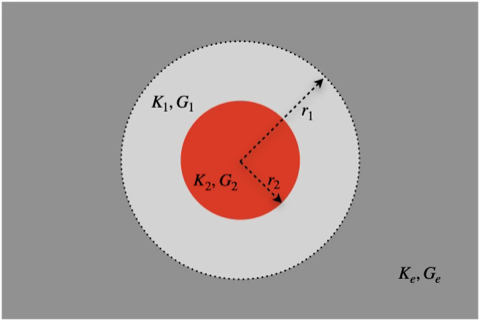
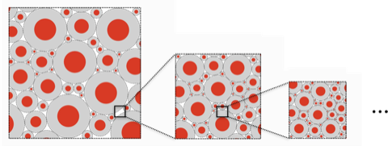

# 复合胞元

考虑如图所示的复合胞元，并整体嵌入到弹性介质中。如下平面的几何构型代表了两种胞元：

1. 同心球胞（Composite Sphere Assemblage, CSA）
2. 同心圆柱（Composite Cylinder Assemblage, CCA）

如果将复合胞元嵌入到**模量相同的弹性介质中**，此时对复合胞元之外的位移和应变场没有任何的扰动。继续用形状相似，但是大小可能不同的复合胞元替换其它区域的弹性介质，不断重复之后，就得到图中所示具有类似于分型结构的 RVE：

于是求解图中所示 RVE 的等效模量，等价于求解如下嵌入到等效弹性介质中单个胞元等效模量问题：

$$
\begin{cases}
(\lambda^{\mathrm{f}} + G^{\mathrm{f}}) \nabla (\nabla\cdot\boldsymbol{u}) + G^{\mathrm{f}} \nabla^2\boldsymbol{u} = \boldsymbol{0}, & r\leq r^{\mathrm{f}} \\
(\lambda^{\mathrm{m}} + G^{\mathrm{m}}) \nabla (\nabla\cdot\boldsymbol{u}) + G^{\mathrm{m}} \nabla^2\boldsymbol{u} = \boldsymbol{0}, & r^{\mathrm{f}} < r\leq r^{\mathrm{m}} \\
(\lambda^{c} + G^{c}) \nabla (\nabla\cdot\boldsymbol{u}) + G^{c} \nabla^2\boldsymbol{u} = \boldsymbol{0}, & r > r^{\mathrm{f}}
\end{cases}
$$

以下将分别求解同心球胞和同心圆柱集合体的等效模量。对于这两种几何模型，**使用上标 $\square^{\mathrm{m}}$ 表示外层基体材料，上标 $\square^{\mathrm{f}}$ 表示内层材料。**

## 同心球胞（CSA）

当施加在远场的应变是静水压力 $\boldsymbol{\varepsilon}_{0}= \frac{1}{3}\varepsilon_{0}\boldsymbol{I}$，此时方程的解具有球对称性，因此可以仿效于求解圆球异质问题的思路，假设位移解具有如下形式：

$$
\begin{equation}
\boldsymbol{u} = \begin{cases}
C \boldsymbol{\varepsilon}_{0} \cdot\boldsymbol{r}, & r \leq r^{\mathrm{f}} \\
A \boldsymbol{\varepsilon}_{0} \cdot\boldsymbol{r} - B   \dfrac{\boldsymbol{\varepsilon}_{0} \cdot\boldsymbol{r}}{(r/r^{\mathrm{m}})^3}, & r^{\mathrm{f}} < r\leq r^{\mathrm{m}} \\
\boldsymbol{\varepsilon}_{0}\cdot\boldsymbol{r}, & r > r^{\mathrm{f}} \\
\end{cases}
\label{eq:A}
\end{equation}
$$

对应的应变场等于

$$
\begin{equation}
\boldsymbol{\varepsilon} = \begin{cases}
C \boldsymbol{\varepsilon}_{0}, & r \leq r^{\mathrm{f}} \\
A \boldsymbol{\varepsilon}_{0} - B  \Big( \dfrac{3\boldsymbol{n}\otimes\boldsymbol{n} - \boldsymbol{I}}{(r/r^{\mathrm{m}})^3} \Big) \cdot \boldsymbol{\varepsilon}_{0}, & r^{\mathrm{f}} < r\leq r^{\mathrm{m}} \\
\boldsymbol{\varepsilon}_{0}, & r > r^{\mathrm{f}} \\
\end{cases}
\label{eq:B}
\end{equation}
$$

以及各向同性材料的应力应变本构方程等于

$$
\boldsymbol{\sigma} = K \ \mathrm{Tr} \boldsymbol{\varepsilon} \boldsymbol{I} + 2G\ \boldsymbol{\varepsilon}^{\mathrm{dev}}, \quad
\boldsymbol{\varepsilon}^{\mathrm{dev}} = \boldsymbol{\varepsilon} - \frac{1}{3} \mathrm{Tr} \boldsymbol{\varepsilon} \boldsymbol{I}
$$

在界面 $\boldsymbol{r}=r^{\mathrm{m}}$ 和 $\boldsymbol{r}=r^{\mathrm{f}}$ 分别根据位移和应力连续方程，得到待定系数 $A,B,C$ 分别为

$$
A = \frac{1}{1 - c^{\mathrm{f}}\kappa^{\mathrm{fm}}}, \quad
B = \frac{-\kappa^{\mathrm{fm}}}{1 - c^{\mathrm{f}}\kappa^{\mathrm{fm}}}, \quad
C = \frac{K^{\mathrm{m}}+4G^{\mathrm{m}}/3}{K^{\mathrm{f}}+4G^{\mathrm{m}}/3} A,
$$

其中使用到系数 $\kappa^{\mathrm{fm}}$ 和体积分数 $c^{\mathrm{f}}$

$$
\kappa^{21} \triangleq \frac{( K^{\mathrm{f}}-K^{\mathrm{m}} )}{K^{\mathrm{f}}+4G^{\mathrm{m}}/3}, \quad
c^{\mathrm{f}} = (r^{\mathrm{f}})^3 / (r^{\mathrm{m}})^3.
$$

代入在界面 $r=r^{\mathrm{m}}$ 的应力连续方程得到

$$
\begin{gathered}
\left\{\begin{aligned}
&\boldsymbol{n} \cdot \boldsymbol{\sigma}^{-}|_{r = r^{\mathrm{m}}} 
= \Big( K^{\mathrm{m}}A - \frac{4}{3}G^{\mathrm{m}}B \Big) \varepsilon_{0} \boldsymbol{n},\quad
\boldsymbol{n} \cdot \boldsymbol{\sigma}^{+}|_{r = r^{\mathrm{m}}} = K^{c}\varepsilon_{0} \boldsymbol{n} \\
&\boldsymbol{\varepsilon}^{-}|_{r = r^{\mathrm{m}}}  
= \frac{1}{3}\varepsilon_{0}(A+B) \boldsymbol{I} - \varepsilon_{0}B  \boldsymbol{n}\otimes\boldsymbol{n}, \quad
\trace \boldsymbol{\varepsilon} = \varepsilon_{0}A \\
&\boldsymbol{\sigma}^{-}|_{r = r^{\mathrm{m}}} 
= \Big( K^{\mathrm{m}}A + \frac{2}{3}G^{\mathrm{m}}B \Big) \varepsilon_{0} \boldsymbol{I} - 2G^{\mathrm{m}} B \varepsilon_{0} \boldsymbol{n}\otimes\boldsymbol{n} \\
\end{aligned}\right.\\
\Rightarrow K^{c} = \frac{K^{\mathrm{m}}+4\kappa^{\mathrm{fm}}G^{\mathrm{m}}/3}{1 - c^{\mathrm{f}}\kappa^{\mathrm{fm}}}
\end{gathered}
$$

如果将 $K^{c}$ 写成更加对称的形式：

$$
\begin{equation}
\boxed{
K^{c} = \langle K \rangle - \frac{\langle K \rangle \langle \tilde{K} \rangle -  K^{\mathrm{m}}K^{\mathrm{f}}}{\langle \tilde{K} \rangle + 4G^{\mathrm{m}}/3}, 
}
\label{eq:csa_k_eff}
\end{equation}
$$

式中，运算符 $\langle \square \rangle$ 和 $\langle \tilde{\square} \rangle$ 定义为

$$
\begin{equation}
\langle \square \rangle = c^{\mathrm{m}}\square^{\mathrm{m}} + c^{\mathrm{f}}\square^{\mathrm{f}}, \quad
\langle \tilde{\square} \rangle = c^{\mathrm{m}}\square^{\mathrm{f}} + c^{\mathrm{f}}\square^{\mathrm{m}}
\label{eq:op_avg}
\end{equation}
$$

可以看到，表达式中 $\langle K \rangle$，$\langle \tilde{K} \rangle$ 和 $K^{\mathrm{m}}K^{\mathrm{f}}$ 交换指标之后结果相同，不同的是分母中出现的项 $4G^{\mathrm{m}}/3$，这意味着 CSA 模型得到的等效模量没有 phase- interchange 属性。当较软的材料放在外层，也即 $G^{\mathrm{m}}<G^{\mathrm{f}}$ 此时得到的 $K^{c}$ 对应为 Hashin-Shtrikman 下界，反之则为上界。当弹性介质为液体时，$G^{\mathrm{m}}$ 等于零，等效体积模量为各相体积模量的调和平均 $K^{c} = \langle K^{-1} \rangle^{-1}$。

## 同心圆柱（CCA）

同心圆柱均质化之后的弹性刚度张量具有横观各向同性对称性，因此可以用 Hill 模量 $(k^{c},\ l^{c},\ n^{c},\ m^{c},\ p^{c})$ 表示。由于在横观各向同性面内是一个广义平面应变问题，因此 5 个等效模量中只有 3 个是完全独立的变量。这里首先给出等效模量之间满足的约束等式，然后再给出等效模量的计算式

### 等效模量约束等式

考虑由基体和纤维组成的复合材料，纤维在空间中的朝向为 1 方向，同时基体和纤维的材料对称性均为横观各向同性，各向同性对称面为 2-3 平面，因此复合后材料的宏观材料对称性仍为横观各向同性。对横观各向同性材料，纤维方向为 1 方向，弹性刚度张量的 Voigt 形式可以用 Hill 模量 $(k,\ l,\ n,\ m,\ p)$ 表示为

$$
\begin{pmatrix}
\sigma_{11} \\
\sigma_{22} \\
\sigma_{33} \\
\sigma_{23} \\
\sigma_{31} \\
\sigma_{12}
\end{pmatrix}=\begin{pmatrix}
n & l & l & 0 & 0 & 0 \\
l & k+m & k-m & 0 & 0 & 0 \\
l & k-m & k+m & 0 & 0 & 0 \\
0 & 0 & 0 & m & 0 & 0 \\
0 & 0 & 0 & 0 & p & 0 \\
0 & 0 & 0 & 0 & 0 & p
\end{pmatrix}
\begin{pmatrix}
\varepsilon_{11} \\
\varepsilon_{22} \\
\varepsilon_{33} \\
2 \varepsilon_{23} \\
2 \varepsilon_{31} \\
2 \varepsilon_{12}
\end{pmatrix}
$$

可以分离轴对称和剪切应变和应力分量

$$
\begin{gathered}
\begin{pmatrix}
\sigma_{11} \\
(\sigma_{22} + \sigma_{33})/2
\end{pmatrix}
= \begin{pmatrix}
n & l \\ l & k
\end{pmatrix}
\begin{pmatrix}
\varepsilon_{11} \\
\varepsilon_{22} + \varepsilon_{33}
\end{pmatrix}, \quad \sigma_{22} - \sigma_{33} = 2m(\varepsilon_{22} - \varepsilon_{33}) \\
\sigma_{23}=2 m \varepsilon_{23} \quad \sigma_{31}=2 p \varepsilon_{31} \quad \sigma_{12}=2 p \varepsilon_{12}
\end{gathered}
$$

如果将轴对称的应变和应力分量进一步分成沿纤维方向的分量 $\sigma_{A},\ \varepsilon_{A}$ 和在各向同性对称面内的分量 $\sigma_{T},\ \varepsilon_{T}$

$$
\sigma_{A} \triangleq \sigma_{11},\quad \varepsilon_{A} \triangleq \varepsilon_{11},\quad
\sigma_{T} \triangleq \frac{1}{2}(\sigma_{22} + \sigma_{33}),  \quad
\varepsilon_{T} \triangleq \varepsilon_{22} + \varepsilon_{33}
$$

那么本构关系有

$$
\left\{
\begin{aligned}
\sigma_{A} &= n\ \varepsilon_{A} + l\ \varepsilon_{T} \\
\sigma_{T} &= l\ \varepsilon_{A} + k\ \varepsilon_{T}
\end{aligned}
\right.
$$

现在考虑在纤维增强型复合材料的均质化问题。宏观的应力应变分量等于各组分的体积平均：

$$
\left\{
\begin{aligned}
\sigma_{A}^{c} &= c^{\mathrm{f}} \sigma_{A}^{\mathrm{f}} + c^{\mathrm{m}} \sigma_{A}^{\mathrm{m}} \\
\sigma_{T}^{c} &= c^{\mathrm{f}} \sigma_{T}^{\mathrm{f}} + c^{\mathrm{m}} \sigma_{T}^{\mathrm{m}}
\end{aligned}
\right.
\quad \text{and} \quad
\left\{
\begin{aligned}
\varepsilon_{A}^{c} = c^{\mathrm{f}} \varepsilon_{A}^{\mathrm{f}} + c^{\mathrm{m}} \varepsilon_{A}^{\mathrm{m}} \\
\varepsilon_{T}^{c} = c^{\mathrm{f}} \varepsilon_{T}^{\mathrm{f}} + c^{\mathrm{m}} \varepsilon_{T}^{\mathrm{m}}
\end{aligned}\right.
$$

由于纤维和基体相的界面是理想粘接状态，因此沿纤维方向的应变分量 $\varepsilon_{A}$ 相同：

$$
\varepsilon_{A}^{\mathrm{f}} = \varepsilon_{A}^{\mathrm{m}} = \varepsilon_{A}^{c}
$$

一方面，将各相的本构关系带入宏观应力分量表达式中得到

$$
\left\{
\begin{aligned}
\sigma_{A}^{c} &= \big( 
  c^{\mathrm{f}} n^{\mathrm{f}}
+ c^{\mathrm{m}} n^{\mathrm{m}} \big) \varepsilon_{A}^{c}
+ c^{\mathrm{f}} l^{\mathrm{f}}\ \varepsilon_{T}^{\mathrm{f}}
+ c^{\mathrm{m}} l^{\mathrm{m}}\ \varepsilon_{T}^{\mathrm{m}} \\
  \sigma_{T}^{c} &= \big( 
  c^{\mathrm{f}} l^{\mathrm{f}}
+ c^{\mathrm{m}} l^{\mathrm{m}} \big) \varepsilon_{A}^{c}
+ c^{\mathrm{f}} k^{\mathrm{f}}\ \varepsilon_{T}^{\mathrm{f}}
+ c^{\mathrm{m}} k^{\mathrm{m}}\ \varepsilon_{T}^{\mathrm{m}} 
\end{aligned}
\right.
$$

另一方面，将宏观本构关系

$$
\left\{
\begin{aligned}
\sigma_{A}^{c} &= n^{c} \varepsilon_{A}^{c} + l^{c} \varepsilon_{T}^{c} \\
\sigma_{T}^{c} &= l^{c} \varepsilon_{A}^{c} + k^{c} \varepsilon_{T}^{c}
\end{aligned}
\right.
$$

中带入应变分量得到

$$
\left\{
\begin{aligned}
\sigma_{A}^{c} &= n^{c} \varepsilon_{A}^{c} + c^{\mathrm{f}} l^{c} \varepsilon_{T}^{\mathrm{f}} + c^{\mathrm{m}} l^{c} \varepsilon_{T}^{\mathrm{m}} \\
\sigma_{T}^{c} &= l^{c} \varepsilon_{A}^{c} + c^{\mathrm{f}} k^{c} \varepsilon_{T}^{\mathrm{f}} + c^{\mathrm{m}} k^{c} \varepsilon_{T}^{\mathrm{m}}
\end{aligned}
\right.
$$

相减得到

$$
\left\{
\begin{aligned}
0 &= \big( 
  c^{\mathrm{f}} n^{\mathrm{f}}
+ c^{\mathrm{m}} n^{\mathrm{m}} - n^{c} \big) \varepsilon_{A}^{c}
+ c^{\mathrm{f}} ( l^{\mathrm{f}} - l^{c} ) \varepsilon_{T}^{\mathrm{f}}
+ c^{\mathrm{m}} ( l^{\mathrm{m}} - l^{c} ) \varepsilon_{T}^{\mathrm{m}} \\
  0 &= \big( 
  c^{\mathrm{f}} l^{\mathrm{f}}
+ c^{\mathrm{m}} l^{\mathrm{m}} - l^{c} \big) \varepsilon_{A}^{c}
+ c^{\mathrm{f}} ( k^{\mathrm{f}} - k^{c} ) \varepsilon_{T}^{\mathrm{f}}
+ c^{\mathrm{m}} ( k^{\mathrm{m}} - k^{c} ) \varepsilon_{T}^{\mathrm{m}} 
\end{aligned}
\right.
$$

对给定的向量 $( \varepsilon_{A}^{c},\ \varepsilon_{T}^{\mathrm{f}},\ \varepsilon_{T}^{\mathrm{m}} )$，向量 $v^{1}$ 和 $v^{2}$ 分别与之正交，那么 $v^{1}$ 和 $v^{2}$ 必然是共线的，由此得到关于 $(k^{c},\ l^{c},\ n^{c})$ 的**两个独立方程**：

$$
\frac{c^{\mathrm{f}} n^{\mathrm{f}}+ c^{\mathrm{m}} n^{\mathrm{m}} - n^{c}}
{c^{\mathrm{f}} l^{\mathrm{f}}+ c^{\mathrm{m}} l^{\mathrm{m}} - l^{c}}
= \frac{l^{\mathrm{f}}-l^{c}}{k^{\mathrm{f}}-k^{c}}
= \frac{l^{\mathrm{m}}-l^{c}}{k^{\mathrm{m}}-k^{c}}
$$

因此，在宏观尺度下具有各向同性对称性的双相纤维增强型单胞，宏观 Hill 模量 $(k^{c},\ l^{c},\ n^{c},\ m^{c},\ p^{c})$ 一共有**三个独立参数**。使用 $k^{c}$ 表示 $l^c$ 和 $n^c$ 得到

$$
\begin{equation}\label{eq:cca_hill}
\boxed{
\begin{aligned}
l^{c} &= \frac{ l^{\mathrm{f}}(k^{\mathrm{m}}-k^c) - l^{\mathrm{m}}(k^{\mathrm{f}}-k^c) }{ k^{\mathrm{m}}-k^{\mathrm{f}} }, \\
n^{c} &= c^{\mathrm{f}} n^{\mathrm{f}}+ c^{\mathrm{m}} n^{\mathrm{m}}- \frac{l^{\mathrm{f}}-l^{c}}{k^{\mathrm{f}}-k^{c}} ( c^{\mathrm{f}} l^{\mathrm{f}}+ c^{\mathrm{m}} l^{\mathrm{m}} - l^{c} )
\end{aligned}
}
\end{equation}
$$

### 等效模量表达式

此处不加证明地给出以 Hill 参数表示的等效模量：

$$
\begin{equation}
\boxed{
k^{c} = \frac{k^{\mathrm{m}}k^{\mathrm{f}} + \langle k \rangle m^{\mathrm{m}}}{\langle \tilde{k} \rangle + m^{\mathrm{m}}}
}
\label{eq:cca_k_eff}
\end{equation}
$$

在已知 $k^{c}$ 之后，$n^{c}$ 和 $l^{c}$ 可以通过恒等式得到。类似的，等效模量 $p^{c}$ 等于

$$
\begin{equation}
\boxed{
p^{c} = \frac{p^{\mathrm{m}}p^{\mathrm{f}} + \langle p \rangle p^{\mathrm{m}}}{\langle \tilde{p} \rangle + p^{\mathrm{m}}}
}
\label{eq:cca_p_eff}
\end{equation}
$$

## 剪切模量的估计

公式 $\eqref{eq:csa_k_eff}$，$\eqref{eq:cca_hill}$，$\eqref{eq:cca_k_eff}$ 和 $\eqref{eq:cca_p_eff}$ 是 CSA 或 CCA 模型的**精确解**，不包含任何假设。然而计算 CSA 模型的等效剪切模量 $G^{c}$，以及 CCA 模型的各向同性对称面内的剪切模量 $m^{c}$，由于外部剪切场不再是均匀的，因此一般无法得到精确的全场结果。然而，如果每一相的剪切模量相同，那么等效剪切模量就等于材料相的剪切模量：

$$
G^{c} = G^{\mathrm{m}} = G^{\mathrm{f}}, \quad
m^{c} = m^{\mathrm{m}} = m^{\mathrm{f}}
$$

如果各相材料的剪切模量并不相同，那么一般需要限定胞元的边界条件类型为线性位移或均匀应力，由此得到的等效剪切模量是**估计式**或**上下界**。以下给出 Christensen 针对 CSA 和 CCA 模型的自洽估计。

### CSA 模型

等效剪切模量满足如下二次方程

$$
A(G^{c}/G^{\mathrm{m}})^2 + B(G^{c}/G^{\mathrm{m}}) + C = 0
$$

其中系数

$$
\begin{aligned}
A = & \ 8(4 - 5\nu^{\mathrm{m}})\eta_1\eta_4 \phi^{10/3} - 2(63\eta_2\eta_4 + 2\eta_1\eta_3)\phi^{7/3} + 252\eta_2\eta_4 \phi^{5/3} \\
& - 50(7 - 12\nu^{\mathrm{m}} + 8(\nu^{\mathrm{m}})^2)\eta_2\eta_4 \phi + 4(7 - 10\nu^{\mathrm{m}})\eta_2\eta_3
\end{aligned}
$$

$$
\begin{aligned}
B = & -4(1 - 5\nu^{\mathrm{m}})\eta_1\eta_4 \phi^{10/3} + 4(63\eta_2\eta_4 + 2\eta_1\eta_3)\phi^{7/3} - 504\eta_2\eta_4 \phi^{5/3} \\
& + 150(3 - \nu^{\mathrm{m}})\nu^{\mathrm{m}}\eta_2\eta_4 \phi - 3(7 - 15\nu^{\mathrm{m}})\eta_2\eta_3
\end{aligned}
$$

$$
\begin{aligned}
C = & -4(7 - 5\nu^{\mathrm{m}})\eta_1\eta_4 \phi^{10/3} - 2(63\eta_2\eta_4 + 2\eta_1\eta_3)\phi^{7/3} + 252\eta_2\eta_4 \phi^{5/3} \\
& - 25(7 - (\nu^{\mathrm{m}})^2)\eta_2\eta_4 \phi - (7 + 5\nu^{\mathrm{m}})\eta_2\eta_3
\end{aligned}
$$

以及

$$
\begin{aligned} \eta_1 &= (7 + 5\nu^{\mathrm{f}})(7 - 10\nu^{\mathrm{m}})\eta_4 + 105(\nu^{\mathrm{f}} - \nu^{\mathrm{m}}) \\ \eta_2 &= (7 + 5\nu^{\mathrm{f}})\eta_4 + 35(1 - \nu^{\mathrm{f}}) \\ \eta_3 &= (8 - 10\nu^{\mathrm{m}})\eta_4 + 15(1 - \nu^{\mathrm{m}}) \\ \eta_4 &= (G^{\mathrm{f}} / G^{\mathrm{m}} - 1) \end{aligned}
$$

其中，$\phi$ 是内部球核的体积分数，内部和外部材料的泊松比分别为 $\nu^{\mathrm{f}}$ 和  $\nu^{\mathrm{m}}$。

### CCA 模型

等效模量 $m^{c}$ 满足二次方程

$$
A_F(m^{c}/G^{\mathrm{m}})^2 + B_F(m^{c}/G^{\mathrm{m}}) + C_F = 0
$$

其中系数表达式为

$$
\begin{aligned} A_F = & \ 3(\gamma - 1)(\gamma + \eta^{\mathrm{f}})\phi(1 - \phi)^2 \\ & + [\gamma\eta^{\mathrm{m}} + \eta^{\mathrm{f}}\eta^{\mathrm{m}} - (\gamma\eta^{\mathrm{m}} - \eta^{\mathrm{f}})\phi^3][(\gamma - 1)\eta^{\mathrm{m}} \phi - (\gamma\eta^{\mathrm{m}} + 1)] \end{aligned}
$$

$$
\begin{aligned} B_F = & -6(\gamma - 1)(\gamma + \eta^{\mathrm{f}})\phi(1 - \phi)^2 \\ & + [\gamma\eta^{\mathrm{m}} + (\gamma - 1)\phi + 1][(\eta^{\mathrm{m}} - 1)(\gamma + \eta^{\mathrm{f}}) - 2(\gamma\eta^{\mathrm{m}} - \eta^{\mathrm{f}})\phi^3] \\ & + (\gamma - 1)(\eta^{\mathrm{m}} + 1)[\gamma + \eta^{\mathrm{f}} + (\gamma\eta^{\mathrm{m}} - \eta^{\mathrm{f}})\phi^3]
\end{aligned}
$$

$$
\begin{aligned} C_F = & \ 3(\gamma - 1)(\gamma + \eta^{\mathrm{f}})\phi(1 - \phi)^2 \\ & + [1 + \gamma\eta^{\mathrm{m}} + (\gamma - 1)\phi][\gamma + \eta^{\mathrm{f}} + (\gamma\eta^{\mathrm{m}} - \eta^{\mathrm{f}})\phi^3]
\end{aligned}
$$

$\phi$ 是内部纤维的体积分数，$\gamma = G^{\mathrm{f}} / G^{\mathrm{m}}, \ \eta^{\mathrm{m}} = 3 - 4\nu^{\mathrm{m}}, \  \eta^{\mathrm{f}} = 3 - 4\nu^{\mathrm{f}}$。

## 更新日志

### 2026/07/24

1. 创建了文档 `复合胞元.md`。
