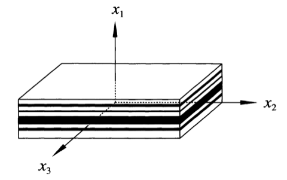

# 层合板模型

考虑图中的层合板，堆叠方向为 1 方向，由两种不同材质的单层板铺成：

层合板中的物理场仅和坐标 $x_1$ 相关，所以无体力的平衡方程简化为

$$
\frac{\partial \sigma_{11}}{\partial x_{1}} = 0 \quad
\frac{\partial \sigma_{21}}{\partial x_{1}} = 0 \quad
\frac{\partial \sigma_{31}}{\partial x_{1}} = 0
$$

因此应力分量 $\sigma_{11}$，$\sigma_{12}$ 和 $\sigma_{13}$ 均为**常值**，平均之后为

$$
\langle \sigma_{11} \rangle = \sigma_{11}, \quad
\langle \sigma_{12} \rangle = \sigma_{12}, \quad
\langle \sigma_{13} \rangle = \sigma_{13}
$$

应变分量 $\varepsilon_{23}$，$\varepsilon_{22}$ 和 $\varepsilon_{33}$ 也必须均为**常值**，以满足远场的边界条件

$$
\langle \varepsilon_{23} \rangle = \varepsilon_{23}^{0}, \quad 
\langle \varepsilon_{22} \rangle = \varepsilon_{22}^{0}, \quad 
\langle \varepsilon_{33} \rangle = \varepsilon_{33}^{0}.
$$

## 单层板为各向同性材料

将上述结论代入到每一层满足的本构方程中，其中所有未求平均 $\langle \cdot \rangle$ 或给定 $\cdot^{0}$ 的物理量均与坐标 $x_{1}$ 相关：

$$
\begin{gathered}
\langle \sigma_{11} \rangle = (\lambda + 2\mu) \varepsilon_{11} + \lambda \varepsilon_{22}^{0} + \lambda \varepsilon_{33}^{0}, \\
\sigma_{22} = (\lambda + 2\mu) \varepsilon_{22}^{0} + \lambda \varepsilon_{11} + \lambda \varepsilon_{33}^{0}, \\
\sigma_{33} = (\lambda + 2\mu) \varepsilon_{33}^{0} + \lambda \varepsilon_{11} + \lambda \varepsilon_{22}^{0}, \\
\sigma_{23} = 2\mu\varepsilon_{23}^{0}, \quad 
\langle \sigma_{13} \rangle = 2\mu\varepsilon_{13}, \quad 
\langle \sigma_{12} \rangle = 2\mu\varepsilon_{12}, \quad
\end{gathered}
$$

11 方向的应变是分段常值函数，其平均等于

$$
\varepsilon_{11} = \frac{1}{\lambda + 2\mu} \langle\sigma_{11} \rangle 
- \frac{\lambda}{\lambda + 2\mu} (\varepsilon_{22}^{0} + \varepsilon_{33}^{0})
$$

因此，各个方向应力的平均等于

$$
\langle\sigma_{11} \rangle 
= \underbrace{\Big\langle \frac{1}{\lambda + 2\mu} \Big\rangle^{-1}}_{L_{11}^{c}} 
\varepsilon_{11}^{0} 
+ \underbrace{\Big\langle \frac{1}{\lambda + 2\mu} \Big\rangle^{-1}
\Big\langle \frac{\lambda}{\lambda + 2\mu} \Big\rangle }_{L_{12}^{c}}
(\varepsilon_{22}^{0} + \varepsilon_{33}^{0})
$$

$$
\begin{aligned}
\langle \sigma_{22} \rangle 
&= \underbrace{\Big\langle \frac{\lambda}{\lambda + 2\mu} \Big\rangle
\Big\langle \frac{1}{\lambda + 2\mu} \Big\rangle^{-1} }_{L_{12}^{c}}
\ \varepsilon_{11}^{0} \\
&+ \underbrace{\Big\{ \Big\langle \frac{1}{\lambda + 2\mu} \Big\rangle^{-1}
\Big\langle \frac{\lambda}{\lambda + 2\mu} \Big\rangle^2
+ \Big\langle \frac{2\lambda\mu}{\lambda + 2\mu} \Big\rangle + 2\langle \mu \rangle \Big\}}_{L_{22}^{c}=L_{23}^{c} + 2L_{44}^c}
\ \varepsilon_{22}^{0} \\
&+ \underbrace{\Big\{ \Big\langle \frac{1}{\lambda + 2\mu} \Big\rangle^{-1}
\Big\langle \frac{\lambda}{\lambda + 2\mu} \Big\rangle^2
+ \Big\langle \frac{2\lambda\mu}{\lambda + 2\mu} \Big\rangle \Big\}}_{L_{23}^{c}}
\ \varepsilon_{33}^{0}
\end{aligned}
$$

$$
\langle \sigma_{23} \rangle = 2\ \underbrace{\langle \mu \rangle }_{L_{44}^{c}}
\varepsilon_{23}^{0}, \quad
\langle \sigma_{13} \rangle = 2\ \underbrace{\langle \mu^{-1} \rangle^{-1} }_{L_{66}^{c}}
\varepsilon_{13}^{0}, \quad 
\langle \sigma_{12} \rangle = 2\ \underbrace{\langle \mu^{-1} \rangle^{-1} }_{L_{66}^{c}}
\varepsilon_{12}^{0}
$$

写成刚度矩阵的形式为

$$
\mathbb{L}^{c}
= \begin{pmatrix}
L_{11}^{c} & L_{12}^{c} & L_{12}^{c} & 0 & 0 & 0 \\
L_{12}^{c} & L_{22}^{c} & L_{23}^{c} & 0 & 0 & 0 \\
L_{12}^{c} & L_{23}^{c} & L_{33}^{c} & 0 & 0 & 0 \\
0 & 0 & 0 & \frac{1}{2}( L_{22}^{c} - L_{23}^{c} ) & 0 & 0 \\
0 & 0 & 0 & 0 & L_{66}^{c} & 0 \\
0 & 0 & 0 & 0 & 0 & L_{66}^{c}
\end{pmatrix}
$$

也即层合板的等效模量表现为横观各向同性。由此得到沿 1 方向和面内 2 和 3 方向的杨氏模量为

$$
\begin{aligned}
E_{1}^{c} &= L_{11}^{c} - \frac{2L_{12}^{c}}{L_{22}^{c}+L_{23}^{c}}, \\
E_{2}^{c} &= E_{3}^{c} = L_{22}^{c} - \frac{(L_{12}^{c})^2 ( L_{23}^{c} - L_{22}^{c})
+L_{23}^{c}\big[ (L_{12}^{c})^2 - L_{11}^{c}L_{23}^{c} \big]}{L_{11}^{c}L_{22}^{c} - (L_{12}^{c})^2}
\end{aligned}
$$

当所有单层板的泊松比相同时，在横观各向同性面内的宏观杨氏模量就等于算数平均值：

$$
E_{2}^{c} = E_{3}^{c} = \langle E \rangle
$$

而当所有单层板的泊松比等于零时，沿堆叠方向的杨氏模量等于调和平均值：

$$
E_{1}^{c} = \langle E^{-1} \rangle^{-1}.
$$

## 单层板为横观各向同性材料

设单层板材料的旋转对称主轴沿 1 方向，与层合板堆叠方向相同，此时使用 Hill 模量表示的等效模量有

$$
\begin{gathered}
m^{c} = \langle m \rangle, \quad
n^{c} = \langle n^{-1} \rangle^{-1}, \quad
p^{c} = \langle p^{-1} \rangle^{-1} \\
k^{c} = (l^{c})^2 / n^c + \langle k - l^2 / n \rangle, \quad
l^{c} = n^{c} \langle l/n \rangle
\end{gathered}
$$

如果将各向同性 Lame 常数表示为 Hill 模量：

$$
\lambda + 2\mu = n = k+m, \quad\lambda = l = k-m, \quad \mu = m = p
$$

那么结果是一致的。

## 更新日志

### 2026/07/24

1. 创建了文档 `层合板.md`。
