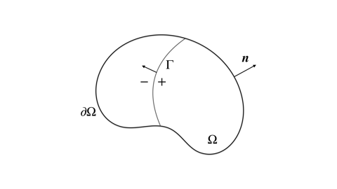

# Hashin--Shtrikman 变分原理的表述

这篇文档首先介绍引入 Hashin--Shtrikman (HS) 变分原理的动机，以及从最小势能原理的对偶问题出发，得到 HS 变分原理的多种等价表述。

## Voigt--Reuss 上下界

如果指定线性位移边界条件 $\boldsymbol{u}|_{\partial\Omega} = \boldsymbol{\varepsilon}_{0}\cdot\boldsymbol{x}$，那么最小势能原理要求真实位移解 $\check{\boldsymbol{u}}$ 是如下变分问题的解：

$$
\begin{equation}\label{eq:min_potential}
\begin{gathered}
\check{\boldsymbol{u}} =\mathop{\mathrm{argmin}}_{\boldsymbol{u}\in \mathcal{U}}\ \Pi_{\boldsymbol{u}}(\boldsymbol{u}) 
= \frac{1}{2}\int_{\Omega} \nabla_{s}\boldsymbol{u}:\mathbb{L}:\nabla_{s}\boldsymbol{u} \ \mathrm{d}\Omega, \\
\mathcal{U} \triangleq \{ \boldsymbol{u} \mid \boldsymbol{u} \in H^{1},\ \boldsymbol{u}|_{\partial\Omega} = \boldsymbol{\varepsilon}_{0}\cdot\boldsymbol{x} \},
\end{gathered}
\end{equation}
$$

以及可以通过上述泛函的最小值 $\check{\Pi}_{\boldsymbol{u}}$ 定义等效模量 $\mathbb{L}_{\boldsymbol{u}}^{c}$：

$$
\frac{1}{2}|\Omega| \boldsymbol{\varepsilon}_{0} : \mathbb{L}_{\boldsymbol{u}}^{c} : \boldsymbol{\varepsilon}_{0} \triangleq \check{\Pi}_{\boldsymbol{u}}.
$$

上下界的估计需要显示给出位移场的表达式，并且满足式 $\eqref{eq:min_potential}$ 中的约束条件。最简单的构造方式是将位移场在边界处的表达式直接延拓到区域 $\Omega$ 内，$\hat{\boldsymbol{u}} = \boldsymbol{\varepsilon}_{0} \cdot\boldsymbol{x}$，代入到变分问题中得到对等效模量上界的 Voigt 估计

$$
\frac{1}{2}|\Omega| \boldsymbol{\varepsilon}_{0} : \mathbb{L}_{\boldsymbol{u}}^{c} : \boldsymbol{\varepsilon}_{0}
\leq 
\frac{1}{2}|\Omega| \boldsymbol{\varepsilon}_{0} : \left\langle \mathbb{L} \right\rangle : \boldsymbol{\varepsilon}_{0}
\Rightarrow
\mathbb{L}_{\boldsymbol{u}}^{c} \leq \mathbb{L}.
$$

类似的，如果指定均匀应力边界条件 $\boldsymbol{\sigma}|_{\partial \Omega} = \boldsymbol{\sigma}_{0}$，那么最小余能原理要求真实的应力场 $\check{\boldsymbol{\sigma}}$ 是如下变分问题的解：

$$
\begin{equation}\label{eq:min_cmpl}
\begin{gathered}
\check{\boldsymbol{\sigma}} =\mathop{\mathrm{argmin}}_{\boldsymbol{\sigma}\in \mathcal{S}}\ \Pi_{\boldsymbol{\sigma}}(\boldsymbol{\sigma}) 
= \frac{1}{2}\int_{\Omega} \boldsymbol{\sigma}:\mathbb{M}:\boldsymbol{\sigma} \ \mathrm{d}\Omega, \\
\mathcal{S} \triangleq \{ \boldsymbol{\sigma} \mid \boldsymbol{\sigma} \in L^{2},\, \boldsymbol{\sigma}|_{\partial \Omega} = \boldsymbol{\sigma}_{0},\ \boldsymbol{\sigma} \cdot \nabla = \boldsymbol{0} \},
\end{gathered}
\end{equation}
$$

并通过泛函的最小值 $\check{\Pi}_{\boldsymbol{\sigma}}$ 定义等效模量 $\mathbb{L}_{\boldsymbol{\sigma}}^{c}$：

$$
\frac{1}{2}|\Omega| \boldsymbol{\sigma}_{0} : \left( \mathbb{L}_{\boldsymbol{\sigma}}^{c} \right)^{-1} : \boldsymbol{\sigma}_{0} \triangleq \check{\Pi}_{\boldsymbol{\sigma}}.
$$

同样，使用边界到区域内的自然延拓（也即内部应力场均匀分布），就可以得到对等效模量下界的 Reuss 估计：

$$
\frac{1}{2}|\Omega| \boldsymbol{\sigma}_{0} : (\mathbb{L}_{\boldsymbol{\sigma}}^{c})^{-1} : \boldsymbol{\sigma}_{0} 
\leq \frac{1}{2}|\Omega| \boldsymbol{\sigma}_{0} : \langle \mathbb{L}^{-1} \rangle : \boldsymbol{\sigma}_{0} 
\Rightarrow
\langle \mathbb{L}^{-1} \rangle^{-1} \leq \mathbb{L}_{\boldsymbol{\sigma}}^{c}.
$$

注意，以上分别是在**不同的边界条件**下得到的等效模量 $\mathbb{L}_{\boldsymbol{u}}^{c}$ 和 $\mathbb{L}_{\boldsymbol{\sigma}}^{c}$，一般并不相同，但如果应用 Hill 给出的代表性体积元的概念——**等效模量与边界条件的类型无关**——重定义与边界条件无关的等效模量 $\mathbb{L}^{c}\triangleq\mathbb{L}_{\boldsymbol{u}}^{c}=\mathbb{L}_{\boldsymbol{\sigma}}^{c}$，并有如下估计：

$$
\begin{equation}
\langle \mathbb{L}^{-1} \rangle^{-1} \leq \mathbb{L}^{c}
\leq \langle \mathbb{L} \rangle.
\label{eq:vrb}
\end{equation}
$$

如果考虑弹性模量是分片常值分布的，那么上式可以进一步化简为

$$
\begin{equation}
\left( \sum_{\alpha=1}^{N} c^{(\alpha)} \mathbb{M}^{(\alpha)} \right)^{-1}
\leq \mathbb{L}^{c} \leq \sum_{\alpha=1}^{N} c^{(\alpha)} \mathbb{L}^{(\alpha)}
\label{eq:vrb_d}
\end{equation}
$$

## 使用 HS 变分原理的动机

VR 上下界的获取仅用到了**均匀分布的试验应变场或应力场**，并没有应用更多关于材料相分布的信息。因此，为得到一个更加准确的估计，需要构造一个与真实解更加接近的试验场。然而，构造一个除均匀场之外、通用且随材料相分布不断变化的试验场并不平凡。例如考虑分片常值分布的弹性模量 $\mathbb{L}$，在内部的界面 $\Gamma$ 处**不连续**，如图所示：

方程系数 $\mathbb{L}$ 的不连续性不会对位移可行域 $\mathcal{U}$ 产生额外的影响，因为位移场保证在内部界面 $\Gamma$ 处连续；但是，在区域 $\Omega$ 内显式构造一个 $H^{1}$ 空间中的函数是困难的。对于应力可行域 $\mathcal{S}$，它只要求试验应力场在 $L^{2}$ 当中，并且满足平衡方程，而分片常值函数恰好满足这两个要求。但是，因为方程系数 $\mathbb{L}$ 在内部界面 $\Gamma$ 不连续，这引入对应力场额外对连续性要求：

$$
\begin{equation}
[\boldsymbol{\sigma}] \cdot \boldsymbol{n} = \boldsymbol{0} \text{ at } \Gamma,\quad
[\boldsymbol{\sigma}] = \boldsymbol{\sigma}^{+} - \boldsymbol{\sigma}^{-}.
\label{eq:ctn_s}
\end{equation}
$$

当界面形状非常复杂时，很难找到一个分片常值的应力场，满足界面处的连续性条件 $\eqref{eq:ctn_s}$。HS 变分原理的巧妙之处就在于构造了一个新的泛函，放松了对试验函数在界面处的连续性要求。继续考虑变分问题 $\eqref{eq:min_potential}$，用容许应变场空间 $\mathcal{E}$ 应变表示为

$$
\begin{equation}\label{eq:min_potl}
\begin{gathered}
\check\Pi = \min_{\boldsymbol{\varepsilon}\in \mathcal{E}} \Pi(\boldsymbol{\varepsilon}) 
= \min_{\boldsymbol{\varepsilon}\in \mathcal{E}}\frac{1}{2}\int_{\Omega} \boldsymbol{\varepsilon}:\mathbb{L}:\boldsymbol{\varepsilon}\ \mathrm{d}\Omega, \\
\mathcal{E} \triangleq \{ \boldsymbol{\varepsilon} \mid\boldsymbol{\varepsilon}=\nabla_{s}\boldsymbol{u},\ \boldsymbol{u} \in H^{1},\ \boldsymbol{u}|_{\partial\Omega} = \boldsymbol{u}_{0} \},
\end{gathered}
\end{equation}
$$

引入参考模量 $\mathbb{L}_{0}$，将泛函 $\eqref{eq:min_potl}$ 分解成如下两部分：

$$
\Pi(\boldsymbol{\varepsilon}) = \underbrace{\frac{1}{2}\int_{\Omega} \boldsymbol{\varepsilon}:(\mathbb{L} - \mathbb{L}_{0}):\boldsymbol{\varepsilon} \ \mathrm{d}\Omega}_{\Delta \Pi}
+ \underbrace{\frac{1}{2}\int_{\Omega} \boldsymbol{\varepsilon}:\mathbb{L}_{0}:\boldsymbol{\varepsilon} \ \mathrm{d}\Omega}_{\Pi_{0}}.
$$

假设 $\Delta \mathbb{L} \triangleq \mathbb{L}-\mathbb{L}_{0}$ **正定**，应用 Young-Fechel 变换，将 $\Delta \Pi$ 表示为关于另一个二阶张量场 $\boldsymbol{p}$ 的二次型变分问题：

$$
\begin{equation}
\Delta \Pi = \max_{\boldsymbol{p} \in \mathcal{P}}
\left\{ \int_{\Omega}
\left( \boldsymbol{p}:\boldsymbol{\varepsilon}
- \frac{1}{2} \boldsymbol{p}:\Delta\mathbb{L}^{-1}:\boldsymbol{p} \right) \mathrm{d}\Omega \right\}, \quad
\mathcal{P}= \{ \boldsymbol{p} \mid \boldsymbol{p} \in L^{2} \}.
\label{eq:yf}
\end{equation}
$$

若 $\Delta \mathbb{L} \triangleq \mathbb{L}-\mathbb{L}_{0}$ **负定**，那么上式中求最大值将替换为求最小值。将式 $\eqref{eq:yf}$ 代入泛函 $\eqref{eq:min_potl}$ 中，并交换求最大最小的顺序，就得到关于两场泛函 $\mathcal{H}(\boldsymbol{p},\boldsymbol{\varepsilon})$ 的变分问题：

$$
\begin{equation}\label{eq:hs_vari}
\check{\Pi} = \begin{cases}
\max\limits_{\boldsymbol{p}\in\mathcal{P}} \min\limits_{\boldsymbol{\varepsilon}\in\mathcal{E}} \mathcal{H}(\boldsymbol{p},\boldsymbol{\varepsilon}), \quad
\Delta\mathbb{L}\text{ is positive definite}, \\
\min\limits_{\boldsymbol{p}\in\mathcal{P}} \min\limits_{\boldsymbol{\varepsilon}\in\mathcal{E}}  \mathcal{H}(\boldsymbol{p},\boldsymbol{\varepsilon}), \quad
\Delta\mathbb{L}\text{ is negative definite},
\end{cases}
\end{equation}
$$

泛函 $\mathcal{H}(\boldsymbol{p},\boldsymbol{\varepsilon})$ 的形式为：

$$
\begin{equation}\label{eq:hsfctl_ori}
\begin{aligned}
\mathcal{H}(\boldsymbol{p},\boldsymbol{\varepsilon})
&\triangleq \Phi(\boldsymbol{p},\, \boldsymbol{\varepsilon}) -\int_{\Omega} 
\frac{1}{2}\boldsymbol{p}:\Delta\mathbb{L}^{-1}:\boldsymbol{p} \, \mathrm{d}\Omega, \\
\Phi(\boldsymbol{p},\, \boldsymbol{\varepsilon}) 
&\triangleq \int_{\Omega} \frac{1}{2} \boldsymbol{\varepsilon} : \mathbb{L}_{0} : \boldsymbol{\varepsilon}
+ \boldsymbol{p} : \boldsymbol{\varepsilon} \, \mathrm{d}\Omega,.
\end{aligned}
\end{equation}
$$

这时就可以解释**为什么要引入额外的模量** $\mathbb{L}_{0}$。上式中泛函 $\Phi$ 是关于 $\nabla\boldsymbol{u}$ 的**二次型泛函**，并存在只与 $\boldsymbol{p}$ 相关的下界：

$$
\begin{aligned}
\Phi(\boldsymbol{p},\, \boldsymbol{\varepsilon})
&= \int_{\Omega} \frac{1}{2} \left(\boldsymbol{\varepsilon} + \mathbb{L}_{0}^{-1}:\boldsymbol{p} \right) 
: \mathbb{L}_{0} : \left(\boldsymbol{\varepsilon} + \mathbb{L}_{0}^{-1}:\boldsymbol{p} \right) \ \mathrm{d}\Omega
- \int_{\Omega} \frac{1}{2} \boldsymbol{p} : \mathbb{L}_{0}^{-1} : \boldsymbol{p} \ \mathrm{d}\Omega \\
&\geq -\int_{\Omega} \frac{1}{2} \boldsymbol{p} : \mathbb{L}_{0}^{-1} : \boldsymbol{p} \ \mathrm{d}\Omega.
\end{aligned}
$$

所以，$\min_{\boldsymbol{\varepsilon}\in\mathcal{E}} \Phi(\boldsymbol{p},\, \boldsymbol{\varepsilon})$ **存在极小值的必要条件仅要求函数 $\boldsymbol{p}$ 平方可积**。因此，HS 变分原理放松了最小势能原理试验函数空间对连续性的约束条件，这就可以显式构造更复杂的试验函数，得到更准确的估计。如果去除二次项 $\frac{1}{2} \boldsymbol{\varepsilon} : \mathbb{L}_{0} : \boldsymbol{\varepsilon}$，那么泛函 $\Phi$ 将是关于 $\boldsymbol{u}$ 的线性泛函，因此最小值等于平凡的 $-\infty$，除非变量 $\boldsymbol{p}$ 满足 $\boldsymbol{p}\cdot\nabla=0$，以及界面条件 $\eqref{eq:ctn_s}$，这才能使得式 $\eqref{eq:hs_vari}$ 中对偶泛函是适定的。这就回退到最小余能原理的形式 $\eqref{eq:min_cmpl}$。

## HS 变分原理的不同表述

式 $\eqref{eq:hs_vari}$ 和式 $\eqref{eq:hsfctl}$ 通过关于最小势能原理的对偶变分问题，给出 HS 变分原理的一般表述。在文献中还有多种其它形式的表述，提供了不同角度的理解，以下将分别介绍。

### 应用扰动应变场

首先将通过分解位移场进一步简化泛函 $\mathcal{H}$ 的形式。位移场 $\boldsymbol{u}$ 可以分解为如下两部分：$\boldsymbol{u} = \boldsymbol{u}_{0} + \tilde{\boldsymbol{u}}$，其中 $\boldsymbol{u}_{0}$ 是使得均质材料的势能 $\Pi_{0}$ 取最小值的位移场，满足给定的位移边界条件，作为泛函中的**已知量**：

$$
\check\Pi_{0}\triangleq\Pi_{0}(\boldsymbol{u}_{0}) = \min_{\boldsymbol{u}\in\mathcal{U}}\frac{1}{2}\int_{\Omega} \nabla_{s}\boldsymbol{u}:\mathbb{L}_{0}:\nabla_{s}\boldsymbol{u} \ \mathrm{d}\Omega;
$$

而位移扰动场 $\tilde{\boldsymbol{u}}$ 是**新的依赖变量**，在可行域空间 $\mathcal{U}_{0}\triangleq \{ \boldsymbol{u} \mid \boldsymbol{u} \in H^{1},\ \boldsymbol{u}|_{\partial\Omega} = \boldsymbol{0} \}$ 中取值。相应的，应变场也可以分解为

$$
\boldsymbol{\varepsilon} = \boldsymbol{\varepsilon}_{0} + \tilde{\boldsymbol{\varepsilon}}, \quad
\boldsymbol{\varepsilon}_{0} = \nabla_{s} \boldsymbol{u}_{0}, \quad
\tilde{\boldsymbol{\varepsilon}} = \nabla_{s} \tilde{\boldsymbol{u}} \in \mathcal{E}_{0}.
$$

按照如上分解，泛函 $\eqref{eq:hsfctl_ori}$ 就可以简化为如下形式：

$$
\begin{equation}
\mathcal{H}(\boldsymbol{p},\tilde{\boldsymbol{\varepsilon}})
\triangleq \int_{\Omega} \left( \frac{1}{2}\tilde{\boldsymbol{\varepsilon}}:\mathbb{L}_{0}:\tilde{\boldsymbol{\varepsilon}}
+ \boldsymbol{p}:\tilde{\boldsymbol{\varepsilon}}
+ \boldsymbol{p}:\boldsymbol{\varepsilon}_{0} 
- \frac{1}{2} \boldsymbol{p}:\Delta\mathbb{L}^{-1}:\boldsymbol{p} \right) \mathrm{d}\Omega
+ \check\Pi_{0},
\label{eq:hsfctl}
\end{equation}
$$

而变分原理 $\eqref{eq:hs_vari}$ 中应变场的可行域应改成 $\mathcal{E}_{0}$。

### 应用辅助方程

式 $\eqref{eq:hs_vari}$ 中的表述嵌套了两个求最值的问题，包含两个互不相关的依赖变量 $(\boldsymbol{p}, \tilde{\boldsymbol{\varepsilon}})$。一种处理方式是将内部求最小值的变分问题转化为相应的 Euler 方程，通过该方程将两个依赖变量进行关联。将 $\mathcal{H}$ 中与依赖变量 $\tilde{\boldsymbol{\varepsilon}}$ 相关的泛函项单独取出，取最小值之后得到的关于 $\boldsymbol{p}$ 的泛函记作 $\mathcal{J}$：

$$
\begin{equation}
\mathcal{J}(\boldsymbol{p}) = \min_{\tilde{\boldsymbol{\varepsilon}} \in \mathcal{E}_{0}} 
\int_{\Omega} 
\left( \frac{1}{2}\tilde{\boldsymbol{\varepsilon}}:\mathbb{L}_{0}:\tilde{\boldsymbol{\varepsilon}}
+ \boldsymbol{p}:\tilde{\boldsymbol{\varepsilon}} \right)\mathrm{d}\Omega.
\label{eq:df_j}
\end{equation}
$$

这一泛函问题对应的边值问题是：

$$
\begin{equation}
\left( \mathbb{L}_{0} : \nabla_{s}\tilde{\boldsymbol{u}} + \boldsymbol{p} \right)\cdot\nabla = \boldsymbol{0}, \quad
\tilde{\boldsymbol{u}}|_{\partial\Omega} = \boldsymbol{0}.
\label{eq:subsd}
\end{equation}
$$

因此，如果给出上述辅助方程之后，内部取最小值的运算就可以拿掉。更进一步地，根据 Clapeyron 定理，外力功等于两倍的势能：

$$
\int_{\Omega} \boldsymbol{p}:\tilde{\boldsymbol{\varepsilon}}\ \mathrm{d}\Omega
=2\int_{\Omega} 
\left( \frac{1}{2}\tilde{\boldsymbol{\varepsilon}}:\mathbb{L}_{0}:\tilde{\boldsymbol{\varepsilon}}
+ \boldsymbol{p}:\tilde{\boldsymbol{\varepsilon}} \right)\mathrm{d}\Omega,
$$

还可以将式 $\eqref{eq:df_j}$ 中的二次型泛函进一步化简，最终得到 $\mathcal{H}$ 的形式为

$$
\begin{equation}
\mathcal{H}(\boldsymbol{p},\tilde{\boldsymbol{\varepsilon}})
= \int_{\Omega} \left( \frac{1}{2}\boldsymbol{p}:\tilde{\boldsymbol{\varepsilon}}
+ \boldsymbol{p}:\boldsymbol{\varepsilon}_{0} 
- \frac{1}{2} \boldsymbol{p}:\Delta\mathbb{L}^{-1}:\boldsymbol{p} \right) \mathrm{d}\Omega
+ \check\Pi_{0},
\label{eq:hsfctl_subsd}
\end{equation}
$$

并在

$$
\begin{equation}
\boldsymbol{p} = \Delta \mathbb{L}:\boldsymbol{\varepsilon}
\label{eq:stat}
\end{equation}
$$

处取驻值。式 $\eqref{eq:subsd}$，$\eqref{eq:hsfctl_subsd}$ 和 $\eqref{eq:stat}$ 则对应 Hashin-Shtrikman 论文中原始泛函形式。

### 应用 Green 函数

根据上一节的内容，已经知道在辅助方程 $\eqref{eq:subsd}$ 提供的关联之下，泛函 $\mathcal{J}$ 可以去除取最小值的运算，直接写成

$$
\mathcal{J}(\boldsymbol{p})
= \int_{\Omega} \frac{1}{2} \boldsymbol{p} : \hat{\boldsymbol{\varepsilon}}(\boldsymbol{p}) \ \mathrm{d}\Omega,
$$

式中，$\hat{\boldsymbol{\varepsilon}}(\boldsymbol{p})$ 是边值问题 $\eqref{eq:subsd}$ 的解，与极化应力 $\boldsymbol{p}$ 相关，可以通过 Green 函数进行形式上地表示：

$$
\hat{\boldsymbol{u}}(\boldsymbol{x}) 
= -\int_{\Omega} \boldsymbol{G}(\boldsymbol{x},\boldsymbol{y})\nabla_{\boldsymbol{y}} : \boldsymbol{p}(\boldsymbol{y}) \ \mathrm{d} \boldsymbol{y}.
$$

为了表达式的清晰，以上将独立变量 $\boldsymbol{x}$，$\boldsymbol{y}$ 显式写出，并将体积元暂时写成 $\mathrm{d}\boldsymbol{x}$，$\mathrm{d}\boldsymbol{y}$ 的形式。因此，经过分部积分之后，应变场可以表示为

$$
\hat{\boldsymbol{\varepsilon}}(\boldsymbol{p})
= -\int_{\Omega} \Gamma(\boldsymbol{x},\boldsymbol{y}) : (\boldsymbol{p}(\boldsymbol{y}) - \boldsymbol{p}(\boldsymbol{x})) \ \mathrm{d} \boldsymbol{y}, \quad
\Gamma(\boldsymbol{x},\boldsymbol{y}) \triangleq\nabla_{\boldsymbol{x}}\boldsymbol{G}\nabla_{\boldsymbol{y}},
$$

式中，$\Gamma$ 是具有次对称性的四阶张量场。将上式代入到 $\mathcal{J}$ 表达式中，再利用 $\Gamma$ 的对称性，就得到

$$
\mathcal{J}(\boldsymbol{p})
= \frac{1}{4}\int_{\Omega} \int_{\Omega}
\{\boldsymbol{p}(\boldsymbol{y}) - \boldsymbol{p}(\boldsymbol{x})\}
:\Gamma(\boldsymbol{x},\boldsymbol{y}) : \{ \boldsymbol{p}(\boldsymbol{y}) - \boldsymbol{p}(\boldsymbol{x}) \} \ \mathrm{d} \boldsymbol{x}\mathrm{d} \boldsymbol{y}
$$

## 更新日志

### 2026/07/24

1. 创建了文档 `Hashin--Shtrikman 变分原理的表述.md`
