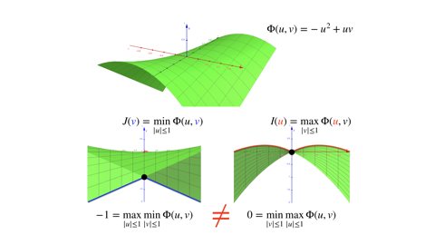

# 变分原理的对偶问题

虽然 Hashin--Shtrikman (HS) 变分原理在细观力学领域影响深远，但其构造方法对初学者（特指本文档作者）还是相当难以理解的。Berdichevsky (2009)[^1] 将 HS 变分原理解释为关于最小势能原理的对偶问题，这使得 HS 变分原理的数学结构清楚许多。这篇文档的目的是介绍对偶变分原理，并给出一个案例。HS 变分原理的陈述和构造方法将分别在和给出。

## 陈述

如果初始求解变分极值的问题是

$$
\begin{equation}\label{eq:init_vp}
\check{I}
= \min_{\boldsymbol{u}\in \mathcal{M}} I(\boldsymbol{u}),
\end{equation}
$$

此外，如果构造一个具有两个依赖变量的新泛函 $\Phi(\boldsymbol{u},\boldsymbol{v})$，其中 $\boldsymbol{u}$ 是原变分 $I$ 的依赖变量，$\boldsymbol{v}$ 是另外一个依赖变量，在集合 $\mathcal{N}$ 中取值，并且原泛函可以写成新泛函在可行域 $\mathcal{N}$ 上取最大值：$I(\boldsymbol{u}) = \max_{\boldsymbol{v}\in\mathcal{N}} \Phi(\boldsymbol{u},\boldsymbol{v})$，那么最初的求解变分极值问题就变成了

$$
\check{I}
= \min_{\boldsymbol{u}\in \mathcal{M}} \max_{\boldsymbol{v}\in\mathcal{N}} \Phi(\boldsymbol{u},\boldsymbol{v}).
$$

假如上式中的最大最小运算**交换顺序**后可以保值，那么在可行域 $\mathcal{M}$ 寻找原泛函最值问题就可以等价为在另一个依赖变量空间 $\mathcal{N}$ 寻找新泛函的最大值：

$$
\begin{equation}
\check{I} = \max_{\boldsymbol{v}\in\mathcal{N}} J(\boldsymbol{v}), \quad
J(\boldsymbol{v}) \triangleq \min_{\boldsymbol{u}\in \mathcal{M}} \Phi(\boldsymbol{u},\boldsymbol{v}).
\label{eq:dual_vp}
\end{equation}
$$

新的变分问题 $\eqref{eq:dual_vp}$ 称为关于原变分问题 $\eqref{eq:init_vp}$ 的**对偶问题**。可以看到，寻找原问题的对偶，其关键在于**显式构造**联系 $I$ 和 $J$ 的变分 $\Phi$，使得最值运算**交换顺序**后保值。然而，并不是所有的泛函都能保证交换顺序之后**最值不变**，例如如下变分问题：

但是交换顺序后的泛函仍有如下不等式成立：

$$
\begin{equation}
\max_{\boldsymbol{v}\in\mathcal{N}} \min_{\boldsymbol{u}\in \mathcal{M}} \Phi(\boldsymbol{u},\boldsymbol{v})
 \leq
\min_{\boldsymbol{u}\in \mathcal{M}} \max_{\boldsymbol{v}\in\mathcal{N}} \Phi(\boldsymbol{u},\boldsymbol{v})
\label{eq:maxmin_ineq}
\end{equation}
$$

## 案例：Dirichlet--von Neuman 问题

首先考虑区域 $\Omega$ 内的 Dirichlet 问题：

$$
\begin{equation}
\Delta u = 0. \quad u|_{\partial\Omega} = u_{0}.
\label{eq:dirichlet}
\end{equation}
$$

该微分方程的解对应为如下变分问题的最小值点：

$$
I(u) = \frac{1}{2}\int_{\Omega} \nabla u \cdot \nabla u \ \mathrm{d}\Omega, \quad
u \in H^{1}.
$$

如果将 $\nabla u$ 看作是已知量，那么可以构造如下关于变量 $\boldsymbol{p}$ 的二次型，使得该二次型的最大值总等于上述变分中的积分项：

$$
\max_{\boldsymbol{p}\in\mathcal{P}} \left( \boldsymbol{p} \cdot\nabla u - \frac{1}{2} \boldsymbol{p} \cdot \boldsymbol{p} \right)
= \frac{1}{2} \nabla u \cdot \nabla u, \text{ at } \boldsymbol{p} = \nabla u.
$$

因此，原变分问题就可以写成

$$
\min_{u\in\mathcal{U}}I(u)
= \min_{u\in\mathcal{U}} \max_{\boldsymbol{p}\in\mathcal{P}} 
\int_{\Omega}
\left( \boldsymbol{p} \cdot\nabla u - \frac{1}{2} \boldsymbol{p} \cdot \boldsymbol{p} \right)
\ \mathrm{d}\Omega.
$$

如果改变最值运算顺序，那么根据不等式 $\eqref{eq:maxmin_ineq}$，有

$$
\max_{\boldsymbol{p}\in\mathcal{P}} \min_{u\in\mathcal{U}}  \int_{\Omega}
\left( \boldsymbol{p} \cdot\nabla u - \frac{1}{2} \boldsymbol{p} \cdot \boldsymbol{p} \right)
\ \mathrm{d}\Omega
\leq \min_{u\in\mathcal{U}}I(u),
$$

对核心项应用分部积分公式，就得到

$$
\begin{equation}\label{eq:u2p}
\begin{aligned}
&\int_{\Omega}
\left( \boldsymbol{p} \cdot\nabla u - \frac{1}{2} \boldsymbol{p} \cdot \boldsymbol{p} \right)
\ \mathrm{d}\Omega\\
=& -\int_{\Omega}u\nabla\cdot \boldsymbol{p} \ \mathrm{d}\Omega
+ \int_{\partial\Omega} u_{0}\boldsymbol{n}\cdot\boldsymbol{p} \ \mathrm{d}\Gamma
- \frac{1}{2} \int_{\Omega} \boldsymbol{p} \cdot \boldsymbol{p}\ \mathrm{d}\Omega.
\end{aligned}
\end{equation}
$$

应用如下符号重写不等式

$$
\begin{equation}
\left\{\begin{aligned}
&\max_{\boldsymbol{p}\in\mathcal{P}} \tilde{J}(\boldsymbol{p})
\leq \min_{u\in\mathcal{U}}I(u), \quad 
\tilde{J}(\boldsymbol{p}) \triangleq \min_{u\in\mathcal{U}}\left[ \Phi(u,\boldsymbol{p}) \right] - I^{c}(\boldsymbol{p}),\\
&\Phi(u,\boldsymbol{p})
\triangleq -\int_{\Omega}u\nabla\cdot \boldsymbol{p} \ \mathrm{d}\Omega + l(\boldsymbol{p}), \quad
l(\boldsymbol{p}) 
\triangleq \int_{\partial\Omega} u_{0}\boldsymbol{n}\cdot\boldsymbol{p}\ \mathrm{d}\Gamma, \\
&I^{c}(\boldsymbol{p}) 
\triangleq \frac{1}{2} \int_{\Omega} \boldsymbol{p} \cdot \boldsymbol{p}\ \mathrm{d}\Omega.
\end{aligned}\right.
\label{eq:dual}
\end{equation}
$$

接下来关注式中的不等号能否取等号。首先注意到泛函 $\Phi$ 是关于 $u$ 的线性泛函，因此 $\Phi$ 取值可以任意小，除非 $\nabla\cdot\boldsymbol{p}\equiv0$：

$$
\min_{u\in\mathcal{U}}\left[ \Phi(u,\boldsymbol{p}) \right]
=\begin{cases}
l(\boldsymbol{p}) , & \nabla\cdot\boldsymbol{p} \equiv 0;\\
-\infty, & \text{otherwise}.
\end{cases}
$$

所以，限制泛函 $\tilde{J}$ 的可行域为 $\tilde{P} = \{ \boldsymbol{p} \mid \nabla\cdot\boldsymbol{p}\equiv 0 \}$，并不会影响该泛函最大值：

$$
\begin{equation}
\max_{\boldsymbol{p}\in\tilde{\mathcal{P}}} \tilde{J}(\boldsymbol{p})
\leq \min_{u\in\mathcal{U}}I(u), \quad 
\tilde{J}(\boldsymbol{p}) = l(\boldsymbol{p}) - I^{c}(\boldsymbol{p}).
\label{eq:j_tilde}
\end{equation}
$$

如果取 $\boldsymbol{p} := \hat{\boldsymbol{p}} = \nabla \check{u}$，其中 $\check{u}$ 是 Dirichlet 问题 $\eqref{eq:dirichlet}$ 的解，因此 $\hat{\boldsymbol{p}} \in \tilde{\mathcal{P}}$，代入泛函 $\tilde{J}$ 中得到

$$
\tilde{J}(\hat{\boldsymbol{p}})
= l(\hat{\boldsymbol{p}}) - I^{c}(\hat{\boldsymbol{p}})
= \frac{1}{2} \int_{\Omega} \nabla\check{u}\cdot\nabla\check{u} \ \mathrm{d}\Omega 
= \min_{u\in\mathcal{U}}I(u).
$$

因此，式 $\eqref{eq:j_tilde}$ 中的不等号可以取等号，由此得到与原变分问题 $\min_{u\in\mathcal{U}} I(u)$ 对偶的变分问题 $\max_{\boldsymbol{p}\in\tilde{P}} \tilde{J}(\boldsymbol{p})$。特别的，在二维问题中，根据 $\boldsymbol{p}$ 散度恒等于零，可以找到一个标量值函数 $\psi$，以及垂直于二维平面的法向 $\boldsymbol{N}_{0}$， 使得 $\boldsymbol{p}$ 等于

$$
\boldsymbol{p} = (\psi_{,y}, -\psi_{,x})
= \nabla\psi \times \boldsymbol{N}_{0}.
$$

由此可以定义新的关于 $\psi$ 的泛函 $J$：

$$
J(\psi)
= \oint_{\partial\Omega} u_{0} \boldsymbol{n} \cdot \nabla\psi \times \boldsymbol{N}_{0} \ \mathrm{d}\Gamma
- \frac{1}{2} \int_{\Omega} \nabla\psi\cdot\nabla\psi \ \mathrm{d}\Omega,
$$

其中，边界积分项可以进一步化简为

$$
\begin{aligned}
&\oint_{\partial\Omega} u_{0} \boldsymbol{n} \cdot \nabla\psi \times \boldsymbol{N}_{0} \ \mathrm{d}\Gamma\\
= &\oint_{\partial\Omega} u_{0} \nabla\psi \cdot \boldsymbol{N}_{0} \times \boldsymbol{n} \ \mathrm{d}\Gamma
= \oint_{\partial\Omega} u_{0} \frac{\mathrm{d} \psi}{\mathrm{d} s} \ \mathrm{d}s
= -\oint_{\partial\Omega} \psi \frac{\mathrm{d} u_{0}}{\mathrm{d} s} \ \mathrm{d}s.
\end{aligned}
$$

所以得到泛函 $J$：

$$
J(\psi)
= -\oint_{\partial\Omega} \psi \frac{\mathrm{d} u_{0}}{\mathrm{d} s} \ \mathrm{d}s
- \frac{1}{2} \int_{\Omega} \nabla\psi\cdot\nabla\psi \ \mathrm{d}\Omega,
$$

而这一泛函的最大值，恰好是如下 von Neumann 问题的解：

$$
\Delta \psi = 0, \quad \nabla\psi \cdot \boldsymbol{n} = -\frac{\mathrm{d} u_0}{\mathrm{d} s}.
$$

在式 $\eqref{eq:u2p}$ 的变换中，将微分算子转移到依赖变量 $\boldsymbol{p}$，由于可行域空间假设 $u$ 和 $\boldsymbol{p}$ 具有足够的连续性，所以可以直接应用 Green 公式。但是，当方程系统引入正定但不连续的系数时：

$$
\begin{equation}
\nabla \cdot \left( \mathbf{A}\cdot\nabla u \right) = 0, \quad
I(u) = \frac{1}{2} \int_{\Omega} \nabla u \cdot \mathbf{A} \cdot\nabla u \ \mathrm{d}\Omega.
\label{eq:dirichlet_disctn}
\end{equation}
$$

该方程对应的对偶变分原理中有

$$
\begin{aligned}
&\int_{\Omega}
\left( \boldsymbol{p} \cdot\mathbf{A}\cdot\nabla u - \frac{1}{2} \boldsymbol{p} \cdot \mathbf{A} \cdot \boldsymbol{p} \right)
\ \mathrm{d}\Omega\\
=& -\int_{\Omega}u\nabla\cdot (\boldsymbol{p}\cdot\mathbf{A}) \ \mathrm{d}\Omega
- \frac{1}{2} \int_{\Omega} \boldsymbol{p} \cdot\mathbf{A}\cdot \boldsymbol{p}\ \mathrm{d}\Omega\\
+& \int_{\partial\Omega} u_{0}\boldsymbol{n}\cdot(\boldsymbol{p}\cdot\mathbf{A}) \ \mathrm{d}\Gamma
+ \boxed{
\int_{\Gamma} u_{\Gamma}\boldsymbol{n}\cdot\left[ \boldsymbol{p}\cdot\mathbf{A} \right] \ \mathrm{d}\Gamma
},
\end{aligned}
$$

其中，框中来自物理量 $\boldsymbol{p}\cdot\mathbf{A}$ 在内界面 $\Gamma$ 的间断值，符号含义为

$$
\left[ \boldsymbol{p}\cdot\mathbf{A} \right] 
= \left( \boldsymbol{p}\cdot\mathbf{A} \right)^{+} - \left( \boldsymbol{p}\cdot\mathbf{A} \right)^{-}.
$$

因此，泛函 $\Phi(u,\boldsymbol{p})$ 中需要额外添加关于间断条件的泛函项 $d(u,\boldsymbol{p})$：

$$
\begin{aligned}
\Phi(u,\boldsymbol{p})
&\triangleq -\int_{\Omega}u\nabla\cdot \boldsymbol{p} \ \mathrm{d}\Omega + d(u,\boldsymbol{p})+l(\boldsymbol{p}),\\
d(u,\boldsymbol{p}) 
&\triangleq \int_{\Gamma} u_{\Gamma}\boldsymbol{n}\cdot\left[ \boldsymbol{p}\cdot\mathbf{A} \right] \ \mathrm{d}\Gamma.
\end{aligned}
$$

这导致依赖变量的容许空间 $\tilde{P}$ 除了原来的散度等于零的限制之外，还要**额外引入间断条件**，这源于泛函 $\Phi$ 取有意义值（有限值）的要求：

$$
\begin{equation}
\min_{u\in\mathcal{U}}\left[ \Phi(u,\boldsymbol{p}) \right]
=\begin{cases}
l(\boldsymbol{p}) , & \nabla\cdot\boldsymbol{p} \equiv 0 \textbf{ and } \left[ \boldsymbol{p}\cdot\mathbf{A} \right] \equiv 0;\\
-\infty, & \text{otherwise}.
\end{cases}
\label{eq:disctn}
\end{equation}
$$

## 更新日志

### 2026/07/24

1. 邱俊淞创建了文档 `变分原理的对偶问题.md`

[^1]: Berdichevsky, V., 2009. Variational Principles of Continuum Mechanics: I. Fundamentals, Interaction of Mechanics and Mathematics. Springer Berlin Heidelberg, Berlin, Heidelberg. https://doi.org/10.1007/978-3-540-88467-5
