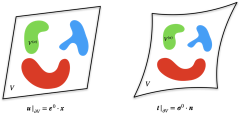
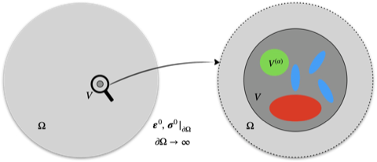
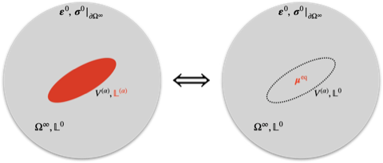

# 简介

这一文档主要讨论以下三部分内容：如何用影响张量（influence tensors）或集中张量（concentrated tensors）表示等效模量；如何使用 Eshelby 张量表示椭球夹杂的集中张量；以及如何评估一个估计方法。

## 使用影响张量表示等效模量

考虑 RVE 区域 $V$，在此区域内施加线性位移或均匀应力边界条件，如图所示。

施加的应变 $\boldsymbol{\varepsilon}^{0}$ 或应力 $\boldsymbol{\sigma}^{0}$ 等于 RVE 内的平均应变或平均应力：

$$
\boldsymbol{\varepsilon}^{0} = \langle \boldsymbol{\varepsilon} \rangle, \quad \text{or} \quad
\boldsymbol{\sigma}^{0} = \langle \boldsymbol{\sigma} \rangle,\quad \text{where }
\langle \cdot \rangle = \frac{1}{|V|} \int_{V} \cdot \ \mathrm{d}\boldsymbol{x}
$$

此时若已知 RVE 的弹性应变影响函数 $\mathbb{E}(\boldsymbol{x})$ 或弹性应力影响函数 $\mathbb{F}(\boldsymbol{x})$，那么就可以通过施加的应变或应力得到 RVE 内部应变或应力场的分布：

$$
\boldsymbol{\varepsilon}(\boldsymbol{x}) = \mathbb{E}(\boldsymbol{x}) : \langle \boldsymbol{\varepsilon} \rangle, \quad \text{or} \quad
\boldsymbol{\sigma}(\boldsymbol{x}) = \mathbb{F}(\boldsymbol{x}) : \langle \boldsymbol{\sigma} \rangle
$$

在各个材料相 $\alpha$ 取平均之后得到

$$
\begin{equation}
\boldsymbol{\varepsilon}^{(\alpha)} = \mathbb{E}^{(\alpha)} : \langle \boldsymbol{\varepsilon} \rangle, \quad \text{or} \quad
\boldsymbol{\sigma}^{(\alpha)} = \mathbb{F}^{(\alpha)} : \langle \boldsymbol{\sigma} \rangle
\label{eq:infl}
\end{equation}
$$

式中，$\mathbb{E}^{(\alpha)}$ 和 $\mathbb{F}^{(\alpha)}$ 是**弹性应变和应力影响张量**，是对应影响函数在材料相 $\alpha$ 所占空间区域 $V^{(\alpha)}$ 的体积平均：

$$
\mathbb{E}^{(\alpha)} = \frac{1}{|V^{(\alpha)}|} \int_{V^{(\alpha)}} \mathbb{E}(\boldsymbol{x}) \ \mathrm{d}\boldsymbol{x}, \quad
\mathbb{F}^{(\alpha)} = \frac{1}{|V^{(\alpha)}|} \int_{V^{(\alpha)}} \mathbb{F}(\boldsymbol{x}) \ \mathrm{d}\boldsymbol{x}.
$$

进而可以通过宏观应变与应力的关系

$$
\langle \boldsymbol{\sigma} \rangle = \mathbb{L}^{c} : \langle \boldsymbol{\varepsilon} \rangle = \langle \mathbb{L} : \mathbb{E} \rangle : \langle \boldsymbol{\varepsilon} \rangle,\quad \text{or}\quad
\langle \boldsymbol{\varepsilon} \rangle = \mathbb{M}^{c} : \langle \boldsymbol{\sigma} \rangle = \langle \mathbb{M}:\mathbb{F} \rangle : \langle \boldsymbol{\sigma} \rangle
$$

确定等效弹性刚度张量 $\mathbb{L}^c$ 或柔度张量 $\mathbb{M}^c$：

$$
\begin{equation}
\mathbb{L}^c = \langle \mathbb{L} : \mathbb{E} \rangle 
= \sum_{\alpha=1}^{N}c^{(\alpha)} \mathbb{L}^{(\alpha)} : \mathbb{E}^{(\alpha)},
\quad \text{or}\quad
\mathbb{M}^c = \langle \mathbb{M} : \mathbb{F} \rangle
= \sum_{\alpha=1}^{N}c^{(\alpha)} \mathbb{M}^{(\alpha)} : \mathbb{F}^{(\alpha)}
\label{eq:lm_eff}
\end{equation}
$$

式中，$\mathbb{L}^{(\alpha)}$ 和 $\mathbb{M}^{(\alpha)}$ 分别是材料相 $\alpha$ 的弹性刚度和柔度张量，$c^{(\alpha)}$ 是材料相 $\alpha$ 的体积分数。需要指出的是，式 $\eqref{eq:lm_eff}$ **没有固定 RVE $V$​ 的组分形状，因此是一般成立的**。若 RVE 是均质的，那么等效弹性刚度和柔度张量与各组分相同，因此有关于影响张量的恒等式：

$$
\begin{equation}
\sum_{\alpha=1}^{N} c^{(\alpha)} \mathbb{E}^{(\alpha)} = \mathbb{I}, \quad
\sum_{\alpha=1}^{N} c^{(\alpha)} \mathbb{F}^{(\alpha)} = \mathbb{I}
\label{eq:sum_identity}
\end{equation}
$$

弹性应变和应力影响张量之间的联系可以通过对应材料相的本构关系获得：

$$
\begin{equation}
\begin{array}{c}
\boldsymbol{\sigma}^{(\alpha)} = \mathbb{L}^{(\alpha)} : \boldsymbol{\varepsilon}^{(\alpha)}
&\Rightarrow& \mathbb{L}^{(\alpha)} : \mathbb{E}^{(\alpha)} : \langle \boldsymbol{\varepsilon} \rangle
= \mathbb{F}^{(\alpha)} : \mathbb{L}^{c} : \langle \boldsymbol{\varepsilon} \rangle 
&\Rightarrow& \mathbb{L}^{(\alpha)} : \mathbb{E}^{(\alpha)} = \mathbb{F}^{(\alpha)} : \mathbb{L}^{c} \\
\boldsymbol{\varepsilon}^{(\alpha)} = \mathbb{M}^{(\alpha)} : \boldsymbol{\sigma}^{(\alpha)}
&\Rightarrow& \mathbb{M}^{(\alpha)} : \mathbb{F}^{(\alpha)} : \langle \boldsymbol{\sigma} \rangle
= \mathbb{E}^{(\alpha)} : \mathbb{M}^{c} : \langle \boldsymbol{\sigma} \rangle 
&\Rightarrow& \mathbb{M}^{(\alpha)} : \mathbb{F}^{(\alpha)} = \mathbb{E}^{(\alpha)} : \mathbb{M}^{c}
\end{array}
\label{eq:ef}
\end{equation}
$$

## 使用集中张量表示等效模量

通过上文的推导可以知道，只要知道 RVE 内各组分的影响张量，就能直接确定 RVE 的等效模量。而现在的问题在于：如何确定影响张量？一般的，只要能求解 RVE 内定义完备的弹性力学方程，得到应变和应力场的分布，就能通过后处理的方式获得各组分的影响张量，这就是计算均质化方法。另一种更加优雅的方式是利用 Eshelby 问题的结论，直接获得影响张量的解析公式，这就是细观力学方法。然而，细观力学方法继承了一些来自 Eshelby 问题的限制：

1. **夹杂形状必须是椭球**。这一几何形状的限制确保夹杂内的应变场是均匀的
2. RVE 必须嵌入到一个**无穷大弹性介质内**。Eshelby 问题是在无穷大弹性介质内求解的，施加的是**远场边界条件**，相当于提供一个背景应变或应力场，因此不必考虑边界条件对内部应变场的扰动

现在定义**应变和应力集中张量** $\mathbb{T}^{(\alpha)}$ 和 $\mathbb{W}^{(\alpha)}$ ，关联**远场和材料相内的应力与应变**：

$$
\begin{equation}
\boldsymbol{\varepsilon}^{(\alpha)} = \mathbb{T}^{(\alpha)} : \boldsymbol{\varepsilon}^{0}, \quad
\boldsymbol{\sigma}^{(\alpha)} = \mathbb{W}^{(\alpha)} : \boldsymbol{\sigma}^{0}
\label{eq:cct}
\end{equation}
$$

此时根据定义，RVE 内的平均应变和应力等于

$$
\begin{equation}
\langle \boldsymbol{\varepsilon} \rangle = \sum_{\alpha=1}^{N} c^{(\alpha)} \boldsymbol{\varepsilon}^{(\alpha)}
= \langle \mathbb{T} \rangle : \boldsymbol{\varepsilon}^{0}, \quad
\langle \boldsymbol{\sigma} \rangle = \sum_{\alpha=1}^{N} c^{(\alpha)} \boldsymbol{\sigma}^{(\alpha)}
= \langle \mathbb{W} \rangle : \boldsymbol{\sigma}^{0}
\label{eq:tw}
\end{equation}
$$

式中，

$$
\begin{equation}
\langle \mathbb{T} \rangle \triangleq \sum_{\alpha=1}^{N} c^{(\alpha)} \mathbb{T}^{(\alpha)}, \quad
\langle \mathbb{W} \rangle \triangleq \sum_{\alpha=1}^{N} c^{(\alpha)} \mathbb{W}^{(\alpha)}
\label{eq:twavg}
\end{equation}
$$

与式 $\eqref{eq:sum_identity}$ 的影响张量恒等式不同，一般式 $\eqref{eq:twavg}$ 中**集中张量的体积平均并不等于单位张量**，这是集中张量和影响张量的不同之处。将式 $\eqref{eq:tw}$ 代入式 $\eqref{eq:cct}$ 中，并与式 $\eqref{eq:infl}$ 对比，就可以得到影响张量和集中张量之间的关联：

$$
\begin{equation}\label{eq:cct_infl}
\begin{gathered}
\mathbb{T}^{(\alpha)} = \mathbb{E}^{(\alpha)} : \langle \mathbb{T} \rangle, \quad
\mathbb{W}^{(\alpha)} = \mathbb{F}^{(\alpha)} : \langle \mathbb{W} \rangle\\
\mathbb{E}^{(\alpha)} = \mathbb{T}^{(\alpha)} : \langle \mathbb{T} \rangle^{-1}, \quad
\mathbb{F}^{(\alpha)} = \mathbb{W}^{(\alpha)} : \langle \mathbb{W} \rangle^{-1}
\end{gathered}
\end{equation}
$$

代入到等效刚度和柔度张量的表达式中，就能得到如下一组等价的公式：

$$
\begin{equation}
\left\{\begin{aligned}
\mathbb{L}^{c}
&= \Big(\sum_{\alpha=1}^{N} c^{(\alpha)} \mathbb{L}^{(\alpha)} : \mathbb{T}^{(\alpha)} \Big)
: \langle \mathbb{T} \rangle^{-1}, \\
\mathbb{O} 
&= \sum_{\alpha=1}^{N} c^{(\alpha)} \big( \mathbb{L}^{c} - \mathbb{L}^{(\alpha)} \big) : \mathbb{T}^{(\alpha)}, \\
\mathbb{L}^{c}
&= \mathbb{L}^{(1)}
+ \Big( \sum_{\alpha=2}^{N} c^{(\alpha)} \big( \mathbb{L}^{(\alpha)} - \mathbb{L}^{(1)} \big) : \mathbb{T}^{(\alpha)} \Big) : \langle \mathbb{T} \rangle^{-1}
\end{aligned}\right.
\label{eq:leff_cct}
\end{equation}
$$

以上表达式的特定变形在某些具体的场景下更加方便使用。例如在考虑的非均质材料由 1 个连续相和多个离散相组成，连续相称为基体，此时基体的形状一般不符合 Eshelby 问题的要求，所以式 $\eqref{eq:leff_cct}$ 中最后一个表达式不需要直接给出基体相集中张量 $\mathbb{T}^{(1)}$（以下如无特别说明，总是默认第 1 相材料是基体相）。类似的，等效柔度张量的估计式为

$$
\begin{equation}\label{eq:eff_cmpl}
\left\{\begin{aligned}
\mathbb{M}^{c} 
&= \Big(\sum_{\alpha=1}^{N} c^{(\alpha)} \mathbb{M}^{(\alpha)} : \mathbb{W}^{(\alpha)} \Big)
: \langle \mathbb{W} \rangle^{-1}, \\
\mathbb{O} 
&= \sum_{\alpha=1}^{N} c^{(\alpha)} \big( \mathbb{M}^{c} - \mathbb{M}^{(\alpha)} \big) : \mathbb{W}^{(\alpha)},\\
\mathbb{M}^{c}
&= \mathbb{M}^{(1)}
+ \Big( \sum_{\alpha=2}^{N} c^{(\alpha)} \big( \mathbb{M}^{(\alpha)} - \mathbb{M}^{(1)} \big) : \mathbb{W}^{(\alpha)} \Big) : \langle \mathbb{W} \rangle^{-1}
\end{aligned}\right.
\end{equation}
$$

将集中张量与影响张量的关系式 $\eqref{eq:cct_infl}$ 代入到式 $\eqref{eq:ef}$ 中，就可以得到集中张量之间的关系为：

$$
\mathbb{L}^{(\alpha)} : \mathbb{T}^{(\alpha)} : \langle \mathbb{T} \rangle^{-1} 
= \mathbb{W}^{(\alpha)} : \langle \mathbb{W} \rangle^{-1} : \mathbb{L}^{c}
$$

### 使用 Eshelby 张量表示椭球夹杂集中张量

此处讨论怎样使用 Eshelby 问题的结论，给出材料相的集中张量。原本的异质问题如图所示，红色区域是模量为 $\mathbb{L}^{(\alpha)}$ 的异质区域 $V^{(\alpha)}$，嵌入在模量为 $\mathbb{L}^{0}$ 的无穷大弹性介质内，远场施加应变 $\boldsymbol{\varepsilon}^{0}$ 或应力 $\boldsymbol{\sigma}^{0}$。等价的 Eshelby 夹杂问题是用和弹性介质相同的材料取代原来的异质 $V^{(\alpha)}$，然而在这一区域内施加一个不等于零的本征应变 $\boldsymbol{\mu}^{\mathrm{eq}}$。

问题等价要求在异质/夹杂内的应力应变相同：

$$
\underbrace{\mathbb{L}^{(\alpha)} : \boldsymbol{\varepsilon}^{(\alpha)}}_{inhomogenity}
= \underbrace{\mathbb{L}^{0} : ( \boldsymbol{\varepsilon}^{(\alpha)} - \boldsymbol{\mu}^{\mathrm{eq}} ) }_{inclusion},
$$

这就得到等效本征应变与异质/夹杂内的应变关系为

$$
\begin{equation}
-\mathbb{L}^{0}:\boldsymbol{\mu}^{\mathrm{eq}} 
= \big( \mathbb{L}^{(\alpha)} - \mathbb{L}^{0} \big) 
: \boldsymbol{\varepsilon}^{(\alpha)}
=\boldsymbol{\lambda}^{\mathrm{eq}},
\label{eq:A}
\end{equation}
$$

式中，$\boldsymbol{\lambda}^{\mathrm{eq}}$ 为本征应力，又称极化应力。在夹杂问题中，夹杂内的应变可通过 Hill 极化张量 $\mathbb{P}$ 和极化应力获得：

$$
\boldsymbol{\varepsilon}^{(\alpha)} = \boldsymbol{\varepsilon}^{0} - \mathbb{P} : \boldsymbol{\lambda}^{\mathrm{eq}}
$$

将极化应力的表达式 $\eqref{eq:A}$ 代入到上式中得到

$$
\boldsymbol{\varepsilon}^{0}
= \big[ \mathbb{I} + \mathbb{P} : \big( \mathbb{L}^{(\alpha)} - \mathbb{L}^{0} \big) \big] : \boldsymbol{\varepsilon}^{(\alpha)}
\Rightarrow 
\mathbb{T}^{(\alpha)} = \big[ \mathbb{I} + \mathbb{P} : \big( \mathbb{L}^{(\alpha)} - \mathbb{L}^{0} \big) \big]^{-1}
$$

上式便是使用 Eshelby 张量表示的材料相 $\alpha$ 的集中张量。集中张量有多种表示方法，这是因为极化张量 $\mathbb{P}$ 可以等价地写成如下形式：

$$
\mathbb{P} = \mathbb{S}:(\mathbb{L}^{0}) ^{-1} 
= \big( \mathbb{L}^{0} + \mathring{\mathbb{L}} \big)^{-1},
$$

式中，$\mathbb{S}$ 是 Eshelby 张量，$\mathring{\mathbb{L}}$ 是区域 $V^{(\alpha)}$ 为孔洞时的模量。由此应变集中张量可以有如下表示：

$$
\begin{equation}
\boxed{\begin{aligned}
\mathbb{T}^{(\alpha)} &= \big[ \mathbb{I} + \mathbb{P} : \big( \mathbb{L}^{(\alpha)} - \mathbb{L}^{0} \big) \big]^{-1} \\
&= \big[ \mathbb{I} + \mathbb{S}:(\mathbb{L}^{0}) ^{-1} : \big( \mathbb{L}^{(\alpha)} - \mathbb{L}^{0} \big) \big]^{-1} \\
&= \big( \mathbb{L}^{(\alpha)} + \mathring{\mathbb{L}} \big)^{-1} 
:  \big( \mathbb{L}^{0} + \mathring{\mathbb{L}} \big)
= \big( \mathbb{L}^{(\alpha)} + \mathring{\mathbb{L}} \big)^{-1} : \mathbb{P}^{-1}
\end{aligned}}
\label{eq:ts}
\end{equation}
$$

类似的，可以得到应力集中张量为

$$
\begin{equation}
\boxed{\begin{aligned}
\mathbb{W}^{(\alpha)} &= \big[ \mathbb{I} + \mathbb{Q} : \big( \mathbb{M}^{(\alpha)} - \mathbb{M}^{0} \big) \big]^{-1} \\
&= \big[ \mathbb{I} + \mathbb{L}^{0} : ( \mathbb{I} - \mathbb{S} ) : \big( \mathbb{M}^{(\alpha)} - \mathbb{M}^{0} \big) \big]^{-1} \\
&= \big( \mathbb{M}^{(\alpha)} + \mathring{\mathbb{M}} \big)^{-1} 
:  \big( \mathbb{M}^{0} + \mathring{\mathbb{M}} \big)
= \big( \mathbb{M}^{(\alpha)} + \mathring{\mathbb{M}} \big)^{-1} : \mathbb{Q}^{-1}
\end{aligned}}
\label{eq:ws}
\end{equation}
$$

式中，四阶张量 $\mathbb{Q}$ 和 $\mathring{\mathbb{M}}$ 满足如下关系：

$$
\mathbb{P}:\mathbb{L}^{0} + \mathbb{M}^{0} : \mathbb{Q} = \mathbb{I}, \quad
\mathring{\mathbb{L}}:\mathring{\mathbb{M}} = \mathbb{I}.
$$

Eshelby 张量 $\mathbb{S}$ /Hill 极化张量 $\mathbb{P}$ /Hill 约束张量 $\mathring{\mathbb{L}}$ 又称为**细观结构描述子**（microstructure descriptors），**同时与弹性介质的模量 $\mathbb{L}^{0}$ 和夹杂形状 $V^{(\alpha)}$ 相关**，因此完整的写法应该是 

$$
\mathbb{S}^{(\alpha)}(\mathbb{L}^{0}),\quad 
\mathbb{P}^{(\alpha)}(\mathbb{L}^{0}),\quad
\mathring{\mathbb{L}}^{(\alpha)}(\mathbb{L}^{0}),
$$

显式地表示这些张量与弹性介质和夹杂形状的相关性。之后的推导如无特别说明，将不显式写出关联的弹性介质，而是在上下文中说明。此外，当所有夹杂的**形状相似且朝向相同时**，在同一个弹性介质中所有夹杂分享相同的 Eshelby 张量，

$$
\mathbb{S}^{(\alpha)} = \mathbb{S}^{(\beta)} = \mathbb{S},
$$

在之后的推导中，如果细观描述子不加上标 $^{(\alpha)}$ 区分不同夹杂，则意味着复合材料内所有夹杂的形状均相似。

### 球核内极化应力与应变集中因子

椭球核内的极化应力定义如下：

$$
\boldsymbol{p} \triangleq (\mathbb{L} - \mathbb{L}_{0}) : \boldsymbol{\varepsilon},\quad \boldsymbol{x}\in \Omega
$$

为获取与远场应变 $\boldsymbol{\varepsilon}_{0}$ 之间的关系，需要确定应变集中因子 $\mathbb{T}$，满足

$$
\boldsymbol{\varepsilon} = \mathbb{T}:\boldsymbol{\varepsilon}_{0}
$$

球核内的应变场可看作等效 Esheby 解与均匀应变场的叠加：

$$
\boldsymbol{\varepsilon} = \mathbb{S} : \boldsymbol{\mu}_{\mathrm{eq}} + \boldsymbol{\varepsilon}_{0},
$$

式中，$\boldsymbol{\mu}_{\mathrm{eq}}$ 是与原异质问题等效的 Eshelby 问题，其等效本征应变可通过球核内的应力相关联：

$$
\mathbb{L} : \boldsymbol{\varepsilon} = \mathbb{L}_{0} : ( \boldsymbol{\varepsilon} - \boldsymbol{\mu}_{\mathrm{eq}})
$$

因此得到等效的本征应变为

$$
\boldsymbol{p} = - \mathbb{L}_{0} : \boldsymbol{\mu}_{\mathrm{eq}}
$$

可以看到，极化应力的物理含义是本征应力，也即固定含本征应变的材料无应变时得到的应力场。代入后得到

$$
\mathbb{T} = \big( 
\mathbb{I} +\mathbb{S} : \mathbb{L}_{0}^{-1} : (\mathbb{L} - \mathbb{L}_{0}) \big)^{-1}
$$

如果此时椭球内材料的刚度等于零，也即内部的椭球核是孔洞，那么远场应变与椭球核内部的应变之间的关系为

$$
\boldsymbol{\varepsilon} = (\mathbb{I} - \mathbb{S}) : \boldsymbol{\varepsilon}_{0}
$$

如果孔洞的形状是球型，并且施加的远场应变是 $\frac{1}{3} \varepsilon_{0} \boldsymbol{I}$，那么孔洞内部的应变大小为

$$
\boldsymbol{\varepsilon} = \frac{2}{9} \frac{1-2\nu}{1-\nu} \varepsilon_{0} \boldsymbol{I}
 \leq \frac{1}{3} \varepsilon_{0} \boldsymbol{I}
$$

因此，在施加体积膨胀的应变场时，孔洞的体积反而会缩小。另一方面，如果在孔洞内部施加大小为 $\boldsymbol{\sigma}^{*}$ 的应力，孔洞产生变形 $\boldsymbol{\varepsilon}^{*}$，两者之间通过孔洞的模量 $\mathbb{L}^{*}$ 关联：

$$
\boldsymbol{\sigma}^{*} = - \mathbb{L}^{*} : \boldsymbol{\varepsilon}^{*}.
$$

而 Eshelby 解给出椭球型夹杂内的应力场同样是均匀的，大小为

$$
-\boldsymbol{\sigma}^{*} = \mathbb{L}_{0} : ( \boldsymbol{\varepsilon} - \boldsymbol{\mu} )
$$

联立后得到

$$
\mathbb{L}^{*} = \mathbb{L}_{0} : ( \mathbb{I} - \mathbb{S} ) : \mathbb{S}^{-1}
$$

注意到与 Hill 张量 $\mathbb{P}$ 之间的关联

$$
\mathbb{L}_{0} + \mathbb{L}^{*} = \mathbb{L}_{0} : \mathbb{S}^{-1} = \mathbb{P}^{-1}
$$

这一表达式在证明估计方法得到等效模量的主对称性或一致性时很好用。

## 评估等效模量估计方法的角度

一般从如下角度评估一种等效模量的估计方法（*Dvorak，micromechanics of composite materials, P51*）：

1. **一致性**：等效刚度和柔度张量 $\mathbb{L}^{c}$ 和 $\mathbb{M}^{c}$ 必须互逆，也即 $\mathbb{L}^{c} : \mathbb{M}^{c} = \mathbb{I}$，其中 $\mathbb{I}$ 是四阶单位张量
2. **主对称性**：等效刚度和柔度张量必须具有四阶张量的主对称性，也即 $L_{ijkl}^{c} = L_{klij}^{c}$，$M_{ijkl}^{c} = M_{klij}^{c}$
3. **上下界**：等效刚度和柔度张量必须在上下界估计范围内

以下将给出具体说明。

## 一致性

结合等效模量定义式 $\eqref{eq:lm_eff}$，$\eqref{eq:sum_identity}$ 和 $\eqref{eq:ef}$，再根据各相张量的互逆关系 $\mathbb{L}^{(\alpha)} : \mathbb{M}^{(\alpha)} = \mathbb{I}$，可以得到等效刚度和柔度张量之间的互逆关系：

$$
\begin{aligned}
\mathbb{L}^{c} : \mathbb{M}^{c}
&= \sum_{\alpha=1}^{N}c^{(\alpha)} \mathbb{L}^{(\alpha)} : \underbrace{\mathbb{E}^{(\alpha)} : \mathbb{M}^{c}}_{\mathrm{ref.} \eqref{eq:ef}} \\
&= \sum_{\alpha=1}^{N}c^{(\alpha)} \underbrace{\mathbb{L}^{(\alpha)} : \mathbb{M}^{(\alpha)}}_{=\mathbb{I}} : \mathbb{F}^{(\alpha)}
= \sum_{\alpha=1}^{N} c^{(\alpha)} \mathbb{F}^{(\alpha)} = \mathbb{I}.
\end{aligned}
$$

因此，只要影响张量满足式 $\eqref{eq:sum_identity}$ 和 $\eqref{eq:ef}$，由此估计得到的等效模量总满足一致性条件。同样的，只要集中张量能够按照式 $\eqref{eq:cct_infl}$ 与影响张量关联，那么估计得到的等效模量同样满足一致性条件。

## 主对称性

这里很难对所有的方法下一致的结论。不过，当**夹杂的形状相同且朝向一致时**，此时得到的宏观刚度或柔度张量总是有主对称性。首先，应变影响张量可以写成如下形式：

$$
\begin{gathered}
\mathbb{E}^{(\alpha)}
= \underbrace{\big( \mathbb{L}^{(\alpha)} + \mathring{\mathbb{L}} \big)^{-1} : \mathbb{P}^{-1}}_{\mathbb{T}^{(\alpha)}}
: \Big( \sum_{\beta=1}^{N} c^{(\beta)} \mathbb{T}^{(\beta)} \Big)^{-1} \\
= \big( \mathbb{L}^{(\alpha)} + \mathring{\mathbb{L}} \big)^{-1}
: \Big( \sum_{\beta=1}^{N} c^{(\beta)} \big( \mathbb{L}^{(\beta)} + \mathring{\mathbb{L}} \big)^{-1} \Big)^{-1},
\end{gathered}
$$

因此，等效刚度张量可以写成

$$
\begin{aligned}
\mathbb{L}^{c}
&= \Big( \sum_{\alpha=1}^{N} c^{(\alpha)} \big( \mathbb{L}^{(\alpha)} + \mathring{\mathbb{L}} \big) : \mathbb{E}^{(\alpha)} \Big)
- \mathring{\mathbb{L}} \\
&= \Big( \sum_{\beta=1}^{N} c^{(\beta)} \big( \mathbb{L}^{(\beta)} + \mathring{\mathbb{L}} \big)^{-1} \Big)^{-1}
- \mathring{\mathbb{L}} = \big( \mathbb{L}^{c} \big)^{\top}
\end{aligned}
$$

## 上下界

对给定的等效模量估计方法，如果存在某一种细观结构，使得该估计方法恰好是这一种细观结构模量的准确估计，那么称这种估计方法是**可获得的**（attainable）。可获得的估计方法总在上下界的范围内。

## 更新日志

### 2026/07/24

1. 邱俊淞创建了文档 `简介.md`

