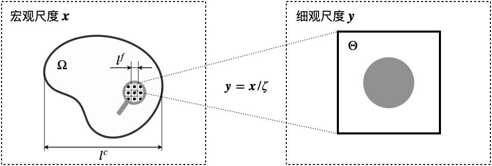

# 降阶均质化的影响张量

在 ROH 的线下-线上计算框架中，影响张量占据核心地位：在线下阶段，通过求解和后处理关于影响函数的弹性力学边值问题，获得影响张量；在线上阶段，通过影响张量构建细尺度降阶方程，求解后得到非均质--非弹性材料的宏观响应。本章将首先在第 $\ref{sec:theory}$ 节给出 ROH 的理论推导过程，这包括（1）对带求解场变量的渐进展开和（2）通过 Green 函数表示本征应变对应变场的影响；然后在第 $\ref{sec:offline}$ 节和第 $\ref{sec:online}$ 节分别介绍 ROH 的线下和线上阶段，说明 ROH 如何计算和应用影响张量。

读者将会在第 $\ref{sec:offline}$ 节看到，ROH 的影响张量可解释为弹性区域内 Green 函数的体积平均。同样应用 Green 函数的降阶方法还有非均匀场变换分析和自洽/虚拟/有限元聚类分析，甚至还可以追溯到更早的以 Eshelby 张量为核心的细观力学方法。本章将在第 $\ref{sec:offline}$ 节通过对比各种方法求解影响张量（或者作用与之类似的张量）的异同，说明 ROH 和这些方法等联系与区别。

最后，本章给出 ROH 在使用单个单元单分块（One Element One Partition，OEOP）策略时，和常应变有限元的等价性证明。多数文献认为，ROH 得到非弹性响应过刚的原因是它无法反应非弹性变形场的高度不均匀性。而本章给出的等价性证明的意义在于：由于常应变有限元自身在计算塑性等不可压缩变形场的缺陷，即使 ROH 使用大量的分块表征不均匀的非弹性变形场，也无法消除过刚现象。因此，对影响张量的修正是必要的。这是促使本论文第三章工作的主要动机。

本论文考虑的多尺度问题具有**宏观和细观两个尺度**。在宏观尺度下，考虑三维空间中的复合材料区域 $\Omega$，其边界为 $\partial \Omega$。区域 $\Omega$ 的点记作 $\boldsymbol{x}$，表示宏观尺度的坐标。复合材料在宏观尺度下的特征尺寸记作 $\ell_{\mathtt{c}}$，同时具有周期性的微结构，记作单胞区域 $\Theta$，其特征尺寸记作 $\ell_{\mathtt{f}}$。定义无量纲小量 $\zeta\triangleq \ell_{\mathtt{f}}/\ell_{\mathtt{c}}$，那么细观尺度坐标 $\boldsymbol{y}$ 与宏观尺度坐标 $\boldsymbol{x}$ 通过如下坐标缩放变换得到：

$$
\begin{equation}\label{eq:coarse_fine_scale_trans}
\boldsymbol{y} = \boldsymbol{x}/\zeta.
\end{equation}
$$

宏细观坐标变换和复合材料与单胞区域的关系如图 $\ref{fig:composite_with_periodic_structure}$ 所示。

**具有周期性微结构的复合材料区域**

单胞 $\Theta$ 由 $N_{\mathtt{phs}}$ 相不同的材料组成，每一相材料占据单胞内的空间为 $\Theta^{(\alpha)}$，其中 $\alpha=1,2,\ldots,N_{\mathtt{phs}}$ 为材料相指标，材料组分之间互不相交，共同组成单胞区域，也即

$$
\begin{equation}\notag
\Theta^{(\alpha)} \,{\Large \cap}\, \Theta^{(\beta)} = {\large\varnothing},\, \alpha\neq \beta;\quad
\bigcup_{\alpha=1}^{N_{\mathtt{phs}}} \Theta^{(\alpha)} = \Theta.
\end{equation}
$$

记每一相材料的弹性刚度张量为 $\mathbb{L}^{(\alpha)}$，那么单胞区域的弹性刚度张量的分布函数 $\mathbb{L}$ 可通过组分的特征函数 $\chi^{(\alpha)}$ 表示为

$$
\begin{equation}\label{eq:fine_scale_stiffness}
\mathbb{L}(\boldsymbol{y}) \triangleq \sum_{\alpha=1}^{N_{\mathtt{phs}}}
\chi^{(\alpha)}(\boldsymbol{y}) \mathbb{L}^{(\alpha)}, \quad
\chi^{(\alpha)}(\boldsymbol{y}) \triangleq \begin{cases}
1, & \boldsymbol{y}\in \Omega^{(\alpha)}, \\
0, & \boldsymbol{y}\notin \Omega^{(\alpha)},
\end{cases}\quad
\chi(\boldsymbol{y}) \triangleq \sum_{\alpha=1}^{N_{\mathtt{phs}}}\chi^{(\alpha)}(\boldsymbol{y}).
\end{equation}
$$

定义体积平均运算

$$
\begin{equation}\label{eq:def_volume_avg}
\langle \bullet \rangle \triangleq \frac{1}{|\Theta|} \int_{\Theta} (\bullet)\,\mathrm{d}\boldsymbol{y}, \quad
\langle \bullet \rangle^{(\alpha)} \triangleq \frac{1}{|\Theta^{(\alpha)}|} \int_{\Theta^{(\alpha)}} (\bullet)\,\mathrm{d}\boldsymbol{y},
\end{equation}
$$

式中，$|\Theta|$ 和 $|\Theta^{(\alpha)}|$ 分别表示区域 $\Theta$ 和 $\Theta^{(\alpha)}$ 的体积。由上述定义可以得到，对任意物理量 $f$，均有

$$
\begin{equation}\notag
\langle f \rangle
= \frac{1}{|\Theta|} \int_{\Theta} f \,\mathrm{d}\boldsymbol{y}
= \sum_{\alpha=1}^{N_{\mathtt{phs}}}\Big(  
\frac{|\Theta^{(\alpha)}|}{|\Theta|} \frac{1}{|\Theta^{(\alpha)}|} \int_{\Theta^{(\alpha)}} f \,\mathrm{d}\boldsymbol{y} \Big)
= \sum_{\alpha=1}^{N_{\mathtt{phs}}} c^{(\alpha)} \langle f \rangle^{(\alpha)},
\end{equation}
$$

式中，$c^{(\alpha)} \triangleq |\Theta^{(\alpha)}|/|\Theta|$ 为材料相 $\alpha$ 的体积分数。

通过式 $\eqref{eq:coarse_fine_scale_trans}$ 给出的坐标变换，弹性刚度张量在宏观坐标下的分布函数为 $\mathbb{L}^{\zeta}(\boldsymbol{x})\triangleq\mathbb{L}(\boldsymbol{x}/\zeta)$，这是一个快速振荡的周期函数。材料 $\mathbb{L}^{\zeta}$ 的非均质一般将导致定解在复合材料区域 $\Omega$ 的物理场也含有快速振荡项，使用上标 $\square^{\zeta}$ 标记，例如位移场 $\boldsymbol{u}^{\zeta}$ 和应力场 $\boldsymbol{\sigma}^{\zeta}$。关于应力场的平衡方程和边界条件为

$$
\begin{equation}\label{eq:govern}
\begin{alignedat}{2}
\nabla \cdot \boldsymbol{\sigma}^{\zeta} + \boldsymbol{f}
&= \boldsymbol{0}, \quad 
&&\boldsymbol{x} \in \Omega, \\
\boldsymbol{u}^{\zeta} 
&= \bar{\boldsymbol{u}}, \quad 
&&\boldsymbol{x} \in \partial_{\boldsymbol{u}}\Omega, \\
\boldsymbol{\sigma}^{\zeta}\cdot \boldsymbol{n} 
&= \bar{\boldsymbol{t}}, \quad
&&\boldsymbol{x} \in \partial_{\boldsymbol{\sigma}}\Omega, 
\end{alignedat}
\end{equation}
$$

式中，算子 $\nabla$ 表示关于坐标 $\boldsymbol{x}$ 的偏导数；$\bar{\boldsymbol{u}}$ 和 $\bar{\boldsymbol{t}}$ 分别是施加在本质边界 $\partial_{\boldsymbol{u}}\Omega$ 和自然边界 $\partial_{\boldsymbol{\sigma}}\Omega$ 的位移与力，边界满足 $\partial\Omega=\partial_{\boldsymbol{u}}\Omega \cup \partial_{\boldsymbol{\sigma}}\Omega$，$\boldsymbol{n}$ 是边界的外法向；向量场 $\boldsymbol{f}$ 是体力项。需要注意的是，方程中指定的体力项 $\boldsymbol{f}$ 和边界条件 $\bar{\boldsymbol{u}}$ 与 $\bar{\boldsymbol{t}}$ 都**不包含快速振荡项**，因此未使用上标 $\square^{\zeta}$ 标记。在小变形假设下，应变场 $\boldsymbol{\varepsilon}^{\zeta}$ 和位移场 $\boldsymbol{u}^{\zeta}$ 通过如下几何方程关联：

$$
\begin{equation}\label{eq:geom}
\boldsymbol{\varepsilon}^{\zeta} 
= \frac{1}{2} \big( \nabla \boldsymbol{u}^{\zeta} 
+ \boldsymbol{u}^{\zeta} \nabla \big) \triangleq \nabla^{\mathtt{s}} \boldsymbol{u}^{\zeta},
\end{equation}
$$

式中定义的算子 $\nabla^{\mathtt{s}}$ 是指标具有对称性的偏导运算。应力和应变之间的本构关系为

$$
\begin{equation}\label{eq:cstt_eigenstrain}
\boldsymbol{\sigma}^{\zeta} = \mathbb{L}^{\zeta } : \big( \boldsymbol{\varepsilon}^{\zeta} 
- \boldsymbol{\mu}^{\zeta} \big),
\end{equation}
$$

式中，$\mathbb{L}^{\zeta}$ 是非均质的四阶弹性刚度张量，$\boldsymbol{\mu}^{\zeta}$ 是二阶本征应变张量，表示由热膨胀、相变、塑性流动或损伤引起的非弹性变形。至此，平衡方程 $\eqref{eq:govern}$、几何方程 $\eqref{eq:geom}$、本构方程 $\eqref{eq:cstt_eigenstrain}$ 共同组成完整的边值问题（材料非线性一般还要求补充关于 $\boldsymbol{\mu}^{\zeta}$ 演化方程，这里暂时略去）。以下将给出 ROH 的理论推导，以处理边值问题 $\eqref{eq:govern}$—$\eqref{eq:cstt_eigenstrain}$ 中出现的小量和非弹性变形。
