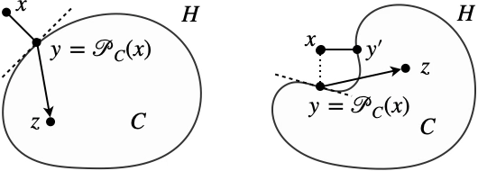

# 快速傅立叶变换

## 单胞内函数空间描述

### 应变场空间的分解

在单胞区域 $\Theta$ 内，所有满足周期性边界条件的位移场组成的空间记作 $H_{\mathtt{per}}^{1}$。使用 $\mathscr{H}_{\mathtt{e}}$ 表示所有在单胞域内平方可积的二阶对称张量场，定义在该空间的内积为

$$
( \boldsymbol{\mu}_{1},\, \boldsymbol{\mu}_{2} )_{\mathscr{H}_{\mathtt{e}}}
\triangleq \langle \boldsymbol{\mu}_{1} : \mathbb{L}_{0} : \boldsymbol{\mu}_{2} \rangle,
$$

式中，$\mathbb{L}_{0}$ 是具有主对称性和次对称性的正定四阶张量，运算 $\langle \bullet \rangle$ 表示在单胞域内的体积积分。在该内积诱导的范数下：

$$
\begin{equation}\label{eq:def_inner_strain}
\| \boldsymbol{\mu}\|_{\mathscr{H}_{\mathtt{e}}}^{2}
\triangleq \langle \boldsymbol{\mu} : \mathbb{L}_{0} : \boldsymbol{\mu} \rangle,
\end{equation}
$$

空间 $\mathscr{H}_{\mathtt{e}}$ 是完备的，因此是 Hilbert 空间。在 Hilbert 空间 $\mathscr{H}_{\mathtt{e}}$ 内，由所有均匀应变场组成的子空间记作 $\mathscr{U}_{\mathtt{e}}$，由所有运动学允许且均值等于零的应变场组成的子空间记作 $\mathscr{E}_{0}$，也即

$$
\mathscr{E}_{0} = \{ \tilde{\boldsymbol{\varepsilon}}
\mid \tilde{\boldsymbol{\varepsilon}} = \nabla_{\mathtt{s}}\boldsymbol{u},\, \boldsymbol{u}\in H_{\mathtt{per}}^{1} \}.
$$

这两个子空间在 $\mathscr{H}_{\mathtt{e}}$ 内是闭的，因此它们分别也是在内积 $\eqref{eq:def_inner_strain}$ 意义下的 Hilbert 空间。注意到

$$
( \boldsymbol{\varepsilon}^{\mathtt{c}},\, \tilde{\boldsymbol{\varepsilon}} )_{\mathscr{H}_{\mathtt{e}}}
= \langle \boldsymbol{\varepsilon}^{\mathtt{c}} : \mathbb{L}_{0} : \tilde{\boldsymbol{\varepsilon}} \rangle
= \boldsymbol{\varepsilon}^{\mathtt{c}} : \mathbb{L}_{0} : \langle \tilde{\boldsymbol{\varepsilon}} \rangle = 0,\quad
\forall \boldsymbol{\varepsilon}^{\mathtt{c}}\in\mathscr{U}_{\mathtt{e}},\, 
\forall \tilde{\boldsymbol{\varepsilon}}\in\mathscr{E}_{0},
$$

所以空间 $\mathscr{U}_{\mathtt{e}}$ 和 $\mathscr{E}_{0}$ 正交，记作

$$
\mathscr{U}_{\mathtt{e}} \perp \mathscr{E}_{0},
$$

那么可以对应变场空间作如下分解：

$$
\begin{equation}\label{eq:decouple_strain_space}
\mathscr{H}_{\mathtt{e}} = \mathscr{U}_{\mathtt{e}} \oplus \mathscr{E}_{0} \oplus \mathscr{E}_{\perp},\quad
\mathscr{E} \triangleq \mathscr{U}_{\mathtt{e}} \oplus \mathscr{E}_{0}.
\end{equation}
$$

### 应变场空间的对偶

应变场空间的对偶空间记作 $\mathscr{H}_{\mathtt{s}}$，在力学中称为应力场空间。对偶运算记作 $( \bullet,\, \bullet)_{\mathscr{H}_{\mathtt{s}}\times\mathscr{H}_{\mathtt{e}}}:\mathscr{H}_{\mathtt{s}}\times\mathscr{H}_{\mathtt{e}}\mapsto\mathbb{R}$​。根据 Riesz 表示定理，Hilbert 空间 $\mathscr{H}_{\mathtt{e}}$ 的对偶空间是它自身，也即可找到一个同构映射 $\mathcal{R}:\mathscr{H}_{\mathtt{e}}\mapsto\mathscr{H}_{\mathtt{s}}$，有

$$
\begin{equation}\label{eq:riesz}
\big( \mathcal{R}(\boldsymbol{\gamma}),\, \delta\boldsymbol{\mu} 
\big)_{\mathscr{H}_{\mathtt{s}}\times\mathscr{H}_{\mathtt{e}}}
= (\boldsymbol{\gamma},\, \delta\boldsymbol{\mu})_{\mathscr{H}_{\mathtt{e}}}, \quad
\forall \delta\boldsymbol{\mu} \in \mathscr{H}_{\mathtt{e}},
\end{equation}
$$

以及原像和像在各自的范数下相等（这也是同构映射的定义）：

$$
\| \mathcal{R}(\boldsymbol{\gamma}) \|_{\mathscr{H}_{\mathtt{s}}}
= \| \boldsymbol{\gamma} \|_{\mathscr{H}_{\mathtt{e}}}.
$$

如果此时定义对偶运算为单胞域内的虚功：

$$
\begin{equation}\label{eq:dual_op}
( \boldsymbol{\tau},\, \boldsymbol{\mu} )_{\mathscr{H}_{\mathtt{s}}\times\mathscr{H}_{\mathtt{e}}}
\triangleq \langle \boldsymbol{\tau}:\boldsymbol{\mu} \rangle,
\end{equation}
$$

在定义应变场空间 $\mathscr{H}_{\mathtt{e}}$ 的内积 $\eqref{eq:def_inner_strain}$ 以及对偶运算 $\eqref{eq:dual_op}$ 后，根据 Riesz 表示定理 $\eqref{eq:riesz}$，得到

$$
\big( \mathcal{R}(\boldsymbol{\gamma}),\, \delta\boldsymbol{\mu} 
\big)_{\mathscr{H}_{\mathtt{s}}\times\mathscr{H}_{\mathtt{e}}}
= \langle \mathcal{R}(\boldsymbol{\gamma}) : \delta\boldsymbol{\mu} \rangle
= \langle \boldsymbol{\gamma} : \mathbb{L}_{0} : \delta\boldsymbol{\mu} \rangle, \quad
\forall \delta\boldsymbol{\mu} \in \mathscr{H}_{\mathtt{e}},
$$

所以同构映射 $\mathcal{R}:\boldsymbol{\gamma}\mapsto\mathbb{L}_{0}:\boldsymbol{\gamma}$，以及应力场的范数和诱导的内积分别为

$$
\begin{equation}\label{eq:inner_stress}
\begin{aligned}
\| \boldsymbol{\tau}\|_{\mathscr{H}_{\mathtt{s}}}^{2}
&= \big\langle (\mathbb{M}_{0} : \boldsymbol{\tau}) : \mathbb{L}_{0} : (\mathbb{M}_{0} : \boldsymbol{\tau}) \big\rangle
= \big\langle \boldsymbol{\tau} : \mathbb{M}_{0} : \boldsymbol{\tau} \big\rangle,\\
( \boldsymbol{\tau}_{1},\, \boldsymbol{\tau}_{2} )_{\mathscr{H}_{\mathtt{s}}}
&= \langle \boldsymbol{\tau}_{1} : \mathbb{M}_{0} : \boldsymbol{\tau}_{2} \rangle,
\end{aligned}
\end{equation}
$$

式中，$\mathbb{M}_{0}$ 是张量，且满足 $\mathbb{L}_{0}:\mathbb{M}_{0}=\mathbb{M}_{0}:\mathbb{L}_{0}=\mathbb{I}$，其中 $\mathbb{I}$ 是四阶单位张量。注意，式 $\eqref{eq:inner_stress}$ 不是定义，而是在定义应变场内积和对偶运算之后，推导得到的结果。类似于应变场空间的分解，将均匀应力场组成的空间记作 $\mathscr{U}_{\mathtt{s}}$，所有满足单胞内无体力平衡方程且均值等于零的应力场组成的空间记作 $\mathscr{S}_{0}$，也即

$$
\mathscr{S}_{0}\triangleq
\{ \tilde{\boldsymbol{\sigma}} \mid \nabla\cdot\tilde{\boldsymbol{\sigma}}=\boldsymbol{0},\, 
\langle \tilde{\boldsymbol{\sigma}} \rangle = \boldsymbol{0}\},
$$

称为自平衡应力场。注意到

$$
(\boldsymbol{\sigma}^{\mathtt{c}},\, \tilde{\boldsymbol{\boldsymbol{\sigma}}})_{\mathscr{H}_{\mathtt{s}}}
= \langle \boldsymbol{\sigma}^{\mathtt{c}} : \mathbb{M}_{0} : \tilde{\boldsymbol{\sigma}} \rangle
= \boldsymbol{\sigma}^{\mathtt{c}} : \mathbb{M}_{0} : \langle \tilde{\boldsymbol{\sigma}} \rangle
= 0,\quad\forall \boldsymbol{\sigma}^{\mathtt{c}}\in\mathscr{U}_{\mathtt{s}},\, 
\forall \tilde{\boldsymbol{\sigma}} \in\mathscr{S}_{0},
$$

因此有 $\mathscr{U}_{\mathtt{s}}\perp\mathscr{S}_{0}$​。可以对应力场空间作如下分解：

$$
\mathscr{H}_{\mathtt{s}} = \mathscr{U}_{\mathtt{s}} \oplus \mathscr{S}_{0} \oplus \mathscr{S}_{\perp},\quad
\mathscr{S} \triangleq \mathscr{U}_{\mathtt{s}} \oplus \mathscr{S}_{0}.
$$

### 子空间的几何正交性

接下来将展示，在上述内积定义下，子空间之间的几何正交性。以下子空间的正交属性又称为 Hill 条件：

$$
\begin{equation}\label{eq:hill_ortho}
\begin{aligned}
\boldsymbol{\sigma}\in\mathscr{S} 
&\iff (\boldsymbol{\sigma},\, \tilde{\boldsymbol{\varepsilon}})_{\mathscr{H}_{\mathtt{e}}\times\mathscr{H}_{\mathtt{s}}}=0, \quad
\forall \tilde{\boldsymbol{\varepsilon}}\in \mathscr{E}_{0}, \\
\boldsymbol{\varepsilon}\in \mathscr{E} 
&\iff ( \tilde{\boldsymbol{\sigma}},\, \boldsymbol{\varepsilon})_{\mathscr{H}_{\mathtt{e}}\times\mathscr{H}_{\mathtt{s}}}=0, \quad
\forall \tilde{\boldsymbol{\sigma}}\in \mathscr{S}_{0},
\end{aligned}
\end{equation}
$$

根据上述条件，就可以得到，对于任意的 $\boldsymbol{\varepsilon}\in\mathscr{E}$ 和 $\boldsymbol{\sigma}\in\mathscr{S}$，有

$$
\begin{aligned}
(\boldsymbol{\sigma},\, \boldsymbol{\varepsilon})_{\mathscr{H}_{\mathtt{s}}\times\mathscr{H}_{\mathtt{e}}}
&= \big\langle \big( \langle \boldsymbol{\sigma} \rangle + \tilde{\boldsymbol{\boldsymbol{\sigma}}} \big) : \big( \langle \boldsymbol{\varepsilon} \rangle + \tilde{\boldsymbol{\boldsymbol{\varepsilon}}} \big)\big\rangle \\
&= \langle \boldsymbol{\sigma} \rangle : \langle \boldsymbol{\varepsilon} \rangle
+ (\tilde{\boldsymbol{\sigma}},\, \langle \boldsymbol{\varepsilon} \rangle)_{\mathscr{H}_{\mathtt{s}}\times\mathscr{H}_{\mathtt{e}}}
+ (\langle \boldsymbol{\sigma} \rangle,\, \tilde{\boldsymbol{\varepsilon}})_{\mathscr{H}_{\mathtt{s}}\times\mathscr{H}_{\mathtt{e}}}
+ (\tilde{\boldsymbol{\sigma}},\, \tilde{\boldsymbol{\varepsilon}})_{\mathscr{H}_{\mathtt{s}}\times\mathscr{H}_{\mathtt{e}}} \\
&= \langle \boldsymbol{\sigma} \rangle : \langle \boldsymbol{\varepsilon} \rangle.
\end{aligned}
$$

此外，一方面，通过 Hill 条件，

$$
\begin{equation}\notag
\begin{aligned}
( \boldsymbol{\sigma},\, \tilde{\boldsymbol{\varepsilon}})_{\mathscr{H}_{\mathtt{e}}\times\mathscr{H}_{\mathtt{s}}}
= ( \boldsymbol{\sigma},\, \mathbb{L}_{0} : \tilde{\boldsymbol{\varepsilon}})_{\mathscr{H}_{\mathtt{s}}}=0,\,
\forall \boldsymbol{\sigma} \in \mathscr{S},\, 
\forall \tilde{\boldsymbol{\varepsilon}} \in \mathscr{E}_{0}
&\quad\Rightarrow\quad
\mathbb{L}_{0} :\tilde{\boldsymbol{\varepsilon}} \in \mathscr{S}_{\perp},\\
( \tilde{\boldsymbol{\sigma}},\, \boldsymbol{\varepsilon})_{\mathscr{H}_{\mathtt{e}}\times\mathscr{H}_{\mathtt{s}}}
= ( \mathbb{M}_{0} : \tilde{\boldsymbol{\sigma}},\, \boldsymbol{\varepsilon})_{\mathscr{H}_{\mathtt{e}}}=0,\,
\forall \tilde{\boldsymbol{\sigma}} \in \mathscr{S}_{0},\, 
\forall \boldsymbol{\varepsilon} \in \mathscr{E}
&\quad\Rightarrow\quad
\mathbb{M}_{0} : \tilde{\boldsymbol{\sigma}} \in \mathscr{E}_{\perp},
\end{aligned}
\end{equation}
$$

另一方面，同构映射 $\mathbb{L}_{0}$ 将子空间 $\mathscr{E}_{0}$ 映射到其对偶空间 $\mathscr{E}_{0}' \subset \mathscr{H}_{\mathtt{s}}$，以及同构映射 $\mathbb{M}_{0}$ 将子空间 $\mathscr{S}_{0}$ 映射到其对偶空间 $\mathscr{S}_{0}'\subset\mathscr{H}_{\mathtt{e}}$。再结合上式，就得到

$$
\begin{equation}\label{eq:dual_subspace_1}
\mathscr{S}_{\perp} = \big( \mathscr{E}_{0} \big)',\quad
\mathscr{E}_{\perp} = \big( \mathscr{S}_{0} \big)',
\end{equation}
$$

再根据 Hilbert 空间的自反性，也即 $H''=H$，可得到

$$
\begin{equation}\label{eq:dual_subspace_2}
\mathscr{E}_{0} = \big( \mathscr{S}_{\perp} \big)',\quad
\mathscr{S}_{0} = \big( \mathscr{E}_{\perp} \big)'.
\end{equation}
$$

可以将上述空间和子空间之间的关系通过如下示意图给出。其中，互为对偶的子空间使用相同形状的外框框出。

### Green 函数作为投影算子

在对上述应变和应力场空间进行几何上的分解之后，现在就可以将求解 Eshelby 问题的 Green 算子解释为空间上的投影算子。Eshelby 问题表述为：对给定的极化应力 $\boldsymbol{\tau}\in H_{\mathtt{s}}$，寻找 $\tilde{\boldsymbol{\varepsilon}}\in \mathscr{E}_{0}$，使得

$$
\boldsymbol{\sigma} = \mathbb{L}_{0}:\tilde{\boldsymbol{\varepsilon}} - \boldsymbol{\tau} \in \mathscr{S}.
$$

注意，在上述问题中，极化应力的符号和细观力学的惯例正负号相反。Green 算子 $\Gamma_{0}:\mathscr{H}_{\mathtt{s}}\mapsto\mathscr{E}_{0}$ 将极化应力 $\boldsymbol{\tau}$ 映射为上述方程的应变解，也即

$$
\nabla\cdot \big[ \mathbb{L}_{0}:(\Gamma_{0}*\boldsymbol{\tau})-\boldsymbol{\tau} \big] = \boldsymbol{0},
$$

相应的，对给定的本征应变 $\boldsymbol{\mu}$​，寻找 $\tilde{\boldsymbol{\sigma}}\in \mathscr{S}_{0}$，使得

$$
\boldsymbol{\varepsilon} = \mathbb{M}_{0}:\tilde{\boldsymbol{\sigma}} - \boldsymbol{\mu} \in \mathscr{E}.
$$

将上述方程从任意本征应变到方程解的映射记作 $\Delta_{0}:\mathscr{H}_{\mathtt{e}}\mapsto\mathscr{S}_{0}$。

定义的 Green 算子 $\Gamma_{0}$ 具有如下性质：

(1). $\Gamma_{0}\circ\mathbb{L}_{0}:\mathscr{H}_{\mathtt{e}}\mapsto\mathscr{H}_{\mathtt{e}}$ 是幂等算子，也即

$$
\begin{equation}\label{eq:idem}
\Gamma_{0}\circ\mathbb{L}_{0}\circ\Gamma_{0}\circ\mathbb{L}_{0}=\Gamma_{0}\circ\mathbb{L}_{0},\quad
\text{or}\quad
\Gamma_{0}\circ\mathbb{L}_{0}\circ\Gamma_{0}=\Gamma_{0}.
\end{equation}
$$

(2). $\Gamma_{0}\circ\mathbb{L}_{0}$ 是自伴算子，也即

$$
\begin{equation}\label{eq:self_adjoint}
\begin{aligned}
\big( \boldsymbol{\mu}_{1},\, (\Gamma_{0}\circ\mathbb{L}_{0})*\boldsymbol{\mu}_{2} \big)_{\mathscr{H}_{\mathtt{e}}}
&= \big( \underbrace{\mathbb{L}_{0} : \boldsymbol{\mu}_{1}}_{:=\boldsymbol{\tau}_{1}},\, 
(\Gamma_{0}\circ\underbrace{\mathbb{L}_{0})*\boldsymbol{\mu}_{2}}_{:=\boldsymbol{\tau}_{2}} \big)_{\mathscr{H}_{\mathtt{s}}\times\mathscr{H}_{\mathtt{e}}}\\
&=\big( \boldsymbol{\tau}_{1},\, 
\Gamma_{0}*\boldsymbol{\tau}_{2} \big)_{\mathscr{H}_{\mathtt{s}}\times\mathscr{H}_{\mathtt{e}}}
\stackrel{\text{reciprocal}}{=}
\big( \boldsymbol{\tau}_{2},\, 
\Gamma_{0}*\boldsymbol{\tau}_{1} \big)_{\mathscr{H}_{\mathtt{s}}\times\mathscr{H}_{\mathtt{e}}}\\
&=\big( (\Gamma_{0}\circ\mathbb{L}_{0})*\boldsymbol{\mu}_{1},\, \boldsymbol{\mu}_{2} \big)_{\mathscr{H}_{\mathtt{e}}}.
\end{aligned}
\end{equation}
$$

(3). 对任意的 $\boldsymbol{\mu}\in\mathscr{H}_{\mathtt{e}}$，有 $\Gamma_{0}\circ\mathbb{L}_{0}*\boldsymbol{\mu}\in \mathscr{E}_{0}$；对任意的 $\tilde{\boldsymbol{\varepsilon}}\in\mathscr{E}_{0}$，有 

$$
\begin{equation}\label{eq:fixed_point}
\Gamma_{0}\circ\mathbb{L}_{0}*\tilde{\boldsymbol{\varepsilon}} = \tilde{\boldsymbol{\varepsilon}}.
\end{equation}
$$
   

相应的，算子 $\Delta_{0}\circ\mathbb{M}_{0}:\mathscr{H}_{\mathtt{s}}\mapsto\mathscr{H}_{\mathtt{s}}$ 也有类似的性质，在此略过。由上述性质可知，$\Gamma_{0}\circ\mathbb{L}_{0}$ 事实上给出了 Hilbert 空间 $\mathscr{H}_{\mathtt{e}}$ 的投影算子，有

$$
\begin{equation}\label{eq:projection_op_strain}
P_{\mathscr{U}_{\mathtt{e}}} = \langle \bullet \rangle,\quad
P_{\mathscr{E}_{0}} = \Gamma_{0}\circ\mathbb{L}_{0},\quad
P_{\mathscr{E}_{\perp}} = \mathbb{M}_{0} \circ \Delta_{0},
\end{equation}
$$

以及在应力场空间中的投影算子：

$$
\begin{equation}\label{eq:projection_op_stress}
P_{\mathscr{U}_{\mathtt{s}}} = \langle \bullet \rangle,\quad
P_{\mathscr{S}_{0}} = \Delta_{0} \circ \mathbb{M}_{0},\quad
P_{\mathscr{E}_{\perp}} = \mathbb{L}_{0} \circ \Gamma_{0},
\end{equation}
$$

这里给出式 $\eqref{eq:projection_op_strain}$ 最后一个等式成立的说明。对给定的本征应变 $\boldsymbol{\mu}$，由应变场空间分解 $\eqref{eq:decouple_strain_space}$，以及子空间之间的对偶关系 $\eqref{eq:dual_subspace_1}$ 可知

$$
\mathbb{L}_{0}: P_{\mathscr{E}_{\perp}}(\boldsymbol{\mu})
=\mathbb{L}_{0}: \big( \boldsymbol{\mu} - \langle \boldsymbol{\mu} \rangle - (\Gamma_{0}\circ\mathbb{L}_{0})*\boldsymbol{\mu} \big) \in \mathscr{J}_{0},
$$

一方面，对任意 $\tilde{\boldsymbol{\sigma}}\in \mathscr{S}_{0}$，算子 $\Delta_{0}\circ\mathbb{M}_{0}$ 将其映射至自身，所以

$$
\big( \Delta_{0}\circ\mathbb{M}_{0} \big)
*\big( \mathbb{L}_{0}: P_{\mathscr{E}_{\perp}}(\boldsymbol{\mu}) \big)
= \mathbb{L}_{0}: P_{\mathscr{E}_{\perp}}(\boldsymbol{\mu});
$$

另一方面，算子 $\Delta_{0}$ 的零空间为相容的应变场空间，也即 $\mathscr{N}(\Delta_{0}) = \mathscr{E}$，所以

$$
\begin{aligned}
\big( \Delta_{0}\circ\mathbb{M}_{0} \big)
*\big( \mathbb{L}_{0}: P_{\mathscr{E}_{\perp}}(\boldsymbol{\mu}) \big)
&= \Delta_{0} * \big( \boldsymbol{\mu} 
- \big[ \underbrace{\langle \boldsymbol{\mu} \rangle + (\Gamma_{0}\circ\mathbb{L}_{0})*\boldsymbol{\mu}}_{\in \mathscr{E}} \big] \big)\\
&= \Delta_{0} * \boldsymbol{\mu};
\end{aligned}
$$

综合上述公式，就得到

$$
P_{\mathscr{E}_{\perp}}(\boldsymbol{\mu})
= \big( \mathbb{M}_{0}\circ\Delta_{0} \big) * \boldsymbol{\mu}.
$$

## 变分原理

### 最小势能原理

对单胞方程：

$$
\begin{equation}\label{eq:strong_eqs}
\left\{\begin{aligned}
\boldsymbol{\varepsilon} &= \bar{\boldsymbol{\varepsilon}} + \tilde{\boldsymbol{\varepsilon}},\quad
\tilde{\boldsymbol{\varepsilon}} \in \mathscr{E}_{0},\\
\boldsymbol{\sigma} &= \mathbb{L}:\boldsymbol{\varepsilon}, \\
\boldsymbol{\sigma} &\in \mathscr{S},
\end{aligned}\right.
\end{equation}
$$

与之等价的变分问题为：

$$
\begin{equation}\label{eq:vari_strain}
\left\{\begin{aligned}
\tilde{\boldsymbol{\varepsilon}}
&=\min_{\tilde{\boldsymbol{\varepsilon}}\in\mathscr{E}_{0}} \mathcal{J}(\tilde{\boldsymbol{\varepsilon}}), \\
\boldsymbol{\sigma}
&= \mathbb{L}:\big( \bar{\boldsymbol{\varepsilon}}+\tilde{\boldsymbol{\varepsilon}} \big).
\end{aligned}\right.
\quad
\mathcal{J}(\tilde{\boldsymbol{\varepsilon}})
\triangleq\frac{1}{2} \big( \mathbb{L}:(\bar{\boldsymbol{\varepsilon}}+\tilde{\boldsymbol{\varepsilon}}),\, 
\bar{\boldsymbol{\varepsilon}}+\tilde{\boldsymbol{\varepsilon}}\big)_{\mathscr{H}_{\mathtt{s}}\times\mathscr{H}_{\mathtt{e}}},
\end{equation}
$$

将泛函 $\mathcal{J}$ 的梯度记作 $\nabla\mathcal{J}$，自然是 $\mathscr{E}_{0}$ 的对偶空间 $\mathscr{S}_{\perp}$ 的元素，但可以通过同构映射重新拉回到 $\mathscr{E}_{0}$。此处定义的梯度是空间 $\mathscr{E}_{0}$ 到自身的映射，$\nabla\mathcal{J}:\mathscr{E}_{0}\mapsto\mathscr{E}_{0}$，有

$$
\big(\nabla\mathcal{J}(\tilde{\boldsymbol{\varepsilon}}),\, \delta\tilde{\boldsymbol{\varepsilon}} \big)_{\mathscr{H}_{\mathtt{e}}}
= \big( \mathbb{L}:(\bar{\boldsymbol{\varepsilon}}+\tilde{\boldsymbol{\varepsilon}}),\, \delta\tilde{\boldsymbol{\varepsilon}} \big)_{\mathscr{H}_{\mathtt{s}}\times\mathscr{H}_{\mathtt{e}}}
= \big(\mathbb{M}_{0}: \mathbb{L}:(\bar{\boldsymbol{\varepsilon}}+\tilde{\boldsymbol{\varepsilon}}),\, \delta\tilde{\boldsymbol{\varepsilon}} \big)_{\mathscr{H}_{\mathtt{e}}},\quad
\forall \delta\tilde{\boldsymbol{\varepsilon}}\in \mathscr{E}_{0},
$$

然而，$\mathbb{M}_{0}: \mathbb{L}:(\bar{\boldsymbol{\varepsilon}}+\tilde{\boldsymbol{\varepsilon}})$ 可能在空间 $\mathscr{E}_{0}$ 之外，它在空间 $\mathscr{E}_{0}$ 的投影才等于 $\nabla\mathcal{J}$，也即

$$
\begin{equation}\label{eq:grad_j}
\nabla\mathcal{J}(\tilde{\boldsymbol{\varepsilon}}) = P_{\mathscr{E}_{0}}\big( \mathbb{M}_{0}: \mathbb{L}:(\bar{\boldsymbol{\varepsilon}}+\tilde{\boldsymbol{\varepsilon}}) \big)
= \Gamma_{0}*\big( \mathbb{L}:(\bar{\boldsymbol{\varepsilon}}+\tilde{\boldsymbol{\varepsilon}}) \big).
\end{equation}
$$

若泛函 $\mathcal{J}$ 在 $\tilde{\boldsymbol{\varepsilon}}:=\tilde{\boldsymbol{\varepsilon}}^{\star}$ 取最小值，那么有

$$
\nabla\mathcal{J}(\tilde{\boldsymbol{\varepsilon}}^{\star})=\boldsymbol{0},
$$

根据 Green 算子的性质，有

$$
\mathbb{L}:(\bar{\boldsymbol{\varepsilon}}+\tilde{\boldsymbol{\varepsilon}}^{\star}) \in \mathscr{J},
$$

所以强形式 $\eqref{eq:strong_eqs}$ 与变分问题 $\eqref{eq:vari_strain}$ 是等价的。

### 几何变分原理

这里定义与变分问题 $\eqref{eq:vari_strain}$ 等价的另一个变分问题，但是其泛函的构造是几何层面的。将梯度表达式 $\eqref{eq:grad_j}$ 代入到如下泛函 $\mathcal{N}:\mathscr{E}_{0}\mapsto\mathbb{R}$，得到

$$
\mathcal{N}(\tilde{\boldsymbol{\varepsilon}})
\triangleq \frac{1}{2}\| \nabla\mathcal{J}(\tilde{\boldsymbol{\varepsilon}}) \|_{\mathscr{H}_{\mathtt{e}}}
= \frac{1}{2}\big\| \Gamma_{0}*\big( \mathbb{L}:(\bar{\boldsymbol{\varepsilon}}+\tilde{\boldsymbol{\varepsilon}}) \big) \big\|_{\mathscr{H}_{\mathtt{e}}}.
$$

注意到应变和应力场函数空间的范数有关系 $\|\boldsymbol{\mu}\|_{\mathscr{H}_{\mathtt{e}}}=\|\mathbb{L}_{0}:\boldsymbol{\mu}\|_{\mathscr{H}_{\mathtt{s}}}$，对任意 $\boldsymbol{\mu}\in \mathscr{H}_{\mathtt{e}}$ 成立，再根据应力场投影算子的表达式 $\eqref{eq:projection_op_stress}$，有

$$
\begin{equation}\label{eq:geo_funcl_equili}
\mathcal{N}(\tilde{\boldsymbol{\varepsilon}})
= \frac{1}{2}\big\| P_{\mathscr{S}_{\perp}} \big( \mathbb{L}:(\bar{\boldsymbol{\varepsilon}}+\tilde{\boldsymbol{\varepsilon}}) \big) \big\|_{\mathscr{H}_{\mathtt{s}}}^{2}.
\end{equation}
$$

上述泛函在 $\tilde{\boldsymbol{\varepsilon}}:=\tilde{\boldsymbol{\varepsilon}}^{\star}$ 处取最小值，也即 $\mathcal{N}(\tilde{\boldsymbol{\varepsilon}}^{\star})=0$，也因此泛函 $\eqref{eq:geo_funcl_equili}$ 有着直观的几何解释：最小化应力场 $\mathbb{L}:(\bar{\boldsymbol{\varepsilon}}+\tilde{\boldsymbol{\varepsilon}})$ 到平衡应力场空间 $\mathscr{S}$ 的距离。泛函 $\eqref{eq:geo_funcl_equili}$ 的梯度 $\nabla\mathcal{N}:\mathscr{E}_{0}\mapsto\mathscr{E}_{0}$ 为

$$
\nabla \mathcal{N}(\tilde{\boldsymbol{\varepsilon}})
= \Gamma_{0}\circ\mathbb{L}\circ\Gamma_{0}
*\big( \mathbb{L}:(\bar{\boldsymbol{\varepsilon}}+\tilde{\boldsymbol{\varepsilon}}) \big).
$$

如果记 $\tilde{\boldsymbol{e}}=\Gamma_{0}*\mathbb{L}:(\bar{\boldsymbol{\varepsilon}}+\tilde{\boldsymbol{\varepsilon}})$，那么有 $\tilde{\boldsymbol{e}}\in\mathscr{E}_{0}$，且

$$
\begin{aligned}
\big( \nabla\mathcal{J},\, \nabla\mathcal{N} \big)_{\mathscr{H}_{\mathtt{e}}}
&= \big( \tilde{\boldsymbol{e}},\, \Gamma_{0}\circ\mathbb{L}*\tilde{\boldsymbol{e}}\big)_{\mathscr{H}_{\mathtt{e}}}
= \big( \tilde{\boldsymbol{e}},\, \Gamma_{0}\circ\mathbb{L}_{0}\circ\mathbb{M}_{0}\circ\mathbb{L}*\tilde{\boldsymbol{e}}\big)_{\mathscr{H}_{\mathtt{e}}}\\
&\stackrel{\eqref{eq:self_adjoint}}{=} \big( \Gamma_{0}\circ\mathbb{L}_{0}*\tilde{\boldsymbol{e}},\, \mathbb{M}_{0}\circ\mathbb{L}*\tilde{\boldsymbol{e}}\big)_{\mathscr{H}_{\mathtt{e}}}
\stackrel{\eqref{eq:idem}}{=} \big( \mathbb{L}:\tilde{\boldsymbol{e}},\, \tilde{\boldsymbol{e}}\big)_{\mathscr{H}_{\mathtt{s}}\times\mathscr{H}_{\mathtt{e}}}\\
&\geq 0,
\end{aligned}
$$

这意味着上述定义的两个泛函的梯度向量夹角小于九十度。

### 双场变分原理

在上述构造几何变分原理时，其几何意义解释为将测试应力场到平衡应力场空间的距离最小化，当取到最小值时，即得到应力场是平衡应力场的约束条件。可以继续以类似的方式添加泛函项，从而将变分原理 $\eqref{eq:vari_strain}$ 中关于相容应变场中取值和应力应变关系进一步放松。对单胞域内每一点 $\boldsymbol{y}\in\Theta$，定义泛函

$$
r(\boldsymbol{y},\, \boldsymbol{\tau},\, \boldsymbol{\mu})
= \frac{1}{2}(\boldsymbol{\tau}-\mathbb{L}:\boldsymbol{\mu}) : \mathbb{M} : (\boldsymbol{\tau}-\mathbb{L}:\boldsymbol{\mu}),
$$

由定义可得到对任意 $(\boldsymbol{y},\, \boldsymbol{\tau},\, \boldsymbol{\mu})$ 有 $r\geq 0$。对应力场的平衡条件的约束可通过泛函 $\eqref{eq:geo_funcl_equili}$ 施加；类似的，对应变场的相容性条件可通过定义泛函 $\mathcal{M}:\mathscr{H}_{\mathtt{e}}\mapsto\mathbb{R}$ 得到：

$$
\begin{equation}\label{eq:compat}
\mathcal{M}(\boldsymbol{\mu})
\triangleq \frac{1}{2}\| (I - P_{\mathscr{E}_{0}})\boldsymbol{\mu} - \bar{\boldsymbol{\varepsilon}} \|_{\mathscr{H}_{\mathtt{e}}}^{2},
\end{equation}
$$

式中，$I$ 是恒等算子。最终，定义双场泛函 $\mathcal{P}:\mathscr{H}_{\mathtt{s}}\times\mathscr{H}_{{\mathtt{e}}}\mapsto\mathbb{R}$ 为

$$
\begin{equation}\label{eq:vari_two_field}
\mathcal{P}(\boldsymbol{\tau},\, \boldsymbol{\mu})
\triangleq \langle r(\boldsymbol{\tau},\, \boldsymbol{\mu}) \rangle
+ \frac{1}{2}\big\| P_{\mathscr{S}_{\perp}} \boldsymbol{\tau} \big\|_{\mathscr{H}_{\mathtt{s}}}^{2}
+ \frac{1}{2}\| (I - P_{\mathscr{E}_{0}})\boldsymbol{\mu} - \bar{\boldsymbol{\varepsilon}} \|_{\mathscr{H}_{\mathtt{e}}}^{2},
\end{equation}
$$

与单胞方程 $\eqref{eq:strong_eqs}$ 等价的变分问题就可以等价地表述为：

$$
(\boldsymbol{\sigma}^{\star},\, \boldsymbol{\varepsilon}^{\star})
=\mathop{\arg\min}_{(\boldsymbol{\tau},\, \boldsymbol{\mu})\in \mathscr{H}_{\mathtt{s}}\times\mathscr{H}_{{\mathtt{e}}}}
\mathcal{P}(\boldsymbol{\tau},\, \boldsymbol{\mu}).
$$

## 附录：Hilbert 空间的投影算子

这里将给出许全华等人编写的《泛函分析讲义》4.2节中关于实数域 Hilbert 空间 $H$ 投影算子的一些定理和推论，方便理解本文档中的结论。

设 $C$ 是 $H$ 的非空闭凸子集，有如下结论成立：

(1). 对任意的 $x\in H$，存在唯一的 $y\in C$，使得

$$
\|x-y\| = d(x,C) \triangleq \inf_{z\in C}\|x-z\|,
$$

   其中 $d(x,C)$ 是 $x$ 到集合 $C$ 的距离。此时称 $y$ 是 $x$ 在 $C$ 上的投影，记作 $P_{C}(x)$。

(2). 设 $x\in H$，那么

$$
y = P_{C}(x) \iff (x-y,\, z-y)_{H} \leq 0.
$$

(3). 映射 $x\mapsto P_{C}(x)$ 是常数为 1 的 Lipschitz 映射，也即对任意的 $x,\, x'\in H$，有

$$
\| P_{C}(x) - P_{C}(x') \| \leq \| x-x' \|.
$$

(4). $P_{C}\circ P_{C}=P_{C}$，且 $P_{C}(H)=C$，即投影算子是幂等算子。

下图通过一个二维空间的几何实例说明，为什么在定理中限制 $C$ 是凸集。

若 $E$ 是 $H$ 的非零闭向量子空间，那么对任意 $x\in H$，它的投影 $P_{E}(x)$ 是子空间 $E$ 中满足条件 $x-y\perp E$的唯一元素 $y$，并且 $P_{E}$ 是 $H$ 到 $E$ 的线性算子，且有 $\| P_{E} \|=1$。进一步可以将空间 $H$ 分解为

$$
H = E \oplus E_{\perp},
$$

也即对任意的 $x\in H$，存在唯一的分解 $x=y+z$，其中 $y\in E$ 和 $z\in E_{\perp}$，并且有如下勾股定理：

$$
\|x\|^{2} = \|y\|^{2}+\|z\|^{2}.
$$
