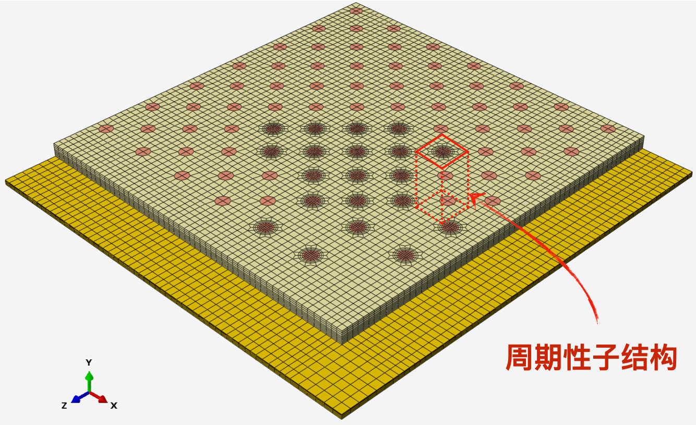
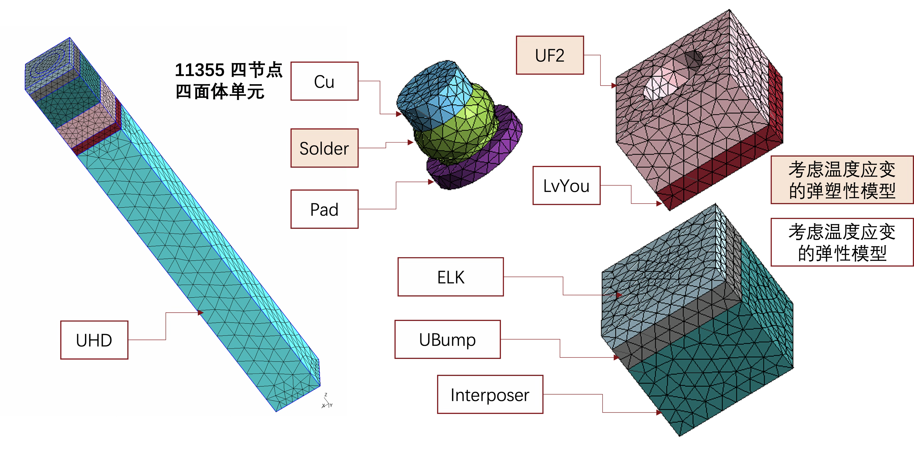
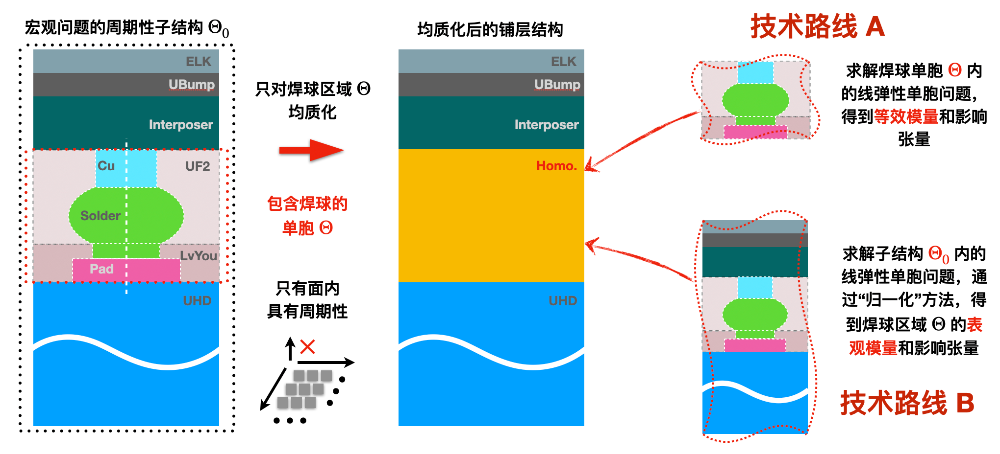

这篇文档的主要目的是计算焊球单胞在（1）周期性边界条件和（2）嵌入 underfill 两种情况下的等效和表观模量与影响张量。在此基础上，证实或证伪当前一些仍然模糊的猜想：

* 嵌入 underfill 后单胞是否满足 Hill-Mandel 条件？表观模量是否仍具有主对称性？
* 两种不同计算方法下，焊球的面外剪切变形（弹性阶段）差别会是多少？

## 问题描述

待降阶的宏观问题如图所示，提取宏观问题的周期性子结构 $\Theta_{0}$，该子结构各组分的形状和材料名称如图所示。子结构中间区域 $\Theta$ 包含 Cu，Solder 和 Pad 三种夹杂，以及 UF2 和 LvYou 两种基体。在区域 $\Theta$ 的上下表面是不同材料的铺层。

子结构 $\Theta_{0}$ 和焊球单胞 $\Theta$ 的二维示意图如图所示。均质化的对象仅是焊球单胞 $\Theta$，均质化之后的宏观几何模型是铺层结构。为对焊球区域进行均质化，有如下两种技术路线：

1. **技术路线 A**：求解焊球单胞 $\Theta$ 内的线弹性单胞问题，得到响应的等效模量和影响张量。
2. **技术路线 B**：将焊球单胞 $\Theta$ 的上下铺层结构也考虑在内，求解子结构 $\Theta_{0}$ 内的线弹性单胞问题。然后“归一化”得到焊球单胞的**表观模量**和**表观影响张量**。

技术路线 A 的一个潜在问题是：焊球单胞 $\Theta$ 只在面内具有周期性，若假设焊球单胞在面外也具有周期性，那么最后均质化的结构可能会低估焊球在面外的剪切变形（需要用算例验证一下）。而技术路线 B 的问题是：焊球单胞 $\Theta$ 内可能并不满足 Hill-Mandel 条件，也即在技术路线 B 的问题设置下，指定子结构 $\Theta_{0}$ 的边界条件为（1）线性位移（2）均匀应力或（3）周期性边界条件的一种或混合，由此 H-M 条件在区域 $\Theta_{0}$ 内成立：

$$
\langle \boldsymbol{\sigma} : \boldsymbol{\varepsilon} \rangle_{\Theta_{0}}
= \langle \boldsymbol{\sigma}\rangle_{\Theta_{0}} : \langle \boldsymbol{\varepsilon} \rangle_{\Theta_{0}}.
$$

然而，在嵌入在子结构内的焊球区域内，H-M 条件并不一定成立：

$$
\langle \boldsymbol{\sigma} : \boldsymbol{\varepsilon} \rangle_{\Theta}
\neq \langle \boldsymbol{\sigma}\rangle_{\Theta_{0}} : \langle \boldsymbol{\varepsilon} \rangle_{\Theta}.
$$

破坏 H-M 条件的一个最直接的后果是，平均化后得到的焊球区域内的表观模量 $\mathbb{L}_{\Theta}^{c}$ 可能不是正定的。首先，焊球区域内的平均应变 $\boldsymbol{\varepsilon}_{\Theta}$ 与施加在子结构 $\Theta_{0}$ 的宏观应变 $\boldsymbol{\varepsilon}_{0}$ 之间的关系为

$$
\begin{equation}
\boldsymbol{\varepsilon}^{\Theta} = \mathbb{E}_{0}^{\Theta} : \boldsymbol{\varepsilon}_{0},
\label{eq:e_cct}
\end{equation}
$$

式中，$\mathbb{E}_{0}^{\Theta}$ 是在嵌入在子结构内的焊球区域的应变集中张量。焊球区域由 5 相材料构成，设置序号 $1,2,\ldots,5$ 表示，因此，焊球区域内的平均应力 $\boldsymbol{\sigma}^{\Theta}$ 表示为

$$
\begin{equation}
\boldsymbol{\sigma}^{\Theta} = \sum_{\alpha = 1}^{5} c_{\Theta}^{(\alpha)} \boldsymbol{\sigma}^{(\alpha)}
= \Big( \sum_{\alpha = 1}^{5} c_{\Theta}^{(\alpha)} \mathbb{L}^{(\alpha)} : \mathbb{E}_{0}^{(\alpha)}  \Big)
: \boldsymbol{\varepsilon}_{0},
\label{eq:s}
\end{equation}
$$

式中，$\boldsymbol{\sigma}^{(\alpha)}$ ，$\mathbb{L}^{(\alpha)}$ 和 $\mathbb{E}_{0}^{(\alpha)}$ 分别是各相材料内的平均应力，弹性刚度模量和应变集中张量（仍需强调，应变集中张量是在子结构内计算得到的）。$c_{\Theta}^{(\alpha)}$ 是各相材料在焊球单胞内的体积分数，与在子结构内的体积分数 $c_{0}^{(\alpha)}$ 之间的关系是：

$$
c_{\Theta}^{(\alpha)} = \left. c_{0}^{(\alpha)} \right/ \sum_{\alpha=1}^{5} c_{0}^{(\alpha)}.
$$

将 $\eqref{eq:e_cct}$ 代入到应力表达式 $\eqref{eq:s}$ 中得到焊球单胞的应力与应变之间的关系式为

$$
\boldsymbol{\sigma}^{\Theta}
= \Big( \sum_{\alpha = 1}^{5} c_{\Theta}^{(\alpha)} \mathbb{L}^{(\alpha)} : \mathbb{E}_{0}^{(\alpha)}  \Big) : \big( \mathbb{E}_{0}^{\Theta} \big)^{-1}
: \boldsymbol{\varepsilon}^{\Theta},
$$

由此定义表观模量 $\mathbb{L}_{\mathrm{app}}^{\Theta}$ 为

$$
\mathbb{L}_{\mathrm{app}}^{\Theta} \triangleq \Big( \sum_{\alpha = 1}^{5} c_{\Theta}^{(\alpha)} \mathbb{L}^{(\alpha)} : \mathbb{E}_{0}^{(\alpha)}  \Big) : \big( \mathbb{E}_{0}^{\Theta} \big)^{-1}.
$$

然而，对于具有复杂几何形状的夹杂，且多相混合的非均质单胞，很难确保 $\mathbb{L}_{\mathrm{app}}^{\Theta}$ 具备主对称性。

## draft

## GMSH 模型构造

### 几何模型

单胞一共分成五种材料, 其中作为基体的材料是 UnderField 和 LvYou, 包含在基体材料中的是 Cu, Solder 和 Pad, 如图所示

### 材料参数

| 材料名称 | 弹性段材料参数  | 热膨胀系数 | 非弹性段材料参数                   | 体积分数 |
| -------- | --------------- | ---------- | ---------------------------------- | -------- |
| Cu       | 110000.0,   0.3 | 1.8000E-05 | -                                  | 0.0693   |
| Pad      | 27000.0,   0.3  | 1.3700E-05 | -                                  | 0.0880   |
| LvYou    | 5000.0,  0.3    | 3.8000E-05 | -                                  | 0.1590   |
| UF       | (见表格)        | (见表格)   | -                                  | 0.5412   |
| Solder   | 41600., 0.38    | 2.17e-05   | *Plastic  33., 0.,25.  33., 1.,25. | 0.1425   |

underfill 关于温度变化的材料参数

| E     | nu   | T    |
| ----- | ---- | ---- |
| 11000 | 0.3  | 25   |
| 300   | 0.3  | 125  |

| $\alpha$ | T    |
| -------- | ---- |
| 2.2e-05  | -40  |
| 2.2e-05  | 114  |
| 8.0e-5   | 115  |
| 8.0e-5   | 125  |

