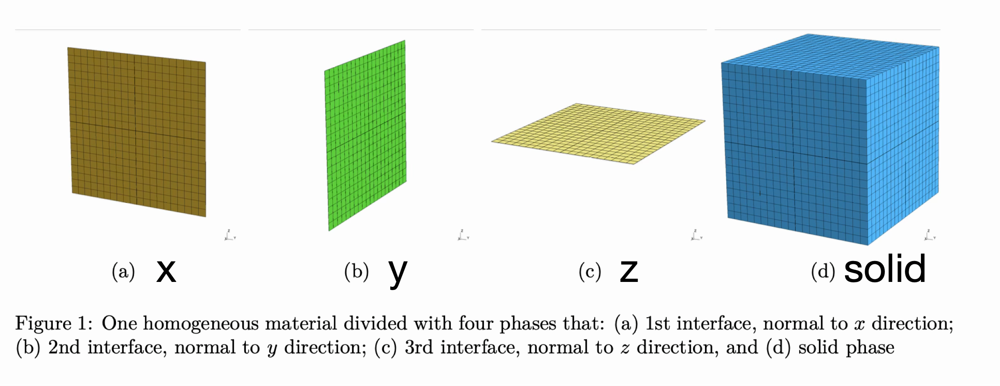

该文档给出正交各向异性均质材料内虚拟界面影响张量的解析表达式。界面影响张量在构造中应满足：当界面进入完全损伤状态时，在对应拉伸或剪切载荷下，单胞宏观响应也表现为完全损伤。

## 三界面-实体相降阶方程和影响张量等式

单胞包含如下材料相：3 个法向分别为 x y z 的界面，和 1 个均质实体，一共有 $N=4$ 相材料，分别用 $\mathrm{x}, \mathrm{y}, \mathrm{z}, \mathrm{S}$ 表示。均质实体为正交各向异性材料，有 9 个独立的材料参数，记弹性刚度和柔度张量分别为 $\mathbb{L}$ 和 $\mathbb{M}$。材料相几何划分方式如图所示：

设虚拟界面相对单胞的厚度为 $t^{(\square)}$，是一个**无量纲数**，各材料相的体积分数等于

$$
c^{(\square)} = t^{(\square)}, \quad \square = \mathrm{x,y,z}\quad
\text{and}\quad c^{(\mathrm{S})} = 1 - c, \quad c = c^{(\mathrm{x})} + c^{(\mathrm{y})} + c^{(\mathrm{z})}.
$$

在降阶多尺度框架下，给定宏观应变 $\boldsymbol{\varepsilon}^{c}$ 和各材料相的本征应变 $\boldsymbol{\mu}^{(\alpha)}$，各材料相的应变 $\boldsymbol{\varepsilon}^{(\alpha)}$ 可通过影响张量 $\{ \mathbb{E}^{(\alpha)},\mathbb{P}^{(\alpha\beta)} \}$ 表示为

$$
\begin{equation}\label{eq:C0121_roh}
\boldsymbol{\varepsilon}^{(\alpha)}
= \mathbb{E}^{(\alpha)} : \boldsymbol{\varepsilon}^{c} + \sum_{\beta} \mathbb{P}^{(\alpha\beta)} : \boldsymbol{\mu}^{(\beta)}, \quad
\alpha,\beta = \mathrm{x}, \mathrm{y}, \mathrm{z}, \mathrm{S}.
\end{equation}
$$

式 $\eqref{eq:C0121_roh}$ 中均质材料的弹性应变影响张量 $\mathbb{E}^{(\alpha)}$ 恒等于四阶单位张量 $\mathbb{I}$。本文档目的是确定所有 $4\times 4=16$ 的本征应变影响张量 ${\mathbb{P}^{(\alpha\beta)}}$。影响张量应满足如下代数等式约束：

1. 相容性条件，
   

$$
   \begin{equation}\label{eq:C0121__fluc}
   \sum_{\alpha=1}^{N} c^{(\alpha)} \mathbb{P}^{(\alpha\beta)} = \mathbb{O}, \quad
   \beta = \mathrm{x}, \mathrm{y}, \mathrm{z}, \mathrm{S}.
   \end{equation}
   $$

2. 还原常本征应变解，
   

$$
   \begin{equation}\label{eq:C0121__iden2}
   \sum_{\beta=1}^{N} \mathbb{P}^{(\alpha\beta)} = \mathbb{O}, \quad
   \alpha = \mathrm{x}, \mathrm{y}, \mathrm{z}, \mathrm{S}.
   \end{equation}
   $$

**式 $\eqref{eq:C0121__fluc}$ 和 $\eqref{eq:C0121__iden2}$ 一共提供了 $7$ 个独立的齐次方程，此时未知影响张量的数量还有 $9$ 个。**需要指出的是，通过线下求解弹性 BVP 得到的影响张量还应满足互易原理给出的等式约束，然而基于非弹性变形模式修正后的影响张量一般不满足弹性问题设置下的互易原理，见 Chaboche et al., 2001。

## 虚拟界面影响张量

我们希望构造的影响张量能够得到的变形模式有：在宏观应变增量 $\Delta \boldsymbol{\varepsilon}^{c}$ 驱动下，当某一界面相发生完全破坏时（不失一般性，以界面 x 为例），此时其它界面和实体相的应变增量全部等于零，而在界面 x 的应变增量等于本征应变增量。将上述变形模式代入降阶多尺度方程 $\eqref{eq:C0121_roh}$ 得到

$$
\begin{equation}\label{eq:C0121__inelas_mode}
\begin{aligned}
\Delta  \boldsymbol{\varepsilon}^{(\mathrm{x})}
= \Delta \boldsymbol{\varepsilon}^{c} + \mathbb{P}^{(\mathrm{xx})} : \Delta  \boldsymbol{\varepsilon}^{(\mathrm{x})}, \quad
\boldsymbol{0}
= \Delta \boldsymbol{\varepsilon}^{c} + \mathbb{P}^{(\mathrm{yx})} : \Delta  \boldsymbol{\varepsilon}^{(\mathrm{x})}, \\
\boldsymbol{0}
= \Delta \boldsymbol{\varepsilon}^{c} + \mathbb{P}^{(\mathrm{zx})} : \Delta  \boldsymbol{\varepsilon}^{(\mathrm{x})}, \quad
\boldsymbol{0}
= \Delta \boldsymbol{\varepsilon}^{c} + \mathbb{P}^{(\mathrm{Sx})} : \Delta  \boldsymbol{\varepsilon}^{(\mathrm{x})}.
\end{aligned}
\end{equation}
$$

又因为宏观应变增量应等于各个材料相应变增量的体积平均，所以 $c^{(\mathrm{x})}\Delta\boldsymbol{\varepsilon}^{(\mathrm{x})} = \Delta\boldsymbol{\varepsilon}^{c}$，代入上式后得到界面相的影响张量满足：

$$
\begin{equation}\label{eq:C0121__infl_eq_by_inelas_mode}
\big( \mathbb{P}^{(\mathrm{xx})}-(1-c^{(\mathrm{x})})\mathbb{I} \big) 
: \Delta  \boldsymbol{\varepsilon}^{c} = \boldsymbol{0}, \quad
\big( \mathbb{P}^{(\mathrm{yx})} + c^{(\mathrm{x})}\mathbb{I} \big)  
: \Delta  \boldsymbol{\varepsilon}^{c} = \boldsymbol{0}, \\
\big( \mathbb{P}^{(\mathrm{zx})} + c^{(\mathrm{x})}\mathbb{I} \big)  
: \Delta  \boldsymbol{\varepsilon}^{c} = \boldsymbol{0}, \quad
\big( \mathbb{P}^{(\mathrm{Sx})} + c^{(\mathrm{x})}\mathbb{I} \big)  
: \Delta  \boldsymbol{\varepsilon}^{c} = \boldsymbol{0}. \\
\end{equation}
$$

上式应该对所有界面相 x 主导的变形模式 $\Delta\boldsymbol{\varepsilon}^{c}$ 恒成立，因此给出关于影响张量分量的约束方程。界面相 y 和 z 应满足类似式 $\eqref{eq:C0121__infl_eq_by_inelas_mode}$ 的约束方程。以下将推导满足上述变形模式约束下的影响张量。将待确定的本征应变影响张量 $\mathbb{P}^{(\alpha\beta)}$ 列举为如下矩阵形式：

$$
\begin{equation}\label{eq:C0121__p_mat}
\boldsymbol{\mathsf{P}} = 
\begin{pmatrix}
\mathbb{P}^{(\mathrm{xx})} & \mathbb{P}^{(\mathrm{xy})} & \mathbb{P}^{(\mathrm{xz})} & \mathbb{P}^{(\mathrm{xS})} \\
\mathbb{P}^{(\mathrm{yx})} & \mathbb{P}^{(\mathrm{yy})} & \mathbb{P}^{(\mathrm{yz})} & \mathbb{P}^{(\mathrm{yS})} \\
\mathbb{P}^{(\mathrm{zx})} & \mathbb{P}^{(\mathrm{zy})} & \mathbb{P}^{(\mathrm{zz})} & \mathbb{P}^{(\mathrm{zS})} \\
\mathbb{P}^{(\mathrm{Sx})} & \mathbb{P}^{(\mathrm{Sy})} & \mathbb{P}^{(\mathrm{Sz})} & \mathbb{P}^{(\mathrm{SS})} \\
\end{pmatrix}.
\end{equation}
$$

假设界面相的体积分数很小，$c^{(\mathrm{x})},c^{(\mathrm{y})},c^{(\mathrm{z})}\ll 1$，这样有

1. 界面对自身的影响张量使用正交各向异性介质内的无穷大平面的 Eshelby 张量 $\mathbb{S}^{(\square)}$ 近似，并与体积分数关联。
   

$$
   \begin{equation}\label{eq:C0121__assump2}
   \mathbb{P}^{(\mathrm{xx})} = \big( 1-c^{(\mathrm{x})} \big)\mathbb{S}^{(\mathrm{x})}, \quad
   \mathbb{P}^{(\mathrm{yy})} = \big( 1-c^{(\mathrm{y})} \big)\mathbb{S}^{(\mathrm{y})}, \quad
   \mathbb{P}^{(\mathrm{zz})} = \big( 1-c^{(\mathrm{z})} \big)\mathbb{S}^{(\mathrm{z})}
   \end{equation}
   $$

2. 将式 $\eqref{eq:C0121__infl_eq_by_inelas_mode}$ 中的单位张量替换为 Eshelby 张量，得到界面相对其它材料相的影响张量为
   

$$
\begin{equation}\label{eq:C0121__assump1}
\mathbb{P}^{(\mathrm{yx})} = \mathbb{P}^{(\mathrm{zx})} = \mathbb{P}^{(\mathrm{Sx})} 
= - c^{(\mathrm{x})} \mathbb{S}^{(\mathrm{x})},\quad
\mathbb{P}^{(\mathrm{xy})} = \mathbb{P}^{(\mathrm{zy})} = \mathbb{P}^{(\mathrm{Sy})} 
= - c^{(\mathrm{y})} \mathbb{S}^{(\mathrm{y})},\quad
\mathbb{P}^{(\mathrm{xz})} = \mathbb{P}^{(\mathrm{yz})} = \mathbb{P}^{(\mathrm{Sz})} 
= - c^{(\mathrm{z})} \mathbb{S}^{(\mathrm{z})}
\end{equation}
$$

式中，四阶张量 $\mathbb{S}^{(\square)}$ 是朝向为 $\square$ 的圆盘型夹杂的 Eshelby 张量。当弹性材料为正交各向异性，且圆盘法向为 1 方向时，Eshelby 张量在全局坐标系下的非零分量等于（Voigt 记法）

$$
S_{11}^{(\mathrm{x})} = 1, \quad S_{12}^{(\mathrm{x})} = L_{12}/L_{11}, \quad S_{13}^{(\mathrm{x})} = L_{13}/L_{11} \quad S_{55}^{(\mathrm{x})} = 1, \quad S_{66}^{(\mathrm{x})} = 1.
$$

将式 $\eqref{eq:C0121__assump1}$ 和 $\eqref{eq:C0121__assump2}$ 代入到本征应变影响张量矩阵列式 $\eqref{eq:C0121__p_mat}$ 中，并应用影响张量恒等式 $\eqref{eq:C0121__fluc}$ 和 $\eqref{eq:C0121__iden2}$，得到

$$
\begin{equation}\label{eq:C0121__infl_anal}
\boldsymbol{\mathsf{P}}
= \begin{pmatrix}
\big( 1-c^{(\mathrm{x})} \big)\mathbb{S}^{(\mathrm{x})} & - c^{(\mathrm{y})} \mathbb{S}^{(\mathrm{y})} & - c^{(\mathrm{z})} \mathbb{S}^{(\mathrm{z})} & \mathbb{S} - \mathbb{S}^{(\mathrm{x})} \\
- c^{(\mathrm{x})} \mathbb{S}^{(\mathrm{x})} & \big( 1-c^{(\mathrm{y})} \big)\mathbb{S}^{(\mathrm{y})} & - c^{(\mathrm{z})} \mathbb{S}^{(\mathrm{z})} & \mathbb{S} - \mathbb{S}^{(\mathrm{y})} \\
- c^{(\mathrm{x})} \mathbb{S}^{(\mathrm{x})} & - c^{(\mathrm{y})} \mathbb{S}^{(\mathrm{y})} & \big( 1-c^{(\mathrm{z})} \big)\mathbb{S}^{(\mathrm{z})} & \mathbb{S} - \mathbb{S}^{(\mathrm{z})} \\
- c^{(\mathrm{x})} \mathbb{S}^{(\mathrm{x})} & - c^{(\mathrm{y})} \mathbb{S}^{(\mathrm{y})} & - c^{(\mathrm{z})} \mathbb{S}^{(\mathrm{z})} & \mathbb{S}
\end{pmatrix},\quad
\mathbb{S} \triangleq c^{(\mathrm{x})} \mathbb{S}^{(\mathrm{x})}
+ c^{(\mathrm{y})} \mathbb{S}^{(\mathrm{y})} + c^{(\mathrm{z})} \mathbb{S}^{(\mathrm{z})}.
\end{equation}
$$

一些评论：

1. 界面相的体积分数。虽然在上述的推导中显式引入了界面的体积分数，并且最后影响张量的结果包含体积分数，但**界面破坏触发宏观失效**这一变形模式与体积分数大小无关。式 $\eqref{eq:C0121__infl_eq_by_inelas_mode}$ 给出的影响张量约束方程确保了这一点。然而，体积分数与界面破坏后的应变集中相关。宏观传递的应变增量将完全转化为破坏后界面相的应变增量，由如下宏细观应变平均公式关联（假设界面 x 发生破坏）：
   

$$
c^{(\mathrm{x})} \Delta \boldsymbol{\varepsilon}^{(\mathrm{x})} = \Delta \boldsymbol{\varepsilon}^{c}.
$$

   因此，当宏观应变增量取有限值，而体积分数 $c^{(\mathrm{x})}\to 0$，此时 $\|\Delta \boldsymbol{\varepsilon}^{(\mathrm{x})}\|\to \infty$。

2. 界面相之间的相交区域。即使界面相体积分数达到界面相之间的相交区域的体积分数不容忽略，在降阶多尺度框架下仍可以忽略这一区域的影响。这里，影响张量仅作为相场和宏观响应的媒介，并不对应一个真实的多尺度问题。

